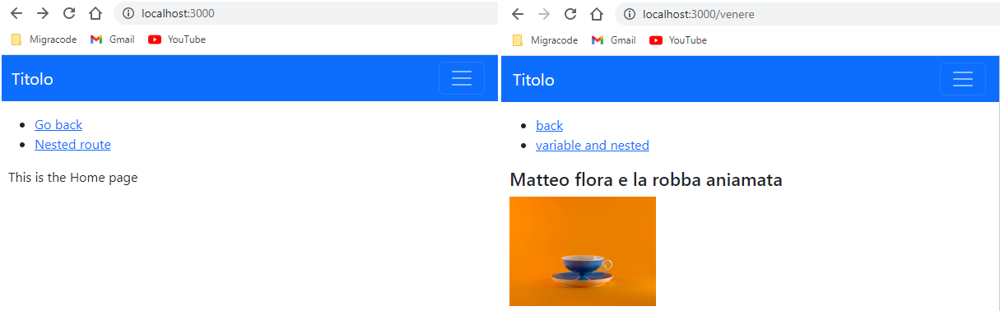
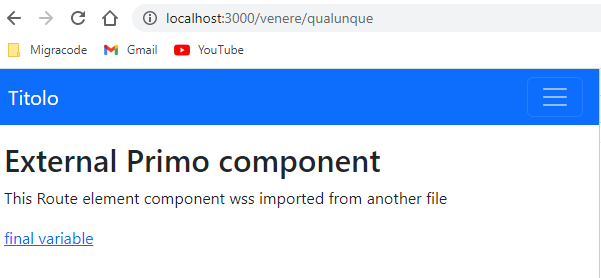
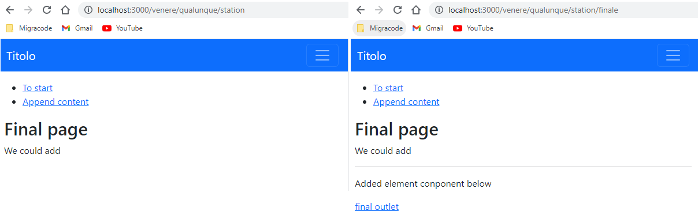
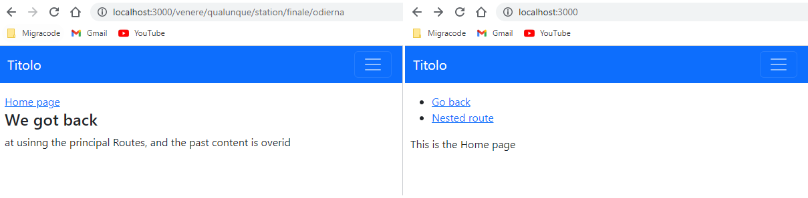

# REACT 2

* 1
* 1
* 1
* 1

We use **Client-side routing** to render **\<Routes> components** without requesting **external documents**.

Routing is not included in react, we need to in import Components from **react-router-dom**.

```
npm i react-router-dom

//We change the name of Browser
import {
  BrowserRouter as Router,
  Link,
  Route,
  useParams,
  Routes,
  Outlet,
  useRouteError
} from "react-router-dom";

```



We render **Router>Routes>Route** in the return, the **element component** is linked to the **URL path**.

We use /\* for the **nested Routes** that will inherit the **parent URL**

```
return(
  <div>
    <Router>

      <Routes>
        <Route path="/" element={<Binge />} errorElement={<Sbaglia />} />
        <Route path="/venere/*" element={<Venere />} />
      </Routes>

    </Router>
  </div>
)

```

The **/** Route is the "**Home**" URL, we use **\<Link>** to **navigate** to the URL PATH,&#x20;

```
//we only need the /(path name) for the TO link.

const Binge = () =>{
  return(
    <div>
      <ul>
        <li> <Link to="/">Home</Link> </li>
        <li> <Link to="/venere">Bergamo</Link> </li>
      </ul>
    </div>
  )
}

```

<figure><figcaption><p>Home / route</p></figcaption></figure>



On the route element component, we use a **variable route path**.

The URL PATH **depends on the \<Link>** and inherits the parent URL.

```
//The path will change depending on the Link, and we can link 2 to one route

return(
  <div>
    <Link to="primem" >Click to nuovo or primo? </Link>
    <Link to="secondum" >Click to nuovo or secondum? </Link>

    <Routes>
      <Route path=":nuovo/*" element={<Primo />} />
    </Routes>
  </div>
)

```

<figure><figcaption><p>URL path on variables </p></figcaption></figure>

1

1

1



We cut the /\* from the path, any extra Route won't inherit the PATH URL.

```
//this is done for the ending routes

return(
  <div>
    <Link to="secondo"> To secondo </Link>

    <Routes>
        <Route path=":meaning" element={<Secondo />} />
    </Routes>
  </div>
)

```

<figure><figcaption><p>variable URL Path</p></figcaption></figure>



### Using \<Outlet /> with React Routes&#x20;

The \<Outlet/> component renders the child route elements in the \<Routes/>



The **outlet** component can be outside \<routes />

```
//We create the first Route

return(
  <div className="container-fluid">
    <nav className="row navbar navbar-expand-md bg-primary navbar-dark"></nav>

    <Router>
      <Routes>
        <Route path="/" element={<Cringe />} />
        <Route path="/venere/*" element={<Venere />} />
      </Routes>
    </Router>

    <Outlet />
  </div>
)

```

Each **route** element component is gonna be **rendered separately** and will **inherit the DOM** set with \<Router />.

```
//When we move to another route using <Link> we will change component

const Binge = () =>{
  return(
    <div>
      <ul>
        <li> <Link to="/"> Go back </Link> </li>
        <li> <Link to="/venere"> Nested route </Link> </li>
      </ul>

      <p>This is the Home page</p>
    </div>
  )
}
```

and then go back to the home component using \<Link />

```
const Venere = () =>{

  return(
    <div>
      <ul>
        <li> <Link to="/"> back </Link> </li>
      </ul>
      
      <h4>Matteo flora e la robba aniamata</h4>
      <div className="row">
        <div className="col-4">
          
        </div>
      </div>
    </div>
  )
}
```

<figure><figcaption><p>Home component and normal route</p></figcaption></figure>



The **\<Outlet />** will work on variable nested \<route/> and imported components.

```
import Primo from "./components/Primo";
import Second from "./components/Second";

return(
  <div className="container-fluid">

    <Router>
      <Routes>
        <Route path="/" element={<Cringe />} />
        <Route path="/venere/*" element={<Venere />} />
        
        <Route path="/venere/:nuovo/*" element={<Primo />} />
      </Routes>
    </Router>

    <Outlet />
  </div>
)

```

\<Outlet /> will work for all the \<route/> in the App component.

```
//From the previous component
<li> <Link to="qualunque"> variable and nested </Link> </li>

const Primo = () =>{

  return(
    <div>
      <h1>External Primo component</h1>
      <p>This Route element component wss imported from another file</p>
      <Link to="station"> final variable </Link>
    </div>
  )
}

```

<figure><figcaption><p>Outlet rendering variable URL path element component</p></figcaption></figure>



We use another variable nested \<route/>.

```
return(
  <div className="container-fluid">

    <Router>
      <Routes>
        <Route path="/" element={<Cringe />} />
        <Route path="/venere/*" element={<Venere />} />
        <Route path="/venere/:nuovo/*" element={<Primo />} />

        <Route path="/venere/:nuovo/:altro/*" element={<Second />} />
      </Routes>
    </Router>

    <Outlet />
  </div>
)

```

On the component, we put a **new \<Routes/>** component

```
const Done = () =>{

  return(
    <div>
      <ul>
        <li> <Link to="/">To start</Link> </li>
        <li> <Link to="finale"> Append content </Link> </li>
      </ul>
      <h1>Final page</h1>
      <p>We could add</p>

      <Routes>
        <Route path="/:stand/*" element={<Grade />} />
      </Routes>
    </div>
  )
}

```

The element component of the route will be **appended below the current component** (set with \<outlet/>)

```
const Grade = () =>{

  return(
    <div>
      <hr/>
      <p>Added element component below</p>
      <Link to="odierna"> final outlet </Link>
    </div>
  )
}

```

<figure><figcaption><p>Route render component outside outlet</p></figcaption></figure>



We add a \<Route/> we want to be the **\<Outlet/>** again.

```
//We use variable path to cover the outside <outlet/> route coz it was nested

return(
  <div className="container-fluid">

    <Router>
      <Routes>
        <Route path="/" element={<Cringe />} />
        <Route path="/venere/*" element={<Venere />} />
        <Route path="/venere/:nuovo/*" element={<Primo />} />
        <Route path="/venere/:nuovo/:altro/*" element={<Second />} />

        <Route path="/venere/:nuovo/:altro/:stand/odierna" element={<Conta />} />
        
      </Routes>
    </Router>

    <Outlet />
  </div>
)

```

From there we can nest a new path or go back to the \<Routes/> path.

```
<Link to="odierna"> final outlet </Link>
//If the route is present in the <routes>, <Outlet/> renders it 

const Conta = () =>{

  return(
    <div>
      <Link to="/">Home page</Link>
      <h3>We got back</h3>
      <p>at using the principal Routes, and the past content is overwritten</p>
    </div>
  )
}

```

<figure><figcaption><p>re-rendering a Route component in the &#x3C;outlet/></p></figcaption></figure>



### ReactJs Forms submit and input Props

1

1

1

1
