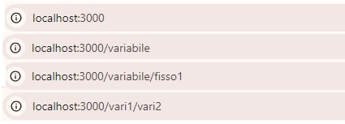

# React-Router-Dom Routes

* [Using \<Outlet> on nested and /\* paths in React Router](react-router-dom-routes.md#using-less-than-outlet-greater-than-on-nested-and-paths-in-react-router)
* [The useParams() hook and nested \<Routes on object arrays.](react-router-dom-routes.md#the-useparams-hook-and-nested-less-than-routes-on-object-arrays)
* [The useLocation() hook and properties](react-router-dom-routes.md#the-uselocation-hook-and-properties)
* [The useNavigation() sibling and localStorage](react-router-dom-routes.md#the-usenavigation-sibling-less-than-route-greater-than-and-localstorage)

We use the [React-Router](https://reactrouter.com/en/main/route/route) library to enable **client-side routing**, allowing the browser to manage page navigation without requesting new HTML documents from the server. &#x20;

Unlike server-side routing, which involves full page reloads, React Router **updates** components and URLs on the **client-side** based on route configurations.&#x20;

<pre class="language-jsx"><code class="lang-jsx">//Not included in React we install its components
npm i react-router-dom

//We change the name of Browser
<strong>import {
</strong>  BrowserRouter as Router,
  Link,
  Route,
  useParams,
  Routes,
  Outlet,
  useRouteError
} from "react-router-dom";
</code></pre>

We configure the \<Route/> **URL path** and **element** component in **Router>Routes**, any component containing React-Router components has to be inside of \<Router/>.



The component outside the \<Router> will remain during all route URL updates.

```jsx
//The "/" component will be the initial render of the page
import Primo from './components/Primo';
import Secondo from './components/Secondo';
import Home from './components/Home';

return (
  <div>
    <Title />

    <Router>
      <Navi />
      <Routes>
        <Route path="/" element={<Home />} />
        <Route path=":primo" element={<Primo />} />
        <Route path=':primo/fisso1' element={<Secondo />} />
        <Route path=':primo/:secondo' element={<Secondo />} />
      </Routes>
    </Router>
  </div>
);
```

<figure><figcaption><p>Fixed and Variable routes</p></figcaption></figure>



The \<Link> component renders an **a**nchor tag, on click, it updates the URL and route based on the <mark style="background-color:blue;">**to**</mark> prop, handling the process **declaratively** (i.e., specifying what to do, not how to do it) and avoiding a full page reload.

The route path can be either **fixed** and explicit or **dynamic**, where certain parts of the URL are replaced with :variables that are later defined by the values provided in the \<Link> **to** prop.

```jsx
//The : is in the Route path, not the to prop
function Title(){
  return <h1>Fixed, No router component</h1>
}

function Navi(){
  return(
    <div>
      <p> <Link to="/"> Home </Link> </p>
      <p> <Link to="variabile"> variable </Link> </p>
      <p> <Link to="variabile/fisso1"> variable+fixed </Link> </p>
      <p> <Link to="vari1/vari2"> variable+variable </Link> </p>
    </div>
  )
}
```



### Using \<Outlet> on nested and /\* paths in React Router

Let's check the properties of **nested \<Routes>** and the properties of the **/\*** catch-All parameter.

```jsx
<Routes>
  <Route path="/" element={<Primo />}>
    <Route path=":variable/*" element={<Secondo />} />
  </Route>
  
  <Route path=":variable/primo/*" element={<Primo />} />
  <Route path=":variable/:altro" element={<Terzo />} />
</Routes>
```



On reload Route components replace any previous element inside the \<Router>.                                                                 A parent Route component can r**ender its child Route using \<Outlet>**, but any new \<Route> that's not included in the nesting **won't render** any previous component.

```jsx
//The child component will share the <Outlet/> position
<div>
  <Link to="edit"> Variable 1< </Link>
  <Link to="edited"> Variable 2< </Link>
  <Link to="etedi"> Variable 3< </Link>
</div>
<Outlet />
```



When **multiple routes** match a given URL, the more specific route will take priority.

```jsx
//A fixed primo path takes priority over primo as :variable
<div>
  <h1>Taken from the {variable} </h1>

  <Link to="number2">		//path=":variable/:altro/*"
    <h5>Second Variable</h5>
  </Link>

  <Link to="primo">			//path=":variable/primo"
    <h5>Fixed route </h5>
  </Link>    
</div>
```



A **catch-all** parameter (/\*) matches any path that shares the same _**previous**_ URL , capturing _**additional**_ parameters and acting as a fallback route when no other suitable path routes exist.

```jsx
//The path http://localhost:3000/edited/primo/edited has no explicit <Route
//But with /* can be rendered with teh <Terzo/>
const { variable, altro } = useParams();

<div>
  Double variable {variable}/ {altro}
</div>
```




Variable \<Route/> path with \<Outlet/> and absolute paths


### The useParams() hook and nested \<Routes on object arrays.

We access the current Route URL path with the **useParams()** hook, which returns a key-value object with the route **path name** and its **url parameter** respectively.

<pre class="language-jsx"><code class="lang-jsx">//We can directly destruct for the route values
let variable = useParams()  //{variable: 'Primo', *: ''} 
let { variable } = useParams();           //Primo
<strong>let articoli = useParams()  //{variable: 'Primo', *: 'useref', articolo: 'useref'}
</strong>let { variable, articolo } = useParams(); //Primo useref

&#x3C;Routes>
  &#x3C;Route path=":variable/*" element={&#x3C;Topic />} />
  &#x3C;Route path=":variable/:articolo" element={&#x3C;Final />} />
&#x3C;/Routes>
</code></pre>



Instead of using the **\<Outlet>** component we can nest routes by adding **\<Routes>** on a element component.

```jsx
//Both need the /* and don't repeat <Router>
//app.js
<Router>
  <Routes>
    <Route path="/*" element={<House />} />
  </Routes>
</Router>

//House.js
<Routes>
  <Route path=":variable/*" element={<Topic />} />
</Routes>
```



We can use URL **path parameters** to filter imported arrays using imported functions.

```jsx
//The first level renders the array object
//The second level renders the array properties of the objects
const topico = [
  {
    name: "This is the Primo window",
    id: "Primo",
    resources: [
      {
        name: "Why React Hooks?",
        id: "why-react-hooks",
        description: `In this post you'll ...`
      },
      ...
    ]
  },
  ...
];

export function getSites() {
  return topico;
}

export function getResor(fonte) {
  return topico.find(({ id }) => id == fonte);
}

export function getDesc({ variable, articolo }) {
  return topico
    .find(({ id }) => id == variable)
    .resources.find(({ id }) => id == articolo);
}

```



<details>

<summary>[Component] array render and content filter on useParams() path parameter</summary>

We render each object's name and set their **id** as **:variable** route path.

```jsx
//Home.js
//We loop each array object
import { getSites } from "../Content";

<div className="d-block">
  <ul>
    {topico.map(({ id, name }) => (
      <li key={id}>
        <Link to={id}> {name} moree?</Link>
      </li>
    ))}
  </ul>
</div>
```

We can add an extra component as a fixed background and components for each avaiable route.

```jsx
//Topic.js
//The component array and extra fixed component
//aren't needed if there is no difference between the components
const { variable } = useParams();

const modules = {
  Primo,
  Secondo,
  Terzo,
};

const Module = modules[variable];

<div className="d-block">
  <h1 className="text-center"> {variable} </h1>

  <Module fonte={variable} />
  //<Primo>	//also the props is optional
</div>
```

Each singular component shares the same filter structure, we render each array id as a new \<Route> and include the next component as child component.

```jsx
//Primo.js
//Both useParams() and props parameters work the same
import { getResor } from "../Content";

let risorsa = getResor(prop.fonte);
const { variable } = useParams();

<div>
  <ul>
    {risorsa.resources.map((id) => (
      <li key={id.id}>
        <Link to={id.id}>{id.name}</Link>
      </li>
    ))}
  </ul>
  <Routes>
    <Route path=":articolo" element={<Final />} />
  </Routes>
</div>
```

The useParams() values from the :variable \<Route> filter and render the content.

```jsx
import { getDesc } from "../Content";
const { variable, articolo } = useParams();
let { name, description } = getDesc({ variable, articolo });

<div>
  <h4> {name}, {description} </h4>
</div>
```

</details>


Router variable Routes with variable components


### The useLocation() hook and properties

The **\<Router>** can contain any **DOM** tag (while \<Routes> can only contain \<Route/>).

```jsx
//Link tags and components work only if rendered inside Router
<Router>
  ...  //Any DOM element here will be fixed in any route
  <Routes>
    <Route path="/primo" element={ <Primo/> } >
      <Route path="primo1" element={ <Secondo/> } />
    </Route>
    <Route path="/primo/secondo/:edit/*" element={ <Terzo/> } />
  </Routes>
</Router>
```

Instead of the deprecated useHistory(), we import the **useLocation()** hook to access the current _location objec_t. It returns the URL <mark style="background-color:blue;">pathname</mark>, a unique route <mark style="background-color:blue;">key</mark>, an indiritation <mark style="background-color:blue;">state</mark>, and both the <mark style="background-color:blue;">search</mark>(?=) and the <mark style="background-color:blue;">hash</mark>(#) in the **URL**.

The **useLocation()** hook updates only if a **router-dom component** is triggered.                                                The _browser_ navigation buttons update the URL using the **history API** and the \<Router/> component tree, but it's not a router event.

```jsx
import {
  useLocation 
} from "react-router-dom";

const location = useLocation();
console.log( location.pathname ) 	//  /primo
```



The search property returns the **search queryString** from the **URL**.

```jsx
//useLocation().pathname won't return the search query
<Link to="secondo/fine?place=anderville&sort=asc">
  Imperative Route 
</Link>

let posto = useLocation()
console.log( posto.search )  //search: "?place=anderville&sort=asc"
```

The **URLSearchParams** is a built-in javascript **interface** for the query strings in the **URL**, It allows us to access and edit the returned key/value pairs.

```jsx
const queryParams = new URLSearchParams(posto.search);
const someParam = queryParams.get('place');

const [via, setVia] = useState( someParam || 0 )	//andreville
```



The **hash value** is separated from the URL by a (#) **fragment identifier**.&#x20;

It updates the **URL without** sending an **HTTP** request to the server nor reloading the browser, used for single-page navigation.

We can use it to log events based on the **anchor ID** the user has been redirected to.

```jsx
//Any new hash replaces the old one in the URL.
//The /primo#parte updated URL will trigger a scroll in the browser
useEffect(()=>{
  console.log("The user has moved")
}, [location.hash])

<div>
  <a href="#parte"> To Section </a>
</div>

<div id="parte"> Scrolled here </div>
```

Hash **sections url** are also used for SEO google search optimitation.

The **\<Link>** won't trigger an ID hash scroll because it doesn't update the URL with a hash, but it replaces the current URL with another one that already includes a hash.

```jsx
//This also applies to external route <Link> with hash.
<Link to="#parte">
  To section
</Link>

<Link to={{ pathname: "secondo/finale", hash: "#parte" }}>
  Hash on imperative navigation
</Link>

//We can use the location.hash to scrollIntoView the ref anchor.
let barra = useRef()

useEffect(() => {
  const hash = posto.hash;

  if (hash && carra.current ) {
    barra.current.scrollIntoView({ behavior: 'smooth' });
  }
}, [posto]);
```



The **state** prop **sends data** between \<Link> routes, It won't persist on reload or route change.         It's easily accessible so it's better to use _localStorage_ and _sessionStorage_ with encryption for user data.

```jsx
//High data might affect performance 
<Link to="secondo/cartoon" state={{valore: "dicinnove", value: 19}}>
  Declarative with state
</Link>

let posto = useLocation()
console.log( posto.state )	//{valore: "dicinnove", value: 19}
```



When a component is mounted by the **\<Router>**, a unique read-only **key** identifier is created based on the current **URL**.

```jsx
//On browser navigation buttons the old key won't be updated
let place = useLocation()
console.log( place.key )
```



Unlike **useParams()**, the useLocation() **pathname** includes both the static and dynamic routes.

```jsx
//From, <Route path="/minni/pop/:fnaf/*" element={ <Terzo/> } />

const { pathname } = useLocation();  // /minni/pop/variegato
const variable = useParams();        //{fnaf: 'variegato', *: ''}
```

### The useNavigation() sibling \<Route> and localStorage

The \<Link> handles **imperative redirecting**, while the **useNavigate()** is for **programatical redirecting**.

The **useNavigate()** hook returns a function that redirects the user in response to a variety of events, not just clicking a link, its 2 arguments are the **route path** and the **options objec**t.

The **replace** property resets the URL to the current path and disables the previous route, while **state** is passed and accessed with useLocation().

```jsx
//We can reset the scroll position with <ScrollRestoration> on dataBrowser
//replace is false by default
function giro(){
  viaggio("primo3", {state: {primo: "here"}, replace: true} )
}

<button className="btn btn-primary" onClick={()=> giro()}>
  Programatically redirect
</button>

//on primo3
console.log( useLocation().state )	//{primo: 'here'}
```

A useNavigate() **relative path** will use **history API** to update the URL without updating the useLocation(), similarly to the browser navigation buttons.

```jsx
//Both will work only if the route has been already rendered

let via = useNavigate()
onClick={()=>( via(1) )}
onClick={()=>( via(-1) )}
```

We can also use the relative path as a shortcut between the **sibling \<Route>**.

```jsx
//from the primo/primo1 sibling route, without re-declaring the route
function test(){
  via("../primo2");
}

//Remember that <Outlet/> goes on the parent Route to make the children visible
<Routes>  
  <Route path="/primo" element={ <Primo/> } >
    <Route path="primo1" element={ <Secondo/> } />
    <Route path="primo2" element={ <Quarto/> } />
    <Route path='primo3' element={ <Terzo/> } />
  </Route>
</Routes>
```

The **localStorage** is a **browser-provided** web storage object, accessible by the _client_ and the _server_, persistent across browser sessions and \<Router> routes.

```jsx
//After being set It can be accessed by any route
let forma={ first: 12, second: "badge" }
localStorage.setItem('stato', JSON.stringify(forma));

const storedFormState = localStorage.getItem('stato');
const parsedFormState = storedFormState ? JSON.parse(storedFormState) : null;

//We useState() to modify it more easily
const [formState, setFormState] = useState(parsedFormState || {});

useEffect(() => {
  localStorage.setItem('stato', JSON.stringify(formState));
}, [formState]);

//How we use input to edit the useState() bound to the localStorage()
<input id="cash" type="text" className="form-control" value={formState.first} 
  onChange={(e)=> setFormState((stat)=> ({...stat, first: e.target.value}) )}/>
  
localStorage.removeItem("stato");
```

1
