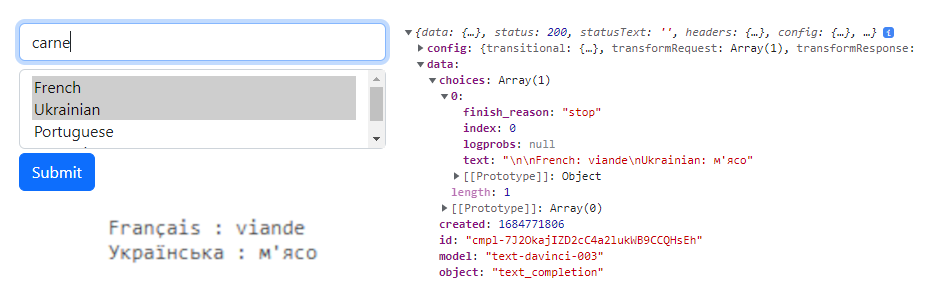
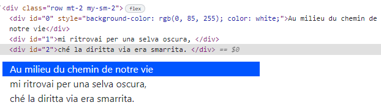
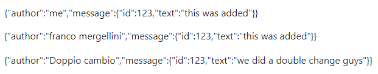
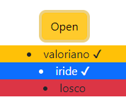

# REACT 3

* 1
* 1
* 1
* 1
* 1

The **fetch() API** provides us a javascript interface to access the protocol, by using the **global method fetch()** and an URL path it returns a promise that will resolve into a **response object**.

The **protocol** is the set of rules used to define **data formats**, needed to allow data exchange between devices.

The promise-based fetch method can implement HTTP concepts like **CORS (Cross-Origin Resource Sharing)**, an HTTP mechanic that allows a server to set the origin (domain, port, or scheme) from which the browser permits to load resources.

```
//We can add an init argument to the fetch(url, init) method

let init= {
  method: 'POST',                 //GET, POST, PUT, DELETE, etc
  body: JSON.stringify({
    q: "Detectando el lenguaje"   //body data type must match "Content-Type" header
  }),
  headers: {
    'Content-type': 'application/json; charset=UTF-8',
  },
}

```

We use **try/catch** to handle network and Cors errors, but we also need to check the **promise.ok**  property to avoid other types of errors (like 404).

Request and Response bodies can only be used once, we use a **request constructor** to copy a fetch() request, and the copy must be done before the body is read

```
//The url detects the language the q string property is

let url = 'https://libretranslate.de/detect';

const lengua= new Request(url, init)
const lengua1 = new Request(url, init1);

try{
  let response = await fetch( lengua );
  if (!response.ok) {
    throw new Error("Network response was not OK");
  }
  let commits = await response.json(); 
  console.log( commits[0].language )        //ES
}catch(error){
  console.log( {error.message} )
}

```

To configure the **OpenAi translate API** in ReactJs

```
import { Configuration, OpenAIApi } from "openai";

const configuration = new Configuration({
  apiKey: "__Open_AI_key__",
});
const openai = new OpenAIApi(configuration);

```

We can prompt single or multiple language translations.



For a single-language translation, we modify the **prompt**.

```
//trim() removes the extra white spaces included in the translation
//it works for longer strings too

const response = await openai.createCompletion({
  model: "text-davinci-003",
  prompt:  `Translate this into Spanish : cipolla`,
  temperature: 0.3,
  max_tokens: 100,
  top_p: 1.0,
  frequency_penalty: 0.0,
  presence_penalty: 0.0,
});

console.log( response )
console.log( response.data.choices[0].text.trim() );    //cebolla

```



To translate into **multiple languages** we **join()** an array into the **prompt**.

```
//On ReactJs a useState() won't work, so we use an array variable
//The API will respond with a string with the language: translated

const handleOnSubmit = async (e) => {
  e.preventDefault()

  colonna = []
  let form = e.target
  let formdata = new FormData(form)

  for( const x of formdata.entries() ){
    if(x[0] == "languages" ){
      colonna.push( x[1] )
    }
  }

  const response = await openai.createCompletion({
    model: "text-davinci-003",
    prompt:  `Translate this into ${ colonna.join(", ") } : ${testo}`,
    temperature: 0.3,
    max_tokens: 100,
    top_p: 1.0,
    frequency_penalty: 0.0,
    presence_penalty: 0.0,
  });

  console.log( response )
  console.log( response.data.choices[0].text.trim() );    
}

```

<figure><figcaption><p>translation response and .text.trim()</p></figcaption></figure>



We use **regex** to create a **useState()** array of **Node elements** to render in the DOM.

<details>

<summary>To render a multi-line string variable as an useState() array</summary>

We use **regex** to create an **array** of a **multi-line** string variable.

```
let texto= `
Nel mezzo del cammin di nostra vita \n
mi ritrovai per una selva oscura, \n
ché la diritta via era smarrita. \n `

const versi = new RegExp( /\n/g )
let cantica = texto.split(versi)
```

Then we use **map()** to create an useState() array with **Node elements.**

```
//we need to invoke it only once, useState() would trigger twice
//whitespaces are array elements as well, we need to edit the index

const [canto, setCanto] = useState( [] )

function compile(){

  if(canto.length == 0){
    cantica.map(((carta, index)=>{
      if(carta !== "" ){ 
        index = (index -1)/2
        setCanto((x)=> [...x,<div id={index} key={chiave+index}>{carta}</div>])
      }
    }))
  }
}

compile()

```

Then we can render it.

```
<div className="row mt-2 my-sm-2">
  {canto}
</div>

```

</details>

<figure><figcaption></figcaption></figure>

We loop through the useState() node elements and, using **regex**, we modify **useState()** to render the translation using **map()**.

```
const trova =  new RegExp( "("+ word + ")", 'ig');

for(let x of canto){
  if( trova.test( x.props.children[1] ) ){

    tradotto = await traduce(toTranslate, Language)

    setCanto((x)=> x.map( (str, index) =>
      (index == id) ? 
      <div id={id} key={key} style={ {backgroundColor: "blue", color:"white"} }> 
        {tradotto} 
      </div> 
      : 
      str
    ))
  }
}

```

<figure><figcaption><p>We update the useState() to get the translation to render</p></figcaption></figure>

### Render useState() arrays and objects

The **useState()** is a react Hook we use to have **state variables** in function components

To modify useState() arrays we use the **spread syntax** and **slice()** method.

```
//slice() doesn't modify the starting useState() it creates a new one
const [linea, setLinea] = useState( [2, 3, 4, 5, 6, 7] )

function add(){
  setLinea((x)=>( [11, ...x, 10] ) )          //[10, 2, 3, 4, 5, 6, 7, 10]
}

function remove(){
  setLinea((x)=> (x.slice(1, x.length - 1)) )  //[2, 3, 4, 5, 6, 7]
}
```

The spread operator works for **useState() objects** too.

<details>

<summary>Add, Remove and modify useState() objects guide</summary>

To render useState() objects in the DOM we use the **static method JSON.stringify()**

```
//It converts a javascript value into a JSON string and works on arrays
const [linea, setLinea] = useState( [2, 3, 4, 5, 6, 7] )

const [ cosa, setCosa ] = useState({
  terzo: "tre",
  quarto: "quattro"
})

<div> { JSON.stringify(cosa) } </div>
<div> { JSON.stringify(linea) } </div>
```

We use the spread syntax to add **key/value objects** to the object useState()

```
//We need "" for both the key and the value

function adding(){
  let adding = {"primo": "valore"}
  setCosa((x)=> ({
    ...adding,
    ...x, 
  }))
}
```

To delete a property from the **useState()** we **copy** it and use the **delete operator,** then we set it as the new useState().

```
//remember the "" on the property

function removing(){
  let copia = {...cosa}
  delete copia["primo"]

  setCosa((x)=>({
    ...copia
  }))
}
```

To add and modify existing properties we.

```
//We can use the current object properties to create new ones

function multing(){
  setCosa((x)=> ({ zero: "zero", ...x, terzo: x.terzo + "anew" }) )
}
```

</details>

<figure><figcaption><p>useState(9 object, add, delete and editing existing properties</p></figcaption></figure>

<details>

<summary>Modify useState() on nested objects</summary>

We need to use the spread syntax multiple times to access **nested object properties**.

```
const [messob, setMessob] = useState({
  author: 'me',
  message: {
    id: 1,
    text: 'This was added'
  }
});

//We need to keep the other properties even if we don't edit them
function second(){
  setMessob((x)=>({
    ...x,
    message: {
      ...x.message,
      id: 123
    }
    })
  )
}

```

The same goes for first-level object properties.

```
//we need to keep the other object properties values still

function primo(){
  setMessob((x)=>({
    author: "franco mergellini",
    message: {
      ...x.message
    }
  }
  ))
}

```

We can combine them.

```
function doppio(){
  setMessob((x)=>({
    author: "Doppio cambio",
    message:{
      ...x.message,
      text: "We did a double change guys" 
    }
  }))
}

```

</details>

<figure><figcaption><p>editing different nested properties in the object</p></figcaption></figure>

1

### Conditional rendering using components props

The if statement is not a **{**javascript expression**}**, so we use the **component's props** in the **function component** to return and render **JSX**.

```
//We first use && logical operator to render the components onClick()
//do not use single numeric conditions, it will return {0} instead of false

const [press, setPress] = useState(false)

<div className="text-center">
  <button className="btn btn-warning my-2" onClick={()=> setPress(true)} >Open</button>
</div>

{press &&
  <div>
    <Item name="valoriano" back="bg-warning" pack={press} />
    <Item name="iride" back="bg-primary text-white" pack={press} />
    <Item name="losco" back="bg-danger" pack={!press} />
  </div>
}
```

<figure><figcaption><p>conditional rendered componentc</p></figcaption></figure>

```
//We then use the props in the function component

function Item({name, back, pack}){
  return (
    <li className={back}>
      {name} {pack && "✔"}
    </li>
  )
}

function Item1({name, back, pack}){
  let itemContent = name;
  if (pack) {
    itemContent = name + " ✔" ;
  }

  return (
    <li className={back}>
      {itemContent}
    </li>
  )
}

```

1

1

1

1

1

1

1

1
