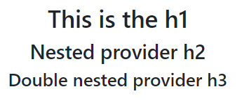

# REACT 3, Fetch() API, OpenAI API translation, useState() objects and conditional rendering, useContext() Providers and useCallback()&#x20;

* [Render useState() arrays and objects](./#render-usestate-arrays-and-objects)
* [Conditional rendering using components props](./#conditional-rendering-using-components-props)
* [UseContext() and Provider components](./#usecontext-and-provider-components)
* [useCallback() React hook with useMemo()](./#usecallback-react-hook-with-usememo)

>

The **fetch() API** provides us a javascript interface to access the protocol, by using the **global method fetch()** and an URL path it returns a promise that will resolve into a **response object**.

The **protocol** is the set of rules used to define **data formats**, needed to allow data exchange between devices.

The promise-based fetch method can implement HTTP concepts like **CORS (Cross-Origin Resource Sharing)**, an HTTP mechanic that allows a server to set the origin (domain, port, or scheme) from which the browser permits to load resources.

```jsx
//We can add an init argument to the fetch(url, init) method

let init= {
  method: 'POST',                 //GET, POST, PUT, DELETE, etc
  body: JSON.stringify({
    q: "Detectando el lenguaje"   //body data type must match "Content-Type" header
  }),
  headers: {
    'Content-type': 'application/json; charset=UTF-8',
  },
}

```

We use **try/catch** to handle network and Cors errors, but we also need to check the **promise.ok**  property to avoid other types of errors (like 404).

Request and Response bodies can only be used once, we use a **request constructor** to copy a fetch() request, and the copy must be done before the body is read

```jsx
//The url detects the language the q string property is

let url = 'https://libretranslate.de/detect';

const lengua= new Request(url, init)
const lengua1 = new Request(url, init1);

try{
  let response = await fetch( lengua );
  if (!response.ok) {
    throw new Error("Network response was not OK");
  }
  let commits = await response.json(); 
  console.log( commits[0].language )        //ES
}catch(error){
  console.log( {error.message} )
}

```

To configure the **OpenAi translate API** in ReactJs

```jsx
import { Configuration, OpenAIApi } from "openai";

const configuration = new Configuration({
  apiKey: "__Open_AI_key__",
});
const openai = new OpenAIApi(configuration);

```

We can prompt single or multiple language translations.



For a single-language translation, we modify the **prompt**.

```jsx
//trim() removes the extra white spaces included in the translation
//it works for longer strings too

const response = await openai.createCompletion({
  model: "text-davinci-003",
  prompt:  `Translate this into Spanish : cipolla`,
  temperature: 0.3,
  max_tokens: 100,
  top_p: 1.0,
  frequency_penalty: 0.0,
  presence_penalty: 0.0,
});

console.log( response )
console.log( response.data.choices[0].text.trim() );    //cebolla

```



To translate into **multiple languages** we **join()** an array into the **prompt**.

```jsx
//On ReactJs a useState() won't work, so we use an array variable
//The API will respond with a string with the language: translated

const handleOnSubmit = async (e) => {
  e.preventDefault()

  colonna = []
  let form = e.target
  let formdata = new FormData(form)

  for( const x of formdata.entries() ){
    if(x[0] == "languages" ){
      colonna.push( x[1] )
    }
  }

  const response = await openai.createCompletion({
    model: "text-davinci-003",
    prompt:  `Translate this into ${ colonna.join(", ") } : ${testo}`,
    temperature: 0.3,
    max_tokens: 100,
    top_p: 1.0,
    frequency_penalty: 0.0,
    presence_penalty: 0.0,
  });

  console.log( response )
  console.log( response.data.choices[0].text.trim() );    
}

```

<figure><figcaption><p>translation response and .text.trim()</p></figcaption></figure>



We use **regex** to create a **useState()** array of **Node elements** to render in the DOM.

<details>

<summary>To render a multi-line string variable as an useState() array</summary>

We use **regex** to create an **array** of a **multi-line** string variable.

```
let texto= `
Nel mezzo del cammin di nostra vita \n
mi ritrovai per una selva oscura, \n
ché la diritta via era smarrita. \n `

const versi = new RegExp( /\n/g )
let cantica = texto.split(versi)
```

Then we use **map()** to create an useState() array with **Node elements.**

```
//we need to invoke it only once, useState() would trigger twice
//whitespaces are array elements as well, we need to edit the index

const [canto, setCanto] = useState( [] )

function compile(){

  if(canto.length == 0){
    cantica.map(((carta, index)=>{
      if(carta !== "" ){ 
        index = (index -1)/2
        setCanto((x)=> [...x,<div id={index} key={chiave+index}>{carta}</div>])
      }
    }))
  }
}

compile()

```

Then we can render it.

```
<div className="row mt-2 my-sm-2">
  {canto}
</div>

```

</details>

<figure><figcaption></figcaption></figure>

We loop through the useState() node elements and, using **regex**, we modify **useState()** to render the translation using **map()**.

```jsx
const trova =  new RegExp( "("+ word + ")", 'ig');

for(let x of canto){
  if( trova.test( x.props.children[1] ) ){

    tradotto = await traduce(toTranslate, Language)

    setCanto((x)=> x.map( (str, index) =>
      (index == id) ? 
      <div id={id} key={key} style={ {backgroundColor: "blue", color:"white"} }> 
        {tradotto} 
      </div> 
      : 
      str
    ))
  }
}

```

<figure><figcaption><p>We update the useState() to get the translation to render</p></figcaption></figure>

### Render useState() arrays and objects

The **useState()** is a react Hook we use to have **state variables** in function components

To modify useState() arrays we use the **spread syntax** and **slice()** method.

```
//slice() doesn't modify the starting useState() it creates a new one
const [linea, setLinea] = useState( [2, 3, 4, 5, 6, 7] )

function add(){
  setLinea((x)=>( [11, ...x, 10] ) )          //[10, 2, 3, 4, 5, 6, 7, 10]
}

function remove(){
  setLinea((x)=> (x.slice(1, x.length - 1)) )  //[2, 3, 4, 5, 6, 7]
}
```

The spread operator works for **useState() objects** too.

<details>

<summary>Add, Remove and modify useState() objects guide</summary>

To render useState() objects in the DOM we use the **static method JSON.stringify()**

```
//It converts a javascript value into a JSON string and works on arrays
const [linea, setLinea] = useState( [2, 3, 4, 5, 6, 7] )

const [ cosa, setCosa ] = useState({
  terzo: "tre",
  quarto: "quattro"
})

<div> { JSON.stringify(cosa) } </div>
<div> { JSON.stringify(linea) } </div>
```

We use the spread syntax to add **key/value objects** to the object useState()

```
//We need "" for both the key and the value

function adding(){
  let adding = {"primo": "valore"}
  setCosa((x)=> ({
    ...adding,
    ...x, 
  }))
}
```

To delete a property from the **useState()** we **copy** it and use the **delete operator,** then we set it as the new useState().

```
//remember the "" on the property

function removing(){
  let copia = {...cosa}
  delete copia["primo"]

  setCosa((x)=>({
    ...copia
  }))
}
```

To add and modify existing properties we.

```
//We can use the current object properties to create new ones

function multing(){
  setCosa((x)=> ({ zero: "zero", ...x, terzo: x.terzo + "anew" }) )
}
```

</details>

<figure><figcaption><p>useState(9 object, add, delete and editing existing properties</p></figcaption></figure>

<details>

<summary>Modify useState() on nested objects</summary>

We need to use the spread syntax multiple times to access **nested object properties**.

```
const [messob, setMessob] = useState({
  author: 'me',
  message: {
    id: 1,
    text: 'This was added'
  }
});

//We need to keep the other properties even if we don't edit them
function second(){
  setMessob((x)=>({
    ...x,
    message: {
      ...x.message,
      id: 123
    }
    })
  )
}

```

The same goes for first-level object properties.

```
//we need to keep the other object properties values still

function primo(){
  setMessob((x)=>({
    author: "franco mergellini",
    message: {
      ...x.message
    }
  }
  ))
}

```

We can combine them.

```
function doppio(){
  setMessob((x)=>({
    author: "Doppio cambio",
    message:{
      ...x.message,
      text: "We did a double change guys" 
    }
  }))
}

```

</details>

<figure><figcaption><p>editing different nested properties in the object</p></figcaption></figure>

<details>

<summary>Modify useState() object property using a variabl</summary>

We use the **\[variable]** to substitute an object property with its **splice()** copy.

```
//We can't use splice() on the useState() property, and slice() isn't
//precise enough, so we splice() a copy

const [deck, setDeck] = useState({
  spade: [ 1, 2, 3, 4, 5 ],
  fiori: [ 1, 2, 3, 4, 5 ],
  cuori: [ 1, 2, 3, 4, 5 ],
  quadri: [ 1, 2, 3, 4, 5 ],
})

let carte = "fiori"
let raggio = deck[carte]
raggio.splice( _index_, 1 )

setDeck((x)=>({
  ...x,
  [carte]: raggio
}))

```

</details>

### Conditional rendering using components props

The if statement is not a **{**&#x6A;avascript expressio&#x6E;**}**, so we use the **component's props** in the **function component** to return and render **JSX**.

```
//We first use && logical operator to render the components onClick()
//do not use single numeric conditions, it will return {0} instead of false

const [press, setPress] = useState(false)

<div className="text-center">
  <button className="btn btn-warning my-2" onClick={()=> setPress(true)}>
    Open
  </button>
</div>

{press &&
  <div>
    <Item name="valoriano" back="bg-warning" pack={press} />
    <Item name="iride" back="bg-primary text-white" pack={press} />
    <Item name="losco" back="bg-danger" pack={!press} />
  </div>
}
```

<figure><figcaption><p>conditional rendered componentc</p></figcaption></figure>

```
//We then use the props in the function component

function Item({name, back, pack}){
  return (
    <li className={back}>
      {name} {pack && "✔"}
    </li>
  )
}

function Item1({name, back, pack}){
  let itemContent = name;
  if (pack) {
    itemContent = name + " ✔" ;
  }

  return (
    <li className={back}>
      {itemContent}
    </li>
  )
}

```

### UseContext() and Provider components

To **share data** between separate and nested **components** we don't use **props** (prop-drilling), we **useContext()**.



We set the Context provided **values once**.

<pre><code>import Relevant from './components/Externals';
<strong>const [drill, setDrill] = useState("element")
</strong>
&#x3C;OutContext.Provider value={{drill,setDrill}}>
  &#x3C;Relevant />
&#x3C;/OutContext.Provider>
</code></pre>

In the imported component we **deconstruct** the context **value object** property.

```
function Relevant(){
  const {drill, setDrill} = useContext(OutContext)
  let dodice = drill + " added"

  return(
    <div>
      Woglio vedere da extern l' {drill} and the {dodice}
      <button className="btn btn-primary"
          onClick={()=> setDrill("arco")}>
        submit
      </button>

      <Sollievo />
    </div>
  )
}
```

And its **nested components** will have access to the **same context value** (even if imported).

```
function Sollievo(){
  const {drill} = useContext(OutContext) 
  let dodice = drill + " 12"

  return(
    <div>
      Abbiamo il tempo {dodice}
    </div>
  )
}
```



The **props** will work on the imported component but they will need to be **re-declared** for any **nested** one.

```
const [drill, setDrill] = useState("element")
<Relevant1 empire={drill} setempire={setDrill} />

function Relevant1(prop){

  return(
    <div>
      <p> This is the imported prop value <b> {prop.empire} </b> </p>
    
      <button className="btn btn-warning btn-sm" 
        onClick={()=> prop.setempire("Vicenza")}>
        Cambio
      </button>
      <Empirico empire={prop.empire} />
    </div>  
  )
}

function Empirico(prop){
  let alluce = prop.empire + 12

  return(
    <div>
      While this is the modified prop {alluce}
    </div>
  )
}

```



The **createMethod API** sets a global state **context object** that components can **Provide** and read. The **useContext() React hook** reads the **component.provide**d context.

```
//The createContext() is the default value when no parent.provider value is available

const ThemeContext = createContext('red')

<ThemeContext.Provider value={"stripes"}>
  <p>This is the {useContext(ThemeContext)} </p>    //We have the value stripes
</ThemeContext.Provider>

```

<details>

<summary>Nested component.Provider and useState value prop</summary>

We can have **multiple** component.Provide and each child will **inherit** each parent **context values**.

```
//Page will only have access to ThemeContext prop value

<ThemeContext.Provider value={"stripes"}>
  <Page />
  <SideContext.Provider value={theme}>
    <Second />
  </SideContext.Provider>
</ThemeContext.Provider>

<button className='btn btn-sm btn-warning' 
        onClick={ ()=>(setTheme( ()=>({first: "the 33th number"})) )}>
  On change
</button>

```

The **value prop** can be a useState(), an object, or a function, when changed it triggers a **re-render** of the **children**'s components

```
//{" "} used to space text from javascript expressions

const ThemeContext = createContext('red')
const SideContext = createContext(null)

const [theme, setTheme] = useState({first: 33});

const Page = () =>{<p>We have the value useContext(ThemeContext)</p>}

function Second(){
  return(
    <p>Re-used context {" "} {useContext(ThemeContext)} {" "}
      and also {useContext(SideContext).first}
    </p>
  )
}

```

</details>

<figure><figcaption><p>Context provided value child component</p></figcaption></figure>

We **import createContext()** to create multiple different Context providers.

```
import { useContext, createContext } from "react";

export const OutsideContext = createContext(15);
export const OutContext = createContext("Saul goodman");

import { OutContext, OutsideContext} from './components/Context';
```

We can **override** specific **context values** for specific children.

```
<ThemeContext.Provider value="dark">
  <ThemeContext.Provider value="light">
    <Footer />
  </ThemeContext.Provider>
</ThemeContext.Provider>
```

Each time an **exported** Context.**Provider** component is used it will **retain** the value of its **useContext()** and can modify it.

```
const level = useContext(LevelContext);

<LevelContext.Provider value={level + 1}>
  {children}
</LevelContext.Provider>
```

<details>

<summary>Nested component providers value increase</summary>

The parent component **provides** all its **children** with the **useContext() value.**

```

function Section({ children }) {
  const level = useContext(LevelContext);

  return (
    <section>
      <LevelContext.Provider value={level + 1}>
        {children}
      </LevelContext.Provider>
    </section>
  );
}
```

We render the useContext() value on another component.

```
function Heading({ children }) {
  const level = useContext(LevelContext);

  switch (level) {
    case 0:
      throw Error('Heading must be inside a Section!');
    case 1:
      return <h1>{children} no section </h1>;
    case 2:
      return <h2>{children}</h2>;
    case 3:
      return <h3>{children}</h3>;
    default:
      throw Error('Unknown level: ' + level);
  }
}
```

The first level render is \<h1>.

```
<Section>
  <Heading>This is the h1</Heading>
  
  <AllPosts />
</Section>
```

Any **nested** component that uses \<Section> **provider** will render its increased **value**.

```
//<h2> nested once inside a <section>
function AllPosts() {
  return (
    <Section>
      <Heading>Posts</Heading>
      
      <RecentPosts />
    </Section>
  );
}

//<h3> nested thrice inside multiple <section>
function RecentPosts() {
  return (
    <Section>
      <Heading>Recent Posts</Heading>
    </Section>
  );
}
```

</details>

<figure><figcaption></figcaption></figure>

### UseCallback() React hook with useMemo()

The **context value** object/props can pass **functions()**, and if any **nested component** changes then the passed function will be **re-rendered**, even if it returns the same value.

To optimize updating the component we **useCallback()** and **useMemo().**

```
const [currentUser, setCurrentUser] = useState(null);

function login(response) {
  storeCredentials(response.credentials);
  setCurrentUser(response.user);
}

return (
  <AuthContext.Provider value={{ currentUser, login }}>
    <Page />
  </AuthContext.Provider>
);
```

The **useCallback()** React Hook **caches**/saves a function and **won't trigger** it unless one of its **dependencies** array elements changes.

```
//All dependencies need to be present inside the function

useCallback(function, dependencies) 

const handleSubmit = useCallback((orderDetails) => {
  posting('/product/' + productId + '/buy', {
    referrer,
    orderDetails,
  });
}, [productId, referrer]);

function posting(url, data) {
  console.log('POST /' + url);
  console.log(data);
}
```

Any function (){} or ()=>{} will be considered a new function, even if it includes the same values, and gets **re-rendered**, to avoid that we **useMemo()**.

The **useMemo()** caches a function returned value while **useCallback()** keeps that function from re-rendering.

<details>

<summary>Optimizing nested component with useMemo() and useCallback()</summary>

The background-color, the onSubmit() event, and the counter useState() are part of the **same component** but the latter updates much slower.

```
//We pass 2 static and 1 useState() to the child component 

const [isDark, setIsDark] = useState(false);

<div className="col-4">

  <div className="form-check">
    <label className="form-check-label">Change back</label>
    <input type="checkbox" className="form-check-input" 
           onChange={e => setIsDark(e.target.checked)}
    />
  </div>

  <ProductPage
    referrerId="wizard_of_oz"
    productId={123}
    theme={isDark ? 'bg-primary' : 'bg-warning'}
  />
</div>
```

In the child component, we cache a **useCallback() function** and pass it as a **prop** to the \<ShippingForm/>

The theme **prop** is not a **dependency** so it **won't re-render** the child component.

```

function posting(url, data) {
  console.log('POST /' + url);
  console.log(data);
}

function ProductPage({ productId, referrer, theme }) {

  const handleSubmit = useCallback( (orderDetails) => {
    posting('/product/' + productId + '/buy', {
      referrer,
      orderDetails
    });
  }, [productId, referrer]);

  return (
    <div className={theme}>
      <ShippingForm calling={handleSubmit} />
    </div>
  );
}
```

A more generic function would have **re-rendered** the **child** component.

```
//Even if the child component doesn't use theme useState()

function handleSubmit(orderDetails){
  posting('/product/' + productId + '/buy', {
    referrer,
    orderDetails
  });
}
```

We **useMemo()** the function component, it **renders** the function **once** and **caches** it, while **useCallback()** keeps it un-rendered, ignoring other components' props changing.

```
//performance.now() counts the milliseconds since the app started 
//we use it twice for the time delay

const ShippingForm = memo( function ShippingForm({ calling }) {
  const [count, setCount] = useState(1);

  let startTime = performance.now();
  while (performance.now() - startTime < 500) {
    // Do nothing for 500 ms to emulate extremely slow code
  }

  function handleSubmit(e) {
    e.preventDefault();
    const formData = new FormData(e.target);
    const orderDetails = {
      ...Object.fromEntries(formData),
      count
    };
    calling(orderDetails);
  }

  return (
    <form onSubmit={handleSubmit} className='p-2'>
      <label> Number of items:
        <button type="button" onClick={() => setCount(count - 1)}>–</button>
        {count}
        <button type="button" onClick={() => setCount(count + 1)}>+</button>
      </label>

      <div>
        <div className='form-floating my-2'>
          <input type="text" className="form-control" placeholder='uno' />
          <label> Street: </label>
        </div>

        <button className="btn btn-secondary">Submit</button>
      </div>

    </form>
)} 
```

</details>

<figure><figcaption><p>Checkbox and form ae fast while counter is slow</p></figcaption></figure>

**Rendering** a component is different from **triggering a function within it**.

The **onSubmit()** will trigger the **useCallback()** function, and if the dependencies it uses don't change, the child component **doesn't get re-rendered.**                                                                                    The useState() **counter** gets rendered, so it **re-renders** the entire components **on change**.

We can **update** an **useState()** in a **useCallback()** function without including it in the dependencies.

```
//Instead of calling the useSatte() inside we pass an update function

const [todos, setTodos] = useState([]);

const handleAddTodo = useCallback((text) => {
  const newTodo = { id: nextId++, text };
  setTodos(todos => [...todos, newTodo]);       //setTodos([...todos, newTodo]);
}, []);                                         //[todos]
```

We **useCallback()** to optimize **custom react hooks** use.

```
//custom hooks are components that return javascript and not JSX
//they need to be called 

import { useDispatch } from './dispatch.js';
const { dispatch } = useDispatch();

const navigate = useCallback((url) => {
  dispatch({ type: 'navigate', url });
}, [dispatch]);

return {
  navigate,
};
```

You can't call **useCallback() in a loop**, extract a **component** for the items, and useCallback() there

<details>

<summary>useCallback() component  in a .map() loop</summary>

We pass the map() loop item as a **prop**, and we return the **useCallback()** function using the **component**.

```
function ReportList({ items }) {
  return (
    <article>
      {items.map(item =>
        <Report key={item.id} item={item} />
      )}
    </article>
  );
}

function Report({ item }) {
  const handleClick = useCallback(() => {
    sendReport(item)
  }, [item]);

  return (
    <div> <Chart onClick={handleClick} /> </div>
  );
}

```

</details>
