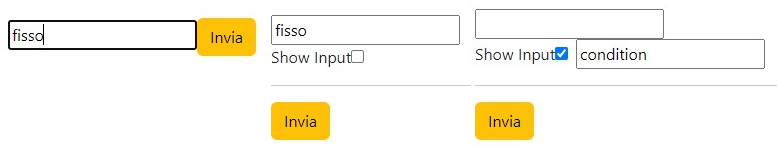
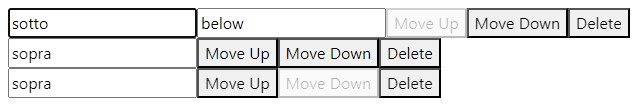

# FormArrays rules and sets

* [The useFieldArray() methods](formarrays-rules-and-sets.md#the-usefieldarray-methods)
* [The fieldArray inputs and values rules on useForm() render](formarrays-rules-and-sets.md#the-fieldarray-inputs-and-values-rules-on-useform-render)
* A[ fieldArray form with nested useForm() components.](formarrays-rules-and-sets.md#a-fieldarray-form-with-nested-useform-components)

The **useFieldArray** hook allows us to render and update inputs in a **dynamic** form, improving user experience and performance.

Its properties are:

> * **name**: The fieldArray name, it's used to set the fieldArray's **defaultValues** in **useForm().**
> * **control**: Its useForm() **control** property.
> * **shouldUnregister**: boolean; it indicates whether the elements of the fieldArray should be unregistered after unmounting. False by default.
> * **rules**: Its validation rules apply to the number of objects in the field array, rather than to the individual input values.

The **useFieldArray**() hook returns an array of input **fields** objects, each with a unique **ID**.                          In the DOM, we **map**() the fieldsArray, using its item.id as the container key attribute, and its properties to render the **inputs** of the current **index** item.



We render **index input errors** with a _**ternary operator**_ on the formState.errors or directly rendering its message by using _**optional chaining (?.)**_.

This approach avoids the 'Cannot read properties of undefined' error that returns on an empty errors object.//The rules errors can block submit and are found in at errors.\_arrayName\_.root

```jsx
//The rendered inputs names need to correspond to the defaultValues(if set)
const {register, control, formState: {errors}} = useForm({
  defaultValues: {
    basic: "primo", 
    domandad: [{primo: "valore", second: "self select"}]
  }
})

const {fields, append} = useFieldArray({
  control: control, name: "domandad",
  rules: { minLength: { value: 4, message: "Its too short" } }
})

<form>
  <input {...register("basic")} />

  <ul>
  {fields.map((item, index)=>{
    return(
      <li key={item.id}>
        <input {...register(`domandad.${index}.primo`,{required: "missing"})}/>
        <input {...register(`domandad.${index}.second`, 
          {minLength: {value: 10, message: "too shorty"}}) }
        />

        <p> { errors?.domandad?.[index]?.primo?.message } </p>
	<p> { errors.domandad&& errors.domandad[index]?.name.message } </p>
      </li>
    )
  })
  }
  </ul>

  <p> { errors.domandad?.root.message } </p>
</form>
```

The arrayFields **errors** property will be an array of error objects, with each error corresponding to its input based on its index.

```jsx
{domandad: Array(3)}
0: name: {type: 'required', message: 'Absent here', ref: input},
2: name: {type: 'required', message: 'Absent here', ref: input}
```

Any **useFieldsArray** method object will have to match the number and names of the fields.map() inputs.

```jsx
<button onClick={()=>{
  append({ primo: "new inputs values", second: "With same key names" })
}}>
  Added
</button>
```



A formArray **dynamic form** allows us to render any **input object**, without needing to hardcode the input names.

We **Object.keys()** a fieldArray **item** and return an array containing its **input name-value** pairs. After removing the 'id', we render each key with its corresponding field array index as the input name.

<pre class="language-jsx"><code class="lang-jsx">//The fieldArray errors render is still based on its index
<strong>//We set the &#x3C;input> defaultValue by extracting the item key input property.
</strong>&#x3C;ul>
  {fields.map((item, index) => {

    return (
      &#x3C;li key={item.id}>
      
        {Object.keys(item)  
          .filter((key) => ( key !== "id" ))
          .map((key) => (
          &#x3C;input
            key={key} // Use the key as the unique key for the input
            {...methods.register(`test.${index}.${key}`, {
              required: "The value is not here"
            })}
            defaultValue={item[key]}
          />
        ))}

        &#x3C;p>{errors?.duello?.[index]?.[key]?.message}&#x3C;/p>
      &#x3C;/li>
    );
  })}
&#x3C;/ul>
</code></pre>

It can receive different types of useFieldArray() input objects.

```jsx
<button onClick={() => append( {thirdo: "rendered"}) }>
  Any input object
</button>
```



The fieldArray inputs can be rendered using different **components**.

```jsx
//Remember the field._index_.name for the input name.
<Controller
  name={`test.${index}.lastName`}
  control={control}
  rules={{ required: "Name is required" }}
  render={({ field }) => (
    <input {...field} placeholder="Enter name" />
  )}
/>
```

### The useFieldArray() methods

The **fieldArray returns** include the **methods** to edit the rendered field object:

<details>

<summary>useFieldArray methods </summary>

* **append**: object. It adds a new input object at the end of the fieldArray.
* **remove**: index. It removes the fieldArray object with the index.
* **insert**: index, object. It adds the input object to the set fieldsArray index.
* **prepend**: object. It places the input object at the start of the fieldArray.
* **swap**: 2 index. It swaps the position of the 2 pre-existent input objects.&#x20;
* **move**: 2 index. It moves the index input position to the target position, moving the inbetween inputs by 1.&#x20;
* **update**: index, object. It updates the value of its specific index input object.&#x20;
* **replace**: object/array. It will replace the entire fieldArray, use an array for multiple input objects.

```jsx
//The methods will apply to the named fieldArray
const { append, prepend, insert, ... } = useFieldArray({
  control, name: "test"
});
```

</details>

```jsx
append( {trina: "catri"}, {})
remove(3)

//insert will fill the first index avaiable if no pre existent length
insert(2, {paguro: "newo"}, {})
prepend({ last: "foreva", every: "body" }, {})

//swap will create blank input objects for indexes exceeding the fields length.
swap(0, 5)
//If move uses non pre-existent indexes, it will create blank inputs to fill it.
move(0, 2)
//The update triggers a re render with its unmount and remount of the input object
update(1, {master: "duel", coco: "cola", sec: "sepa"})
replace( [{party: "basic", locro: "mais"}, {giravolta: "salti"}] )
```

All **useFieldArray()** methods focus the input indexes they apply to.                                                                   The **append**, **prepend**, and **insert** methods include optional properties, **shouldFocus** and **focusIndex**, which determine whether to focus its object index or a specific input object in the fieldArray.

```jsx
//The properties are contained in the method optional object property
<button onClick={()=>{insert(2, {paguro: "newo"}, {shouldFocus: false}) }} >
  inserto
</button>

<button onClick={()=>{prepend({ last: "foreva", every: "body" }, {focusIndex: 2}) }}>
  prependa
</button>
```

Do not stack useFieldArray **methods**; instead, we _useEffect()_ to **sequentially** trigger methods based on specific useState dependencies.

```jsx
//We set a condition for teh first render useEffect() trigger
const [doppio, setDoppio] = useState(0)

useEffect(() => {
  if (fields.length > 1) {
    remove(0); // Remove the first item after the component mounts, min 1 index
  }
  
}, [ doppio ]);

function mettiaggiunt(){
  append({ firstName: "aggiunto elemento", lastName: "rimosso"  })
  setDoppio((x)=> x + 1)
}
```

### The fieldArray inputs and values rules on useForm() render

The **fieldArray <**&#x69;nput> index can be used to conditionally render an input or dynamically modify the form based on the input's position.



A useFieldArray will automatically create its array even without defaultValues when input objects are added.

We **useWatch()** the **\<input>** index value as condition to render the specific \<input> property.   Any added input property will be returned by the **onSubmit** function, even if it is not rendered.                                                   The static form ensures that only one **conditional input** will be rendered at a time.

```jsx
//A dynamic form might re-renderinputs with the same name or returned value
//We destruct and pass the index and control as object properties 
//The handlesubmit can filter the un-rendered input properties.
const ConditionalInput = ({ control, index }) => {
  const value = useWatch({ name: "test", control });

  return (
    <Controller
      control={control} name={`test.${index}.firstName`}
      render={({ field }) =>
        value?.[index]?.checkbox === "on" ? <input {...field} /> : null
      }
    />
  );
};

const { handleSubmit, control, register } = useForm();
const { fields, append, prepend } = useFieldArray({
  control, name: "test"
});

function vediamo(dati){
  let test = dati.test.filter((ogge)=>( ogge.checkbox && ogge ))
}

return(
  <div>
  <form onSubmit={handleSubmit(vediamo)}>
  <input {...register("fisso")} />

  {fields.map((field, index) => {
    const id = `test.${index}.checkbox`;
    return (
      <div key={field.id}>
        <section>
          <label htmlFor={id}>Show Input</label>
          <input {...register(id)} type="checkbox" value="on" id={id} />
          <ConditionalInput {...{ control, index }} />
        </section>
        <hr />
      </div>
    );
  })}

    <input type="submit" className="btn btn-warning" />
  </form>
  
  <button onClick={ () => append({ firstName: "" }) }>
    append
  </button>
  </div>
)
```

<figure><figcaption><p>Conditional Input component with fieldArray methods</p></figcaption></figure>



In a fieldArray, we can use the current \<input> **index** to customize the **move** method or conditionally disable the input buttons.

```jsx
//We disable the first and last fieldArray elements form moving.
//We move each input forward or backwards by 1
const { register, handleSubmit, control} = useForm()

const {fields, append, prepend, remove, move} = useFieldArray({
  name: "campo", control
})

const handleMove = (fromIndex, toIndex) => {
  move(fromIndex, toIndex);
};

<form onSubmit={handleSubmit(vediamo)} className="m-5">
  {fields.map((item, index)=>{
    
    return(
      <div key={item.id}>
        {Object.keys(item)
          .filter((x)=> x !== "id" )
          .map((key, value)=>{

            return(
              <input 
                {...register( `campo.${index}.${key}` )}
                key={ key } defaultValue={ value }
              />
            )
          })
        }

        <button 
          onClick={() => handleMove(index, index - 1)} 
          disabled={index === 0}>
            Move Up
        </button>
        <button
          onClick={() => handleMove(index, index + 1)} 
          disabled={index === fields.length - 1}>
            Move Down
        </button>

        <button type="button" onClick={() => remove(index)}>
          Delete
        </button>
      </div>
    )
  })}
</form>
```

<figure><figcaption><p>Disabling buttons that can't be moved in the fieldsArray</p></figcaption></figure>



The fieldArray will **batch updates** during the component's re-render, and any functions that access it will retrieve the **last rendered form object**.

We create an object that merges the **fieldArray** with its **watch()** current values, allowing us to have the complete field values available.

```jsx
//The formArray will be avaiable on the onSubmit() event handler 
//We map() loop and update each fieldArray input object with the watch() 
function Noinput(){
  const { register, control, watch, formState } = useForm();
  const { fields, append, remove, move } = useFieldArray({
    control, name: "fieldArray"
  });

  const watchFieldArray = watch("fieldArray");
  const controlledFields = fields.map((field, index) => {
    return {
      ...field,
      ...watchFieldArray[index]
    };
  });
  //The current fieldArray inputs and values will be avaiable
  const passo = () => console.log(controlledFields);

  return(
    <form>
      <input {...register("primo")} />

      {fields.map((field, index) => {
        return <input key={field.id} {...register(`fieldArray.${index}.name`)} />; 
      })}

      <button onClick={() => append({ primo: "yet to", secondo: "be updated" })}>
        Double
      </button>
      
      <button onClick={() => passo()}>
        Access current firldArray values
      </button>
    </form>
  )
}
```

### A fieldArray form with nested useForm() components.

We render a **parent fieldArray** useForm() with a **nested useForm()** component.

The nested component \<Singular> will render and **register** the fieldArray i**nput objects**, and **onSubmit()** it will **update** the parent fieldArray, using the index and useFieldArray() update props

<details>

<summary>The useWatch() hook update on different useForm() control object properties</summary>

A custom hook (like **useWatch()**) will update based on the **useForm() structure** of its **control** property.

The parent useForm() will get updated based on its **fieldArray** structure, not its field values. The child useForm() registers the inputs, so its control will trigger the useWatch() on input change to return the current field values.

We use a ternary operator useWatch() name to specify the input index being watched, an undefined name would return the entire form, so we use a non-existent input name.

```jsx
//Parent fieldArray useForm(), will update only on re-render
function Diretto(){
  ...
  return(
    <div className="mb-5">
      ...
      {fields.map((item, index)=>{
        return(
          <div key={item.id}>
            <Singular 
              control={control} update={update}
              index={index} value={item}
            />
          </div>
        ) 
      })}
    </div>
  )
}

//Child useForm(), the useWatch() nestControl will trigger on input change
//The dot notation to access the array object
const Singular = ({ control, update, index, value }) => {
  const { register, handleSubmit, control: nestControl } = useForm({
    defaultValues: value
  })

  const data = useWatch({
    control: nestControl,
    name: index == 1 ? `secondName` : "none",
  });
  console.log( "Current value", data )

  //This can also access the field value, but only on fieldArray change.
  const data1 = useWatch({
    control,
    name: "valori.1.secondName"
  })
  console.log( "Current value on updated fieldArray", data1 )
  
  return(
    <div>
      <Risulta control={control} index={index}/>

      <input {...register("firstName", {required: "true"})}/>
      <input {...register("secondName", {required: "true"})}/>
      <label> Input checked:
        <input type="checkbox" {...register("working")}/>
      </label>
    </div>
  )
}
```

</details>

The third child component \<Risulta> will be **conditionally rendered** based on its index input **values**.             It will be re-rendered each time the **fieldArray** is updated due to the **useWatch() control** property.

```jsx
//On fieldArray update will return null if field value is empty
const Risulta = ({ control, index }) => {
  const data = useWatch({
    name: `valori.${index}`,control
  })

  if (!data?.firstName) return null;

  return(
    <div>
      <p> Updated: {data?.firstName} {data?.lastName} </p>
      <p>{Boolean(data?.working) && data?.working && "I am working."}</p>
    </div>
  )
}

//Any new fieldArray input object can be passed as a prop into a defaultValue.
//The update prop form useFieldArray() method updates the fieldArray
const Singular = ({ control, update, index, value }) => {
  const { register, handleSubmit, control: nestControl } = useForm({
    defaultValues: value
  })
  
  return(
    <div>
      <Risulta control={control} index={index}/>

      <input {...register("firstName", {required: "true"})}/>
      <input {...register("secondName", {required: "true"})}/>
      <label> Input checked:
        <input type="checkbox" {...register("working")}/>
      </label>

      <button type="button" onClick={handleSubmit((data)=>{update(index, data)})}>
        fieldArrayUpdate
      </button>
    </div>
  )
}

function Diretto(){
  const { register, handleSubmit, control } = useForm()
  const {fields, update, remove, append} = useFieldArray({
    name: "valori", control
  })

  const manda = (dati) => console.log( dati )

  return(
    <div>
      <form onSubmit={handleSubmit(manda)}>
        <input {...register("primo")} />

        {fields.map((item, index)=>{

          return(
            <div key={item.id}>
              <Singular 
                control={control} update={update}
                index={index} value={item}
              />

              <button type="button" onClick={()=>{ remove(index) }}> 
                delete 
              </button>
            </div>
          ) 
        })}

        <button onClick={()=>{ append({firstName: "", secondName: ""}) }}>
          primo 
        </button>

        <input type="submit" />
      </form>
    </div>
  )
}
```



Append and render fieldArray input object components


1
