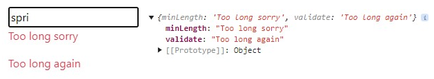

# Page

* 1
* 1
* 1
* 1
* 1

The **\<errorMessage>** is an imported component used to render an input formState error.

<pre class="language-jsx"><code class="lang-jsx"><strong>npm install @hookform/error-message
</strong>import { ErrorMessage } from "@hookform/error-message"
</code></pre>

Its **properties** are:

> * **name**: The input we render the errors from, required.
> * **errors**: The useForm() formState errors object.
> * **render**: The fucntion component that renders the error in the DOM.
> * **as**: alternative wrapper component for the error message.

It can render errors from external components and \<Controller/> inputs in the form.

```jsx
//We need the criteriaMode to render multiple errors
const {register, formState: {errors}}= useForm({ criteriaMode: "all" })

<form>
  <input {...methods.register("Terzo", {
    minLength: { value: 5, message: "too long sorry" },
    validate: (value)=>{ return (value.length>1) && "Too long again" }
  })} />

  <ErrorMessage errors={methods.formState.errors} name="Terzo" as="p" />        

  <ErrorMessage
    errors={methods.formState.errors} name="Terzo"
    render={({ message }) => <p className="text-warning">{message}</p>}
  />
</form>
```

<figure><figcaption><p>Multiple errors in &#x3C;ErrorMessage> input</p></figcaption></figure>

We iterate through **multiple error messages** using the **Object.entries()** method. Since the rendered elements are treated as a list, we extract the key argument to use as the key for each element.

```jsx
//The Objects.values() or .keys() would've returned key list error
//Object.entries() returns an array of [key, value] arrays, that's why we map([])
<ErrorMessage
  errors={methods.formState.errors} name="Terzo"
  render={({ messages }) => {
    return (messages &&
    Object.entries(messages).map(([type, message]) => (
      <p className="text-danger" key={type}>{message}</p>
    )) )
  }}
/> 
```

### The useWatch() method

The **useWatch()** custom hook subscribes to changes in the selected input, but unlike the watch() method, it **limits re-renders** to only the component in which it is declared.                                                                 On the first render, it returns the **defaultValues** provided to useForm().

The **useWatch()** properties are:

> * **name**: string/array. The input currently being watched.
> * **control**: The useForm() control object.
> * **defaultValue**: string/object. Once declared it replaces the useForm() defaultValues.
> * **disabled**: boolean. It disables the subscription to the watched input value.
> * **Exact**: boolean. If set default false, it will **trigger** the useWatch() for inputs that share the initial part of the name property (e.g., "primo222" for "primo"), but it will not **update** the value.

```jsx
//The returned array order depends on its name array order 
//useWatch() is reccomended for external input components
function Basic(){
  let {control, register, watch} = useFormContext()
  
  const watchsecond = useWatch({
    control, name: ["terzo", "secondo"],
    defaultValue: { secondo: "new value" }, disabled: !isWatching,
  })

  return(
    <div>
      <input {...register("secondo")} />
      <input {...register("secondo222")}/>
      <p> {watchsecond} </p>
    </div>
  )
}

const methods = useForm({
  defaultValues: { primo: "primo", secondo: "secondino" }
})

return( 
  <div>
    <FormProvider {...methods}>
      <form>
        <input {...methods.register("primo")} />
        <Basic />
        <input {...methods.register("terzo")}/>
      </form>
    </FormProvider>
  </div>
)
```

<details>

<summary>The watch() and useWatch() rules for external input components</summary>

The **useWatch()** hook method can trigger a form re-render that **unfocuses** the input onChange() event.

**useWatch**: If it is declared within the form component, about an input component.

**watch**:                                                                                                                                                              If set in an input component watching its own input.                                                                            If set in the form component about an input component.

In those intances, we need to render the input components **outside** the form component.

```jsx
//Example of external component, for useWatch()
function Secon(){
  let {control, register, watch} = useFormContext()
  
  return(
    <div> 
      <input {...register("secondo")} />
    </div>
  )
}

function Formcomp(){
  const methods = useForm()

  const watchsecond = useWatch({
    control, name: "secondo"
  })

  return( 
    <div>
      <FormProvider {...methods}>
        <form>
          <input {...methods.register("primo")} />
          <Secon />
        </form>
      </FormProvider>
    </div>
  )
}
```

</details>

1

1

1

1

1

1

1
