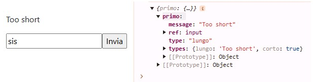
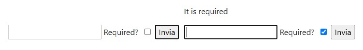

# React-hook-form 1: register, formState and watch.

* [The useForm() register function.](react-hook-form-1-register-formstate-and-watch..md#the-useform-register-function)
* [The formState useForm() object.](react-hook-form-1-register-formstate-and-watch..md#the-formstate-useform-object)
* [The useForm() watch method.](react-hook-form-1-register-formstate-and-watch..md#the-useform-watch-method)

The **React-Hook-Form** is a _form management library_ for React. It minimizes re-renders by leveraging the native **form validation API** and easily integrates with other UI libraries.                                                   It features a simple API structure through the **useForm() hook**, which offers methods for handling forms, it supports both synchronous and asynchronous validation, along with built-in error handling.

The **register()** method from the useForm() hook tracks each **input** name and value in the form state. On submit the **handleSubmit()** function will make the **form data** available to its callback function argument.

We manage multiple independent forms by creating different **instances** of the useForm() methods.

```jsx
npm install react-hook-form
import { useForm } from "react-hook-form"

//The inputs maintain their built-in attributes
const { register, handleSubmit } = useForm()
const { register: register1, handleSubmit: handleSubmit1} = useForm();

return(
  <div className="m-5">
    <form onSubmit={handleSubmit( ((data)=> console.log(data)) )}>
      <input {...register("prima")} />
      <input type="submit" />
    </form>

    <form onClick={handleSubmit1( ((data)=> console.log(data)) )}>
      <input {...register1("prima")} />
      <input type="submit" />
    </form>
  </div>
)
```

The **useForm() hook** configures the form behavior through its options object properties.

<details>

<summary>useForm() properties</summary>

<mark style="color:orange;">**mode**</mark>: it sets the event that triggers each input validation progress, it influences other properties that depend on validation, such as isValid.

<mark style="color:orange;">**reValidateMode**</mark>: It alters the validation triggers following a submission with errors, it specifies which events prompt the re-evaluation of input values and their associated errors.

<mark style="color:orange;">defaultValues</mark>: Its sets the initial values for each input field. if set to undefined it will conflict with the form state.

<mark style="color:orange;">values</mark>: Similar to defaultValues, it sets the initial values after the defaultValues and allows us to edit the field values outside the input change.

<mark style="color:orange;">errors</mark>: Similar to values, the errors prop allows us to set an initial error object, which can be updated independently of the input validation rules.

<mark style="color:orange;">resetOptions</mark>: It seems to only work on teh reset() option.

<mark style="color:orange;">criteriaMode</mark>: It determines how validation errors are handled; by default, only the **first error of each input** is recorded, but we can configure it to include all returned errors.

<mark style="color:orange;">shouldFocusError</mark>: By default it will focus on the input field that has an error. If set to false, it will not trigger any focus on errors. This feature works with inputs that have linked refs.

<mark style="color:orange;">delayError</mark>: It delays the rendering of errors returned by the inputs based on the validation trigger event

<mark style="color:orange;">shouldUnregister</mark>: It unregisters any unmounted input from the form state and overrides any similar configurations at the child level.

<mark style="color:orange;">shouldUseNativeValidation</mark>: Set to false by default, this option enables the browser's native validation and allows the use of the _:valid_ and _:invalid_ CSS pseudo-selectors.

<mark style="color:orange;">disable</mark>: It disables all input fields in the form and can be used to prevent user interaction during an asynchronous event.

<mark style="color:orange;">resolver</mark>: This function allows you to integrate any validation library with the useForm() validation process.

</details>

```jsx
//External values can be used on the useForm() props values
let [valori, setValori] = useState({})
let [sbagli, setSbagli] = useState({})

const {
  register, handleSubmit, formState: { errors, isValid },
} = useForm({
  mode: "onSubmit"            //onChange | onBlur | onTouched | all 
  reValidateMode: "onChange"  //onBlur | onSubmit = 'onChange'
  defaultValues: async () => {
    let prezzo = await fetch("https://api.coindesk.com/v1/bpi/currentprice.json")
    let risultato = await prezzo.json()

    return {
      primo: "unico",
      secondo: risultato.chartName
    }
  },
  criteriaMode. "firstError"	// "all"
  values: valori,
  errors: sbagli,
  criteriaMode: "firstError"	//"all"
  shouldFocusError: true,
  delayError: 0,
  shouldUnregister: true,
  disable: false
})
```

We edit useForm() properties using their assigned state values.

```jsx
//Destruct the actual errors object and not the returned state
<button onClick={()=> setValori(()=> ({primo: "new", secondo: "values"}) )}>
  Set input values
</button>

<button onClick={()=> setSbagli((erro)=> ({...errors, secondo: "new error"}))>
  Add error
</button>
```

### The useForm() register function

The **register()** function, returned by **useForm()**, registers a field into the form state.                                   It returns an object that, when destructured within an \<input> element, provides all the necessary **props** and **event handlers** from the useForm() hook.                                                                                            The input's **name** is used as an argument for the **register** function to link the input to the form state. We can also include a configuration **options objec**t as an argument to the register function.

The **register()** function can be destructured outside of the input tag.                                                              Any function returned by the register event handler needs to be called on each native input event to ensure that the updated values are available in the form state.

```jsx
//The input needs the same name and ref as the destructed register 
const { register, handleSubmit } = useForm()
const {onChange: cambio, ref: ref2} = register("secondo")

function doppio(event){
  //custom and original onChange
  console.log(event.target.value) 
  cambio(event)
}

const valori = (data) => {console.log(data)}

<form onSubmit={handleSubmit(valori)}>
  <input {...register("primo", {onChange: ()=>{console.log("pressed")} })}/>
  <input name="secondo" ref={ref2} onChange={doppio}/>
  <input type="submit" />
</form> 
```

By using specific naming conventions, we can create **object structures** based on the input **names**.

```jsx
//If a number is used, it will be treated as an element of an array.
<form>
  <input {...register("primo.uno")}/>
  <input {...register("secondo.2")}/>
<form/>

{ primo: {uno: "valore"}, secondo: [, , "valore"] }
```

The register options object includes all **built-in** validation rules.                                                                             The **onBlur()** event handler triggers each time the user focuses away from the input.

```jsx
//Use the useForm() value prop to set input values
//We can return strings with the built in validation rules.
const [luce, setLuce] = useState(0)

<input {...register("primo", {
  required: {
    value: true, 
    message: "The input is empty"
  }, 
  minLength: 5, maxLength: 10, pattern: /^[a-zA-Z]+$/,
  value: luce,
  onBlur: (event) => {
    console.log("Past input:", event.target.value);
  },
})}/>
```

The **valueAsNumber** and **valueAsDate** properties will **parse** the input data into their respective types.  Any input value in the form data is a **string**, regardless of the input **type** attribute. If the input values cannot be parsed, it will return **NaN**.                                                                                                                     The **type** attribute in the input element controls the allowed input types and interactions within the **browser**, preventing the entry of other types of input, but it still returns **strings** to the js.

The **shouldUnregister** prop applies to the single input upon unmounting.                                                     The **disabled** prop results in undefined for the input values. To avoid this, we can use the _placeholder_ attribute on the input.

```jsx
//do not use shouldUnregister with useFieldArray due to execution order
//Use readOnly or disabled fieldset to return values from disabled inputs
<form>
  <input type="number/date" {...register("primo", {
    shouldUnregister: false, //true 
    valueAsNumber: true, valueAsDate: true,
  })} />
  <input {...register("secondo")} readOnly placeholder="not changeable value"/>
  <fieldset disabled>
    <input {...register("terzo")} placeholder="First Name" />
  </fieldset>
  <input type="submit" />
</form>
```

The **setValueAs** prop modifies the input value before the validation process. It is ignored if the valueAsNumber or valueAsDate are present.

The **validate** property contains the validation rule functions.                                                                          You can validate using either a **single** callback function or an **object** with multiple function properties. Any returned strings will be added to the error object under the types property. You can return false to indicate a validation error. The validate property supports asynchronous functions for validation.



The setValueAs edited input can skip some validate property functions.

```jsx
//Use criteriaMode: "all" on useForm() to return multiple errors
<form>
  <input {...register("primo", {
    setValueAs: (value) => ( value + "/api.com" )
    validate: {
      lungo: (value) => value.length < 5 && "Too short",
      corto: v => v.length < 10 && false
    } 
  })} />
</form>
```



We can use the **async** fetch response on the validate process.

```jsx
//We add teh validate property to the separated register()
const {
  register, handleSubmit,
  formState: { errors, isValid, isDirty },
} = useForm();

const { ref } = register("primo", {
  validate: async (value)=>{
    const response = await fetch('https://catfact.ninja/fact', {
      method: 'GET',
      headers: { 'Content-Type': 'application/json' },
    });

    let result = await response.json()

    if( response.ok ){
      console.log("Both ok and value.length for error")
      if(value.length> 5){
        return "Beyond we are"
      }
    }
  }
});

<form>
  <input name="primo" ref={ref} />
</form>
```



<figure><figcaption><p>Returned true error value on returned false validation</p></figcaption></figure>

We can modify the properties of a registered input option by **re-declaring** the **register()** function with the input's name.

```jsx
//It can be declared as a result of any event.
function cambio(event){
  event.target.checked ?? register('primo',{ required: true }) : register('primo');
}

<form>
  <p> {errors.primo && "It is required"} </p>

  <input {...register("primo")} /> <span> Required? </span>
  <input {...register("check", { onChange: (e)=> (cambio(e)) } )} type="checkbox" />
</form>
```

<figure><figcaption><p>A changed register() on checkbox event</p></figcaption></figure>

The **unregister()** method will manually remove an unmounted input from the form state. And any validation rules associated with the unregistered input will be removed. Its options props are [here](https://react-hook-form.com/docs/useform/unregister).

```jsx
//It aplies to the input name, instead of using shouldUnregister prop
//If just un-registered the input will be re-registered on render
const [vede, setVede] = useState(true)

function togli(){
  setVede(false); unregister("primo.uno")
}

<form>
  <button onClick={togli}> Un-register </button>
  {vede && <input {...register("primo.uno")} />}
</form>
```

### The formState useForm() object.

The returned **formState** object contains information about the form, it allows you to track user interactions, validation status, and any errors that may occur during form submission.

```jsx
//We can create instances of the formState properties
const { register, formState: { isDirty } } = useForm();
const { register: register1, formState: { isDirty: isDirty1 } } = useForm();
```

<details>

<summary>List of formState properties</summary>

The properties of the useForm(), like **defaultValues** and **mode**, affect how the formState properties behave.

* **isDirty**: boolean for the entire form, true if any value is changed from its defaultValues.
* **dirtyFields**: {inputName: boolean}, returns an object with the inputs that have been changed.
* **touchedFields**: like dirtyFields, it returns true for any interaction the user had with the input.
* **defaultValues**: returns the useForm() returnValues.
* **isSubmitted**: boolean, true after any submit event, even if blocked by errors.
* **isSubmittedSuccessfull**: boolean, true only for complete submit events
* **submitCount**: integer, counts even unsuccessful submits.
* **errors**: object, gets updated by the built-in and validate input rules.
* **isValid**: boolean, updated in real time, returns true if all input validations are passed.
* **isValidating**: boolean, Depending on the validation mode set in useForm(), it returns true at the start of the validation process and false after the event is completed.
* **validatingFields**: {inputName: boolean}, returns an object with the inputs being validated.
* **isLoading**: boolean, returns true when the defaultValues, if async, is being set.

</details>

The **formState** properties are updated in batches, meaning they are held and do not trigger a re-render until all updates are processed. Therefore, when subscribing to formState properties through useEffect, we need to include the entire formState as a dependency for the effect to work correctly.

```jsx
//We need to repeat formState, if we destruct properties form it
const { register, handleSubmit, formState,
  formState: { 
    isDirty, dirtyFields, touchedFields, defaultValues, isLoading,
    isSubmitted, isSubmitSuccessful, submitCount,
    isValid, isValidating, validatingFields, errors, disabled
  }
} = useForm({mode: "onblur"})

useEffect(() => {
  /* Triggered formState property */
  console.log( "On validation event", formState.validatingFields )
},[formState]);

<form onSubmit={handleSubmit(valori)}>
  <p> {errors.terzo && "It is required"} </p>

  <input {...register("primo", { required: true, 
    validate: (value)=>{                    
      if(value.length > 5){
        return "Failed triggered validate event"
      }
    }
  })}/>
</form>
```

### The useForm() watch method.

The useForm() **watch** method _subscribes_ to changes in the specified registered input.                                It triggers a re-render whenever the input value is updated. It can include a **defaultValue** as its second **argument**, which sets the initial value of the watched input.

```jsx
//The defaultValue watch will be updated with the useForm() defaultValue
const {register, handleSubmit, watch} = useForm({
  defaultValues: { secondo: "seconded value" }
})

let seco = watch("secondo", "prime value")
let vedi = () => console.log( seco )  //"prime value" , "seconded value"

<form> <input {...register("secondo")}/> </form>

//We can create mutiple watch variables
let [sec, tez] = watch(["secondo", "terzo"])  //"secondo" , "terzo"
let ultimi = watch(["secondo", "terzo"])      //["secondo", "terzo"]
let tutto= watch() 			      //{} containig the entire form.
```

In the **useEffect()** hook, we can monitor the form values without triggering a re-render by using the extracted **unsubscribe** method during the cleanup function.

```jsx
//We destruct the callback function arguments
let sottoprimo = watch((value, { name, type }) => {
  console.log( value )
})

useEffect(() => {
  const { unsubscribe } = watch(({secondo}) => {
    if( secondo ){
      console.log(secondo)
    }
  })
  return () => unsubscribe()
}, [watch])
```

For a detailed explanation of how and when `watch` and `useWatch` cause form components to **re-render**, refer to [this page](page.md#the-watch-and-usewatch-rules-for-external-input-components).
