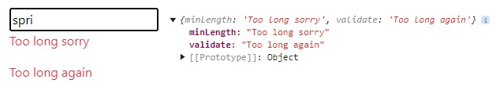

# The \<errorMessage> component, useWatch() hook and multi-page funnel useForm().

* [The useWatch() method.](the-less-than-errormessage-greater-than-component-usewatch-hook-and-multi-page-funnel-useform-..md#the-usewatch-method)
* 1
* 1
* 1

The **\<errorMessage>** is an imported component used to render an input formState error.

<pre class="language-jsx"><code class="lang-jsx"><strong>npm install @hookform/error-message
</strong>import { ErrorMessage } from "@hookform/error-message"
</code></pre>

Its **properties** are:

> * **name**: The input we render the errors from, required.
> * **errors**: The useForm() formState errors object.
> * **render**: The fucntion component that renders the error in the DOM.
> * **as**: alternative wrapper component for the error message.

It can render errors from external components and \<Controller/> inputs in the form.

```jsx
//We need the criteriaMode to render multiple errors
const {register, formState: {errors}}= useForm({ criteriaMode: "all" })

<form>
  <input {...methods.register("Terzo", {
    minLength: { value: 5, message: "too long sorry" },
    validate: (value)=>{ return (value.length>1) && "Too long again" }
  })} />

  <ErrorMessage errors={methods.formState.errors} name="Terzo" as="p" />        

  <ErrorMessage
    errors={methods.formState.errors} name="Terzo"
    render={({ message }) => <p className="text-warning">{message}</p>}
  />
</form>
```

<figure><figcaption><p>Multiple errors in &#x3C;ErrorMessage> input</p></figcaption></figure>

We iterate through **multiple error messages** using the **Object.entries()** method. Since the rendered elements are treated as a list, we extract the key argument to use as the key for each element.

```jsx
//The Objects.values() or .keys() would've returned key list error
//Object.entries() returns an array of [key, value] arrays, that's why we map([])
<ErrorMessage
  errors={methods.formState.errors} name="Terzo"
  render={({ messages }) => {
    return (messages &&
    Object.entries(messages).map(([type, message]) => (
      <p className="text-danger" key={type}>{message}</p>
    )) )
  }}
/> 
```

### The useWatch() method

The **useWatch()** custom hook subscribes to changes in the selected input, but unlike the watch() method, it **limits re-renders** to only the component in which it is declared.                                                                 On the first render, it returns the **defaultValues** provided to useForm().

The **useWatch()** properties are:

> * **name**: string/array. The input currently being watched.
> * **control**: The useForm() control object.
> * **defaultValue**: string/object. Once declared it replaces the useForm() defaultValues.
> * **disabled**: boolean. It disables the subscription to the watched input value.
> * **Exact**: boolean. If set default false, it will **trigger** the useWatch() for inputs that share the initial part of the name property (e.g., "primo222" for "primo"), but it will not **update** the value.

```jsx
//The returned array order depends on its name array order 
//useWatch() is reccomended for external input components
function Basic(){
  let {control, register, watch} = useFormContext()
  
  const watchsecond = useWatch({
    control, name: ["terzo", "secondo"],
    defaultValue: { secondo: "new value" }, disabled: !isWatching,
  })

  return(
    <div>
      <input {...register("secondo")} />
      <input {...register("secondo222")}/>
      <p> {watchsecond} </p>
    </div>
  )
}

const methods = useForm({
  defaultValues: { primo: "primo", secondo: "secondino" }
})

return( 
  <div>
    <FormProvider {...methods}>
      <form>
        <input {...methods.register("primo")} />
        <Basic />
        <input {...methods.register("terzo")}/>
      </form>
    </FormProvider>
  </div>
)
```

<details>

<summary>The watch() and useWatch() rules for external input components</summary>

The **useWatch()** hook method can trigger a form re-render that **unfocuses** the input onChange() event.

**useWatch**: If it is declared within the form component, about an input component.

**watch**:                                                                                                                                                              If set in an input component watching its own input.                                                                            If set in the form component about an input component.

In those intances, we need to render the input components **outside** the form component.

```jsx
//Example of external component, for useWatch()
function Secon(){
  let {control, register, watch} = useFormContext()
  
  return(
    <div> 
      <input {...register("secondo")} />
    </div>
  )
}

function Formcomp(){
  const methods = useForm()

  const watchsecond = useWatch({
    control, name: "secondo"
  })

  return( 
    <div>
      <FormProvider {...methods}>
        <form>
          <input {...methods.register("primo")} />
          <Secon />
        </form>
      </FormProvider>
    </div>
  )
}
```

</details>

### Multi-Step Form with local-state-machine

A funnel, or **wizard form**, **segments** a complex form among **multiple** pages.                                                      The [**local-state-machine**](https://github.com/beekai-oss/little-state-machine) library manages the form state in **sessionStorage**, providing **context** across all funnel pages.

The **createStore()** method initializes the form data in sessionStorage. It accepts two object arguments: one for the initial **default values** of the form state, and another for its **configuration properties**.

> **name**: string. Sets the name of the sessionStorage state object. Defaults to \_\__LSM\_\__.&#x20;
>
> **middlewares**: array of functions. Contains functions that wil execute after useStateMachine() functions. They won't trigger if the sessionStorage state is modified externally.

```jsx
//The log functions don't return anything.
//The sessionStorage state needs to be action updated before being visible
npm install little-state-machine
import { createStore } from "little-state-machine";

function log(store) {
  console.log("before or after the result?: ", store);
  return ;
}

createStore({
  default: 'siamo messi', value: 'male'
}, {
  name: "elementi", middleWares: [ log ]
});
```

Each component within the form funnel needs to call the **useStateMachine()** custom hook.                 The useStateMachine() returns its current form **state** and an **action** object containing the functions declared in the hook, which are used to interact with the shared form **context**.

**Action** functions can be triggered within any event handler. On form submit, they update the current state using the form data as the **payload**.

```jsx
//Update merges the current state and the payload destructed objects
//Return null will trigger error if a state value is used in the form
import { useNavigate } from "react-router-dom";
import { useStateMachine} from "little-state-machine";

function updateAction = (state, payload) => ( {...state, ...payload} )
function deleteAction = (state) => ({}) //or ()

//We onSubmit() navigate to the next funnel form, with updated data.
const { register, handleSubmit } = useForm();
const { state, actions } = useStateMachine({ updateAction, deleteAction });
let viaggio = useNavigate()

const delete = () => actions.deleteAction()

function nextform(data){
  action.updateAction(data)
  viaggio( "funnel" )
}

<form onSubmit={handleSubmit(nextform)}>
  ...<input/>
  <input type="submit" />
  <button onClick={()=>{actions.updateAction()}}> Alternative update </button>
</form>
```

We can use the sessionStorage's methods to remove state objects.

```jsx
//Provided by the browser's Web Storage API,
//Won't trigger logs functions nor errors if state is used in the form
sessionStorage.removeItem("__LSM__")	//the defaulName has 2 _
sessionStorage.clear()
```

The updated **state** value persists across navigation, it can be used as the input's defaultValue, allowing users to retain their previous input values.

```jsx
//If state becomes null it returns error
<form>
  <input {...register("firstName")} defaultValue={state.firstName} />
  <input {...register("lastName")} defaultValue={state.lastName} />
</form>
```

The **\<StateMachineProvider/>** makes the state context available to all components rendered within the React Router.

```jsx
//The createStore() needs to be set in the same file as its StateMachineProvider
import {StateMachineProvider, createStore} from "little-state-machine";
createStore({}, {});

function Final() {
  return (
    <StateMachineProvider>
      <Routes>
        <Route path="/" element={<Primo />} />
        <Route path="/avanti" element={<Secondo />}/>
        <Route path="/avanti/funnel" element={<Finalizza />}/>
      </Routes>
    </StateMachineProvider>
  );
}
```

If createStorage() contains **nested objects**, you need to destructure them within the update function to correctly modify their values.

```jsx
//We can choose where to locate the payload data
createStore({
  unchanged: {metro: "booming"},
  primo: 'siamo messi'
});

function updateAction(state, payload) {
  return {
    ...state, 
    unchanged: {
      ...state.unchanged,
      ...payload
    }
  };
}
```


Funnel JS example

