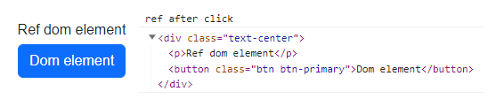
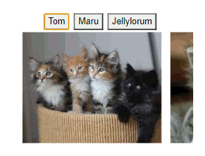

# REACT 4, useMemo(), useReducer(), ReactJs scaling and useRef(()=>{}) Dom manipulation.

* 1
* 1
* 1

**useMemo(**function, dependencies**)** is a React Hook that **caches** the **return value** of a function _between re-renders_.

```jsx
const memoized = useMemo(
  () => memoize(depend),
  [depend]
);
```

A useMemo() function will be **re-called** only if one of its **dependencies** changes.

<details>

<summary>useMemo() render example</summary>

We import an array of objects as a prop with 2 useState().

```jsx
import TodoList from './components/Externals';

import { createTodos } from './components/External1';
const todos = createTodos();

const [tab, setTab] = useState('all');
const [isDark, setIsDark] = useState(false);

<div>
  <button onClick={() => setTab('all')} />
  <button  onClick={() => setTab('active')} />
  <button onClick={() => setTab('completed')} />
</div>

<input
  type="checkbox"
  checked={isDark}
  onChange={e => setIsDark(e.target.checked)}
/>

<TodoList
  todos={todos}
  tab={tab}
  theme={isDark ? 'bg-warning' : 'bg-success text-white'}
/>

```

We **useMemo()** a slow imported function using 2 props, any _theme_ useState() changes will **re-render** the parent component but **won't re-call** the useMemo() function.

<pre class="language-jsx"><code class="lang-jsx">import { filterTodos } from './External1'

function Todolist({ todos, theme, tab }) {

<strong>  const visibleTodos = useMemo(
</strong>    () => filterTodos(todos, tab),
    [todos, tab]
  );

  return (
    &#x3C;div className={theme}>
      &#x3C;p>Note: filterTodos is artificially slowed down!&#x3C;/p>
      &#x3C;ul>
        {visibleTodos.map(todo => (
          &#x3C;li key={todo.id}>
            {todo.completed ?
              &#x3C;s>{todo.text}&#x3C;/s> :
              todo.text
            }
          &#x3C;/li>
        ))}
      &#x3C;/ul>
    &#x3C;/div>
  );
}
</code></pre>

The useMemo() function is a delayed function that filters the array object to be rendered

```jsx
export function filterTodos(todos, tab) {

  let startTime = performance.now();
  
  while (performance.now() - startTime < 500) {
    // Do nothing for 500 ms to emulate extremely slow code
  }

  return todos.filter(todo => {
    if (tab === 'all') {
      return true;
    } else if (tab === 'active') {
      return !todo.completed;
    } else if (tab === 'completed') {
      return todo.completed;
    }
  });
}
```

</details>

<figure><figcaption><p>slow button useMemo() change and fast checkbox</p></figcaption></figure>

### The useRef() React Hook

The **useRef()** lets us reference a value that’s not needed for rendering

```jsx
//It returns an object with a single property .current

const valref = useRef(0);
valref.current == 0
```

Contrary to **useState()**, **useRef()** changes _won't re-render_ the page and its new value will be **immediately available** between different functions (unlike useState() which has to render it first).

<details>

<summary>Difference in updating useRef() and useState()</summary>

In this example, we show the useRef() value using a handler function.

```jsx
let ref = useRef(0);
const [ refe, setRefe ] = useState(0) 

console.log("gets re-called only with useState")

function handleClick() {
  ref.current = ref.current + 1;
  alert('After click useRef() is ' + ref.current);
}

function altroClick(){
  setRefe((x)=> x + 1)
  alert("After click useState() is " + refe)
}

<div>
  <button onClick={handleClick}>
    The useRef()
  </button>
  <button onClick={altroClick}>
    the useState()
  </button>
  <button onClick={separate}>
    Calling both
  </button>
</div>
```

</details>

<figure><figcaption><p>Returned useRef() and useState() values</p></figcaption></figure>

**useRef()** is stored in React and won't need any setter function because it always _returns the same object._

**useRef()** is used to communicate with external API, timeID variables, and DOM manipulation, if rendered It won't update its value.

```jsx
//Don't relay too much logic on useRef() and remember to use its .current property 

timeoutID.current = setTimeout(() => {
  alert("Sent!");
}, 3000);

clearTimeout(timeoutID.current);
```

On inputs, you can render the **useState()** input AND a **useRef()**.current value.

```jsx
//In case we need an instant input value for javascript functions

value={e.target.value}
onChange={(e) => {
  setText(e.target.value);
  reffe.current = e.target.value;
}}
```

Don't **useRef()** on a **javascript expression**, its value won't update.

```jsx
/This won't work, useSatte() instead
const isOnRef = useRef(false);

<button>
  {isOnRef.current ? 'On': 'Off'}
</button>
```

The same **useRef()** created inside **repeated components** won't interfere with each other.

<details>

<summary>Indipendent useRef() on repeated components and debounced buttons</summary>

An useRef() can't be initialized inside a normal function, only on a component.

```jsx
//And if we initialize it outside it will return only the last trigger
let mia = useRef(null)

function chiama(alerta){
  clearTimeout(mia.current)
  mia.current = setTimeout(() => {
    alert(alerta)    //useRef() will be re-set on each click
  }, 1000)
}

<button onClick={()=> chiama("Primo avviso")}>
  Alerta1
</button>

<button onClick={()=> chiama("Secondo avviso credo")}>
  Alerta due
</button>
```

_Multiple components_ can **useRef()** independently from each other.

```jsx
//multiple buttons for multiple different timeout() alerts

function DebouncedButton({ chiama, children }) {
  const timeoutRef = useRef(null);

  return (
    <button
      onClick={() => {
        clearTimeout(timeoutRef.current);
        timeoutRef.current = setTimeout(() => {
          chiama();    //launch / boiled alerts
        }, 1000);
      }}
    >
      {children}
    </button>
  )
}

<DebouncedButton onlick={() => alert("launch")}>
  Launch the spaceship
</DebouncedButton>
<DebouncedButton onlick={() => alert("boiled")}>
  Boil the soup
</DebouncedButton>
```

We clearTimeout() onClick() to **debounce** the button, to start its timeout() only after the button stops being clicked.

</details>

### useRef() callback function and DOM manipulation

We **useRef()** to access the React Node **JSX** elements.

```jsx
//To access the ref data we use event handlers, we can also use Browser API methods
let pink = useRef()

function handle(){
  console.log("ref after click")
  pink.current.focus();
  console.log( pink.current )
}

<div ref={pink}>
  <p>Ref element</p>

  <button onClick={refer}>
    Access Dom ref
  </button>
</div>
//You need useEffect(()=>{}, []) To access it onLoad() if not you get current:null
```

<figure><figcaption><p>Accessing a JSX Node element</p></figcaption></figure>

The **ref attribute** can contain a **callback function**, it uses the DOM as an _argument_, and it triggers on _render_.

<pre class="language-jsx"><code class="lang-jsx">//On re-render it uses null on its argument and then re-calls its callback function.
//Other ref changes won't have any effects
let doll= useRef(0)
const [malon, setMalon] = useState(0)

function cliccato(){
  doll.current = doll.current + 1 
  console.log( "ref: " + doll.current )
}

//The callback function ref doesn't need to be useRef() set
<a data-footnote-ref href="#user-content-fn-1">&#x3C;div ref={(node) => console.log(node)}></a>  
  &#x3C;p>We have it&#x3C;/p>
  &#x3C;button className='btn btn-primary' onClick={()=> cliccato()}>Reff&#x3C;/button>

  &#x3C;p>{malon}&#x3C;/p>
  &#x3C;button className="btn btn-warning" onClick={()=> setMalon((e)=> e+1 )}>
    State
  &#x3C;/button>
&#x3C;/div>
</code></pre>

<figure><figcaption><p>Callback function on useState() render</p></figcaption></figure>

The callback function **ref argument** can fill an **useRef() array.**&#x20;

```jsx
//Instead of using querySelectorAll()
let refArray = useRef([])

<div ref={(ref) => (refArray.current[0] = ref)}> Zero </div>
<div ref={(ref) => (refArray.current[1] = ref)}> Uno </div>
<div ref={(ref) => (refArray.current[2] = ref)}> Due </div>
```

The **ref attribute** can't be assigned to Node elements on loops or javascript expressions.

```jsx
//Any React hook has to be on a component

{items.map((item) => {
  const ref = useRef(null);
  return <li ref={ref} />;
})}
```

We create a Map object of Node elements using ref callback function.

<details>

<summary>ref callback function on looped Node elements</summary>

We create an array of 20 image objects and a getMap() function for the **ref.**

```jsx
const catList = [];

for (let i = 0; i < 10; i++) {
  catList.push({
    id: i,
    imageUrl: 'https://placekitten.com/250/200?image=' + i
  });
}

//We set ref with a Map object once
const itemsRef = useRef(null);
function getMap() {
  if (!itemsRef.current) {
    itemsRef.current = new Map();
  }
  return itemsRef.current;
}
```

We use Node IDs from the **ref map object** and the map.get() for the **scrollIntoView()** method.

```jsx
function scrollToId(itemId) {
  const map = getMap();
  
  const node = map.get(itemId);
  node.scrollIntoView({
    behavior: 'smooth',
    block: 'nearest',
    inline: 'center'
  });
}

<nav>
  <button onClick={() => scrollToId(0)}>
    Tom
  </button>
  <button onClick={() => scrollToId(5)}>
    Maru
  </button>
  <button onClick={() => scrollToId(9)}>
    Jellylorum
  </button>
</nav>
```

We use a new **ref callback function** to loop through each rendered **\<li>** element, and we set the ref map object with key/value pairs of Images **ID** and **Node element**.

```jsx
//We render with map() but set the ref separately and push node elements

<div>
  <ul>
    {catList.map(cat => (
      <li
        key={cat.id}
        ref={(node) => {
          const map = getMap();

          if (node) {
            map.set(cat.id, node);
          } else {
            map.delete(cat.id);
          }
        }}
      >
        
      </li>
    ))}
  </ul>
</div>
```

</details>

<figure><figcaption></figcaption></figure>

We can't pass a **children ref** from its parent component.

```jsx
//Will return the error "function components cannot be given refs"

function MyInput(props) {
  return <input {...props} />;
}

<MyInput ref={inputRef} />
```

The Js querySelector() works in ReactJs, but it's better to use the **useRef()** hook on <mark style="background-color:blue;">DOM elements.</mark>

Its mutable reference values persist and can be updated at any time without affecting component output or triggering **re-renders**.



A **parent** component can pass a **useRef()** hook to a **children** component as a **prop**, allowing the parent to access the updated DOM value from the children.

```jsx
//The ref is avaiable only onEffect() after the DOM renders
let passed = useRef(null)  

useEffect(()=>{
  console.log( passed.current )
}, [])

<div>
  <Navbar passed={passed} />
  <Home passed={passed} />
</div>
```



We can access and modify the DOM useRef() from both the parent and sibling components.

```jsx
//Navbar.js
function Navbar({passed}){
  const inputRef = passed;

  return(
    <div ref={inputRef} className="naviga">
      ...
    </div>
  )
}

//Home.js
function Home({passed}){
	
  useEffect(()=>{
    console.log( passed.current )
  })
}
```



We use <mark style="background-color:blue;">React.useImperativeHandle</mark> to _customize_ the **current** value of a **useRef()** object and expose methods to its parent component.&#x20;

These **methods** can return other useRef() or useState() values, allowing us to create an interface for editing the useRef() object from the parent component.



If the useRef() value gets updated on the children components, an event is needed to access it.

```jsx
//conti.current won't trigger an useEffect() re-render
//but the updated values are accessible on event.
function App(){
  let conti = useRef(null)

  return (
    <div>
      <button onClick={()=> console.log( conti.current.refe() )}>
        Access
      </button>
    
      <Primo conti={conti}/>
      <Secondo conti={conti} />
    </div>
  );
}
```

If you need more data to be shared between components check [scale-up ReactJs](usereducer-and-scale-up-reactjs-with-usecontext.md).



Even if set in a useRef() object both useRef() and **useState()** follow their own render rules.

```jsx
//The useState() updated no matter the component where the method is called
//The callback fucntion doesn't pass any value 
function Primo({conti}){
  let [numba, setNumba] = useState(0)
  let numbaref = useRef(0) 

  let primate = useRef(null)

  React.useImperativeHandle(conti, () => ({
    current: primate.current,
    changer: () => {
      setNumba((x)=> ( x+1 ))
      numbaref.current += 1
    },
    stato: () => {
      return numba
    },
    refe: ()=>{
      return numbaref.current
    }

  }));

  return(
    <div>
      <p ref={primate}> passed DOM element </p>
      <p> {numba} </p>
    </div>
  )
}
```



Any **React.useImperativeHandle** useState(), passed as a prop from the sibling component, wil**l** have a delayed value. We need a local useState() updated with ref.current values.

```jsx
//The conti prop starts at null, so we conditionally render it on page mount

function Secondo({conti}){
  let [stato2, setStato2] = useState(0)

  return(
    <div>
      <p>Altrimenti si arrabbiano dopppio </p>
      <button onClick={() => { 
          conti.current.changer(); 
          console.log( conti.current.stato());
          console.log( conti.current.refe() )
          setStato2( conti.current.refe() )
        }}>
        Test the state { conti.current ? conti.current.stato() : 0}
      </button>
      <p>{ stato2 }</p>

    </div>
  )
}
```



The **forwardRef() API** opts for receiving the rep prop as the second argument into the child component.

```jsx
//We import forwardRef from "react", now we can call the child ref.current

const MyInput = forwardRef((props, ref) => {
  return <input {...props} ref={ref} />;
});

function handleClick() {
  console.log( inputRef.current )
  inputRef.current.focus();
}

<MyInput ref={inputRef} />
```

Each **React update** includes a **render** (when it calls its function components) and a **commit** (where it applies the changes).

**Ref** isn't defined during the first **render** and will be null when no Node has been created yet.                    **During commit ref** is first set to null and then gets **updated** with the Node DOM element.

**Updating** a **DOM element** won't immediately update its **ref Node** element, DOM methods won't have the updated ref value either.

We use a **flushSynch()** call to wrap the **update DOM function**, so both can update synchronously.

```jsx
//React DOM updates are queued, flushSynch() updates the ref before for the render
import { flushSync } from 'react-dom';

flushSync(()=>{
  setTodos([ ...todos, newTodo]);
})

listRef.current.lastChild.scrollIntoView({
  behavior: 'smooth',
  block: 'nearest'
});

<ul ref={listRef} >
  {todos.map(todo => ... }
</ul>
```

<details>

<summary>FlushSynch() to scrollIntoView of updated DOM list</summary>

We set an array of objects, the **ref** for the **\<ul>** node, and the \<ul> and input useState().

```jsx
//We trigger the loop once without functions()
let nextId = 0;
let initialTodos = [];

for (let i = 0; i < 20; i++) {
  initialTodos.push({
    id: nextId++,
    text: 'Todo #' + (i + 1)
  });
}

const listRef = useRef(null);
const [text, setText] = useState('');
const [todos, setTodos] = useState(
  initialTodos
);
```

We render the array as **\<li>** elements, the **ref** is set on the **\<ul>** but we can access its children using ref property **.children** and **.childNode**.

```jsx
<button onClick={handleAdd}>
  Ultimo
</button>
<input
  value={text}
  onChange={e => setText(e.target.value)}
/>

<ul ref={listRef}>
  {todos.map(todo => (
    <li key={todo.id}>{todo.text}</li>
  ))}
</ul>
```

On input, we create a new object to push to the \<ul> DOM.

Without **flushSync()** the **ref** DOM method would have scrolled at #20, instead of the new element.

```jsx
function handleAdd() {
  const newTodo = { id: nextId++, text: text };
  setText('');

  flushSync(()=>{
    setTodos([ ...todos, newTodo]);   // listRef.current.children/childNodes
  })

  listRef.current.lastChild.scrollIntoView({
    behavior: 'smooth',
    block: 'nearest'
  });
}
```

</details>

<figure><figcaption><p>Scroll onClick() without and then with Flushsynch()</p></figcaption></figure>

**ref** shouldn't be used to edit the DOM, limit it to elements that aren't updated by React.

```jsx
//If we delete a ref Node element its Dom element is deleted as well.
<button
  onClick={() => {
    ref.current.remove();
  }}>
  Remove from DOM
</button>

<p ref={ref}>Soon to be removed</p>
```

We can trigger the **play()** and **pause()** DOM method on a \<video> Node ref.

```jsx
let vedo= useRef(null)
const [acceso, setAcceso] = useState(false)

function handleClick() {
  const nextIsPlaying = !acceso;
  setAcceso(nextIsPlaying);
  
  {(nextIsPlaying) ? vedo.current.play() : vedo.current.pause() }
}

<button onClick={handleClick}> {acceso ? 'Pause' : 'Play'} </button>

<video width="250" ref={vedo}>
  <source
    src="https://interactive-examples.mdn.mozilla.net/media/cc0-videos/flower.mp4"
    type="video/mp4"
  />
</video>
```

<figure><figcaption></figcaption></figure>

We can create **conditional ref attributes**, using **flushSync()** to keep the ref condition updated.

<details>

<summary>scollIntoView() DOM method on conditional red attribute</summary>

We create an array of image objects, we set the **ref**, the useState(), and the **index** (condition) **flushSync()** function.

```jsx
const [index, setIndex] = useState(0);
let referal = useRef(null)

const catList = [];
for (let i = 0; i < 10; i++) {
  catList.push({
    id: i,
    imageUrl: 'https://placekitten.com/250/200?image=' + i
  });
}

function indexref(){
  
  flushSync(() => { 
    (index < catList.length - 1) ? setIndex(index + 1) : setIndex(0)
  });

  referal.current.scrollIntoView({
    behavior: 'smooth',
    block: 'nearest',
    inline: 'center'
  });  
}
```

We render the image array and set the **conditional ref attribute** on the Node element with ID **matching the useState()** index (that's why we need _flushSync()_)

The moment a new Node element gets the **ref attribute** it will be **scrollIntoView()**.

```jsx
//For the no-matching images ref will be null
<button onClick={ () => indexref() }>
  Next
</button>

<ul>

  {catList.map((cat, i) => (
    <li key={cat.id}
        ref={ index === i ? referal : null }
    >
      
    </li>
  ))}
</ul>
```

</details>

<figure><figcaption><p>Scrolling onClick() using ref attributes and DOM methods</p></figcaption></figure>

The Node element **ref** can receive a **DOM method** while in a **different component,** using **forwardRef().**

```jsx
//DOM methods triggered on separate components will still trigger the current ref
const inputRef = useRef(null);

<nav>
  <SearchButton onClick={() => {
    inputRef.current.focus();
  }} />
</nav>
<SearchInput ref={inputRef} />

//This will .focus() the ref on a separate component
function SearchButton({ vision }) {
  return (
    <button onClick={vision}>
      Search
    </button>
  );
}

//The DOM method will affect the Node element that received the ref
const SearchInput = forwardRef((props, ref)=>{
  return( 
    <input
      ref={ref}
      placeholder="Looking for something?"
    />
  )
})
```

[^1]: This is teh callback function
