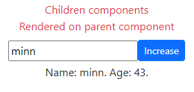

# useReducer() and scale up ReactJs with useContext()

* 1
* 1

The **useReducer(reducer, state)** adds a reducer function to change the state object.

```jsx
//The reducer function uses (initial) state and (dispatch) action as arguments. 
//some cases return update the state, other replace it with _action_ properties

function reducer(state, action) {
  switch (action.type) {
    case 'incremented_age': {
      return {
        name: state.name,
        age: state.age + 1
      };
    }
    case 'changed_name': {
      return {
        name: action.nextName,
        age: state.age
      };
    }
  }
  throw Error('Unknown action: ' + action.type);
}

const initialState = { name: 'Taylor', age: 42 };
const [state, dispatch] = useReducer(reducer, initialState);
```

The **useReducer()** returns the current **state** and the **dispatch** update function to **re-render** the state.

```jsx
//dispatch() objects needs a type for its reducer() 
const [state, dispatch] = useReducer(reducer, initialState);

function handleButtonClick() {
  dispatch({ type: 'incremented_age' });
}

function handleInputChange(e) {
  dispatch({
    type: 'changed_name',
    nextName: e.target.value
  }); 
}

<div>
  <input
    value={state.name}
    onChange={handleInputChange}
  />

  <button onClick={handleButtonClick}>
    Increment age
  </button>
  <p>Name: {state.name}. Age: {state.age}.</p>
</div>
```

<details>

<summary>Reducer return objects</summary>

The **reducer()** function doesn't update _single properties_, it **returns new state objects**.

```jsx
//we can decostrcut the state and change some props
//or we can use methods to return or delete specific props from the object

function tasksReducer(tasks, action) {
  switch (action.type) {
    case 'added': {
      return [...tasks, {
        id: action.id,
        text: action.text,
        done: false
      }];
    }
    case 'changed': {
      return tasks.map(t => {
        if (t.id === action.task.id) {
          return action.task;
        } else {
          return t;
        }
      });
    }
    case 'deleted': {
      return tasks.filter(t => t.id !== action.id);
    }
    default: {
      throw Error('Unknown action: ' + action.type);
    }
  }
}
```

</details>

An **initial state** object returned from a **function**, even if called once, will be re-called each re-render.

We add an **initializer function** to the **useReducer()** hook.

```jsx
//Any argument in the initializer function will be the second useReducer() argument
const [state, dispatch] = useReducer(reducer, createInitialState(username));
const [state, dispatch] = useReducer(reducer, username, createInitialState);

//If no argument is needed in the initializer function then it's null
const [state, dispatch] = useReducer(reducer, none, createInitialState);
```

### Scaling up React components with useContext() and useReducer()

A parent component includes its **{children}** components as a **prop.**

```jsx
//we can style ANY children component in the Parent
const Text = () => <p>This is favorable</p>

function Sentence({children}){
  return(
    <div className='text-danger text-center'>
      {children}
    </div>
  )
}

<Sentence>
  <p>These are children</p>
  <Text />
</Sentence>
```

We **useContext()** and **useReducer()** to manage complex states and event handlers at **every component level.**

<details>

<summary>Single component useContext() and useReducer() </summary>

We **createContext()** Provider values for the **\[state, dispatch]** of **useReducer().**

Any imported nested **component** will have access to both the state and event handler functions.

1

1

1

1

</details>

<figure><figcaption><p>Scaled up useReducer() and useContext()</p></figcaption></figure>

An useReducer() value used in <mark style="color:blue;">**inline style**</mark> will need to be parseInt() before, even if it's an integer.

```jsx
//We use a useContext() value to set up an hsl() color, 

import { useStato, useStatoset } from "../data/Context";

let stato = useStato()
let dispatch = useStatoset()

<ParallaxLayer offset={3.55} className="bg-main">
  <Lamp className="position-relative fourthback" 
    style={{ fill: `hsl(${parseInt(stato.base) + 180 }, 100%, 36%)` }}/>
</ParallaxLayer>
```

1

1

1

1

1
