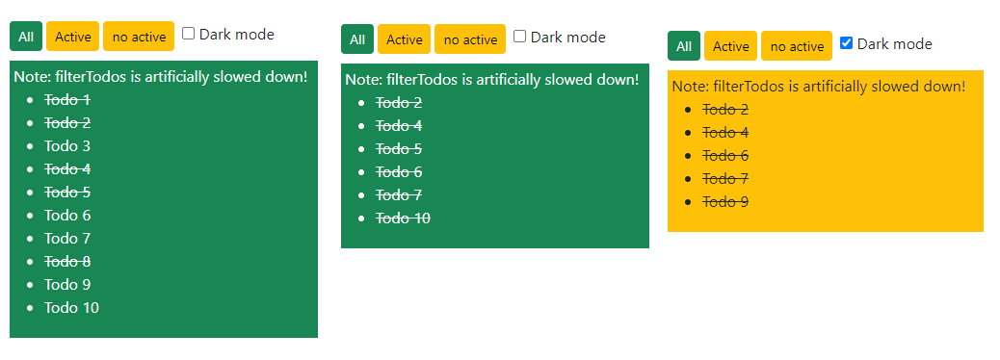
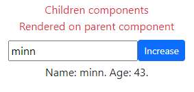
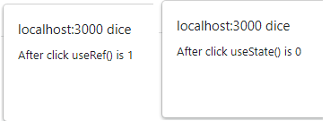
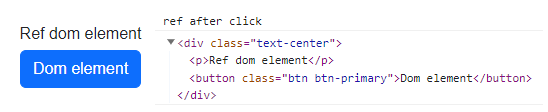
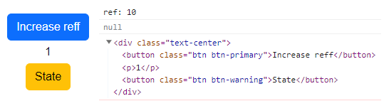
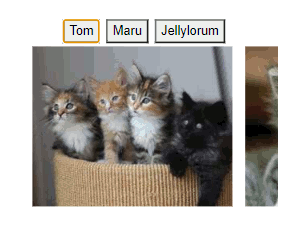

# REACT 4

* 1
* 1
* 1

**useMemo(**function, dependencies**)** is a React Hook that **caches** the **return value** of a function _between re-renders_.

```
const memoized = useMemo(
  () => memoize(depend),
  [depend]
);
```

A useMemo() function will be **re-called** only if one of its **dependencies** changes.

<details>

<summary>useMemo() render example</summary>

We import an array of objects as a prop with 2 useState().

```
import TodoList from './components/Externals';

import { createTodos } from './components/External1';
const todos = createTodos();

const [tab, setTab] = useState('all');
const [isDark, setIsDark] = useState(false);

<div>
  <button onClick={() => setTab('all')} />
  <button  onClick={() => setTab('active')} />
  <button onClick={() => setTab('completed')} />
</div>

<input
  type="checkbox"
  checked={isDark}
  onChange={e => setIsDark(e.target.checked)}
/>

<TodoList
  todos={todos}
  tab={tab}
  theme={isDark ? 'bg-warning' : 'bg-success text-white'}
/>

```

We **useMemo()** a slow imported function using 2 props, any _theme_ useState() changes will **re-render** the parent component but **won't re-call** the useMemo() function.

<pre><code>import { filterTodos } from './External1'

function Todolist({ todos, theme, tab }) {

<strong>  const visibleTodos = useMemo(
</strong>    () => filterTodos(todos, tab),
    [todos, tab]
  );

  return (
    &#x3C;div className={theme}>
      &#x3C;p>Note: filterTodos is artificially slowed down!&#x3C;/p>
      &#x3C;ul>
        {visibleTodos.map(todo => (
          &#x3C;li key={todo.id}>
            {todo.completed ?
              &#x3C;s>{todo.text}&#x3C;/s> :
              todo.text
            }
          &#x3C;/li>
        ))}
      &#x3C;/ul>
    &#x3C;/div>
  );
}

</code></pre>

The useMemo() function is a delayed function that filters the array object to be rendered

```
export function filterTodos(todos, tab) {

  let startTime = performance.now();
  
  while (performance.now() - startTime < 500) {
    // Do nothing for 500 ms to emulate extremely slow code
  }

  return todos.filter(todo => {
    if (tab === 'all') {
      return true;
    } else if (tab === 'active') {
      return !todo.completed;
    } else if (tab === 'completed') {
      return todo.completed;
    }
  });
}

```

</details>

<figure><figcaption><p>slow button useMemo() change and fast checkbox</p></figcaption></figure>

### The useReducer() React Hook

The **useReducer(reducer, state)** adds a reducer function to change the state object.

```
//The reducer function uses (initial) state and (dispatch) action as arguments. 
//some cases return update the state, other replace it with action properties

function reducer(state, action) {
  switch (action.type) {
    case 'incremented_age': {
      return {
        name: state.name,
        age: state.age + 1
      };
    }
    case 'changed_name': {
      return {
        name: action.nextName,
        age: state.age
      };
    }
  }
  throw Error('Unknown action: ' + action.type);
}

const initialState = { name: 'Taylor', age: 42 };
const [state, dispatch] = useReducer(reducer, initialState);
```

The **useReducer()** returns the current **state** and the **dispatch** update function to **re-render** the state.

```
//dispatch() objects needs a type for its reducer() 
const [state, dispatch] = useReducer(reducer, initialState);

function handleButtonClick() {
  dispatch({ type: 'incremented_age' });
}

function handleInputChange(e) {
  dispatch({
    type: 'changed_name',
    nextName: e.target.value
  }); 
}

<div>
  <input
    value={state.name}
    onChange={handleInputChange}
  />

  <button onClick={handleButtonClick}>
    Increment age
  </button>
  <p>Name: {state.name}. Age: {state.age}.</p>
</div>

```

<details>

<summary>Reducer return objects</summary>

The **reducer()** function doesn't update _single properties_, it **returns new state objects**.

```
//we can decostrcut the state and change some props
//or we can use methods to return or delete specific props from the object

function tasksReducer(tasks, action) {
  switch (action.type) {
    case 'added': {
      return [...tasks, {
        id: action.id,
        text: action.text,
        done: false
      }];
    }
    case 'changed': {
      return tasks.map(t => {
        if (t.id === action.task.id) {
          return action.task;
        } else {
          return t;
        }
      });
    }
    case 'deleted': {
      return tasks.filter(t => t.id !== action.id);
    }
    default: {
      throw Error('Unknown action: ' + action.type);
    }
  }
}

```

1

1

1

1

1

1

1

</details>

An **initial state** object returned from a **function**, even if called once, will be re-called each re-render.

We add an **initializer function** to the **useReducer()** hook.

```
//Any argument in the initializer function will be the second useReducer() argument
const [state, dispatch] = useReducer(reducer, createInitialState(username));
const [state, dispatch] = useReducer(reducer, username, createInitialState);

//If no argument is needed in the initializer function then it's null
const [state, dispatch] = useReducer(reducer, none, createInitialState);

```

### Scaling up React components with useContext() and useReducer()

A parent component includes its **{children}** components as a **prop.**

```
//we can style ANY children component in the Parent
const Text = () => <p>This is favorable</p>

function Sentence({children}){
  return(
    <div className='text-danger text-center'>
      {children}
    </div>
  )
}

<Sentence>
  <p>These are children</p>
  <Text />
</Sentence>

```

We **useContext()** and **useReducer()** to manage complex states and event handlers at **every component level.**

<details>

<summary>Single component useContext() and useReducer() </summary>

We **createContext()** Provider values for the **\[state, dispatch]** of **useReducer().**

Any imported nested **component** will have access to both the state and event handler functions.

```
//while rendering any {children} component 
import { useReducer, useContext, createContext} from 'react';

const Stato = createContext(null);
const Statodis = createContext(null);

export default function Task({children}) {

  function reducer(state, action) {
    switch (action.type) {
      case 'incremented_age': {
        return {
          name: state.name,
          age: state.age + 1
        };
      }
      case 'changed_name': {
        return {
          name: action.nextName,
          age: state.age
        };
      }
    }
    throw Error('Unknown action: ' + action.type);
  }
  const initialState = { name: 'Taylor', age: 42 };
  const [instate, dispatch] = useReducer(reducer, initialState);

  return (
    <div>
      <Stato.Provider value={instate}>
        <Statodis.Provider value={dispatch} >
          {children}
        </Statodis.Provider>
      </Stato.Provider>
    </div>
    );
}
```

The **useContext()** needs to be in the same page as the provider to work.                           We need to **export** it as a **custom Hook**.

```
//It won't work on an imported component
import Task from "./components/External1"
let instate = useContext(Task)

//We export the provided values 
export function useStato() {
  return useContext(Stato);
}
export function useStatodis() {
  return useContext(Statodis);
}

import Task, { useStato, useStatodis } from "./components/External1"

let stato = useStato()
let dispatch = useStatodis()

```

We **import** the _component_ and the _custom hooks_:

```
import Task, { useStato, useStatodis } from "./components/External1"

<div className='row me-0 '>
  <Florida>
    <p>Children components</p>
    <Text />
  </Florida>

  <Task>
    <Increase />
  </Task>
</div>

```

Now any **children** component has access to the **dispatch()** event handler.

```
//and will share the useReducer() state
function Increase(){

  let stato = useStato()
  let dispatch = useStatodis()

  function handleButtonClick() {
    dispatch({ type: 'incremented_age' });
  }
  
  function handleInputChange(e) {
    dispatch({
      type: 'changed_name',
      nextName: e.target.value
    }); 
  }

  return(
    <div>
      <input
        value={ stato.name }
        onChange={handleInputChange}
      />

      <button onClick={handleButtonClick}>
        Increase
      </button>
      <p>Name: {stato.name}. Age: {stato.age}.</p>
    </div>
  )
}

```

</details>

<figure><figcaption><p>Scaled up useReducer() and useContext()</p></figcaption></figure>

### The useRef() React Hook

The **useRef()** lets us reference a value that’s not needed for rendering

```
//It returns an object with a single property .current

const valref = useRef(0);
valref.current == 0
```

Contrary to **useState()**, **useRef()** changes _won't re-render_ the page and its new value will be **immediately available** between different functions (unlike useState() which has to render it first).

<details>

<summary>Difference in updating useRef() and useState()</summary>

In this example, we show the useRef() value using a handler function.

```
let ref = useRef(0);
const [ refe, setRefe ] = useState(0) 

console.log("gets re-called only with useState")

function handleClick() {
  ref.current = ref.current + 1;
  alert('After click useRef() is ' + ref.current);
}

function altroClick(){
  setRefe((x)=> x + 1)
  alert("After click useState() is " + refe)
}

<div>
  <button onClick={handleClick}>
    The useRef()
  </button>
  <button onClick={altroClick}>
    the useState()
  </button>
  <button onClick={separate}>
    Calling both
  </button>
</div>
```

</details>

<figure><figcaption><p>Returned useRef() and useState() values</p></figcaption></figure>

**useRef()** is stored in React and won't need any setter function because it always _returns the same object._

**useRef()** is used to communicate with external API, timeID variables, and DOM manipulation, if rendered It won't update its value.

```
//Don't relay too much logic on useRef() and remember to use its .current property 

timeoutID.current = setTimeout(() => {
  alert("Sent!");
}, 3000);

clearTimeout(timeoutID.current);
```

On inputs, you can render the **useState()** input AND a **useRef()**.current value.

```
//In case we need an instant input value for javascript functions

value={e.target.value}
onChange={(e) => {
  setText(e.target.value);
  reffe.current = e.target.value;
}}
```

Don't **useRef()** on a **javascript expression**, its value won't update.

```
/This won't work, useSatte() instead
const isOnRef = useRef(false);

<button>
  {isOnRef.current ? 'On': 'Off'}
</button>
```

The same **useRef()** created inside **repeated components** won't interfere with each other.

<details>

<summary>Indipendent useRef() on repeated components and debounced buttons</summary>

An useRef() can't be initialized inside a normal function, only on a component.

```
//And if we initialize it outside it will return only the last trigger
let mia = useRef(null)

function chiama(alerta){
  clearTimeout(mia.current)
  mia.current = setTimeout(() => {
    alert(alerta)    //useRef() will be re-set on each click
  }, 1000)
}

<button onClick={()=> chiama("Primo avviso")}>
  Alerta1
</button>

<button onClick={()=> chiama("Secondo avviso credo")}>
  Alerta due
</button>
```

_Multiple components_ can **useRef()** independently from each other.

```
//multiple buttons for multiple different timeout() alerts

function DebouncedButton({ chiama, children }) {
  const timeoutRef = useRef(null);

  return (
    <button
      onClick={() => {
        clearTimeout(timeoutRef.current);
        timeoutRef.current = setTimeout(() => {
          chiama();    //launch / boiled alerts
        }, 1000);
      }}
    >
      {children}
    </button>
  )
}

<DebouncedButton onlick={() => alert("launch")}>
  Launch the spaceship
</DebouncedButton>
<DebouncedButton onlick={() => alert("boiled")}>
  Boil the soup
</DebouncedButton>
```

We clearTimeout() onClick() to **debounce** the button, to start its timeout() only after the button stops being clicked.

</details>

### DOM manipulation with useRef()&#x20;

We **useRef()** to access the React Node **JSX** elements.

```
//To access the ref data we use event handlers, we can also use Browser API methods
let pink = useRef()

function handle(){
  console.log("ref after click")
  pink.current.focus();
  console.log( pink.current )
}

<div ref={pink}>
  <p>Ref element</p>

  <button onClick={refer}>
    Access Dom ref
  </button>
</div>

```

<figure><figcaption><p>Accessing a JSX Node element</p></figcaption></figure>

The **ref attribute** can contain a **callback function**, it uses the DOM as an _argument_, and it triggers on _render_.

<pre><code>//On re-render it uses null on its argument and then re-calls its callback function.
//Other ref changes won't have any effects

let doll= useRef(0)
const [malon, setMalon] = useState(0)

function cliccato(){
  doll.current = doll.current + 1 
  console.log( "ref: " + doll.current )
}

<a data-footnote-ref href="#user-content-fn-1">&#x3C;div ref={(node) => console.log(node)}></a>  
  &#x3C;p>We have it&#x3C;/p>
  &#x3C;button className='btn btn-primary' onClick={()=> cliccato()}>Reff&#x3C;/button>

  &#x3C;p>{malon}&#x3C;/p>
  &#x3C;button className="btn btn-warning" onClick={()=> setMalon((e)=> e+1 )}>
    State
  &#x3C;/button>
&#x3C;/div>
</code></pre>

<figure><figcaption><p>Callback function on useState() render</p></figcaption></figure>

The **ref attribute** can't be assigned to Node elements on loops or javascript expressions.

```
//Any React hook has to be on a component

{items.map((item) => {
  const ref = useRef(null);
  return <li ref={ref} />;
})}
```

We create a Map object of Node elements using ref callback function.

<details>

<summary>ref callback function on looped Node elements</summary>

We create an array of 20 image objects and a getMap() function for the **ref.**

```
const catList = [];

for (let i = 0; i < 10; i++) {
  catList.push({
    id: i,
    imageUrl: 'https://placekitten.com/250/200?image=' + i
  });
}

//We set ref with a Map object once
const itemsRef = useRef(null);
function getMap() {
  if (!itemsRef.current) {
    itemsRef.current = new Map();
  }
  return itemsRef.current;
}
```

We use Node IDs from the **ref map object** for the **scrollIntoView()** method.

```
function scrollToId(itemId) {
  const map = getMap();
  
  const node = map.get(itemId);
  node.scrollIntoView({
    behavior: 'smooth',
    block: 'nearest',
    inline: 'center'
  });
}

<nav>
  <button onClick={() => scrollToId(0)}>
    Tom
  </button>
  <button onClick={() => scrollToId(5)}>
    Maru
  </button>
  <button onClick={() => scrollToId(9)}>
    Jellylorum
  </button>
</nav>
```

We use the **ref callback function** to loop through each rendered **\<li>** element, and we set the ref map object with key/value pairs of Images **ID** and **Node element**.

```
//We render with map() but set the ref separately and push node elements

<div>
  <ul>
    {catList.map(cat => (
      <li
        key={cat.id}
        ref={(node) => {
          const map = getMap();

          if (node) {
            map.set(cat.id, node);
          } else {
            map.delete(cat.id);
          }
        }}
      >
        
      </li>
    ))}
  </ul>
</div>
```

</details>

<figure><figcaption></figcaption></figure>

1

1

1

1

1

1

1

[^1]: This is teh callback function
