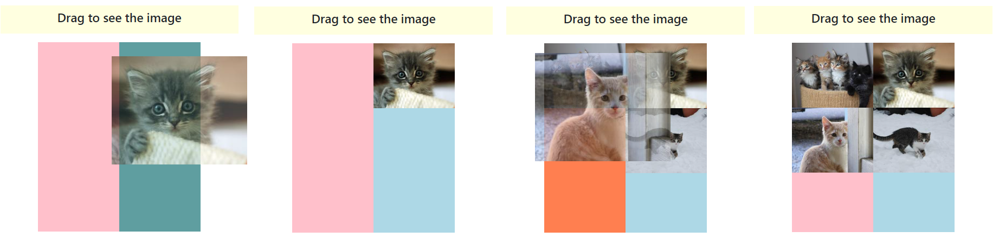

# REACT 5, useRef() instance methods, React keyframe animations, useRef() scroll, onDrag() and onDrop() React Events

* [Instance methods on useRef() DOM elements](react-5-useref-instance-methods-react-keyframe-animations-useref-scroll-ondrag-and-ondrop-react-even.md#instance-methods-on-useref-dom-elements.)
* [onDrag() and onDrop() ReactJS events](react-5-useref-instance-methods-react-keyframe-animations-useref-scroll-ondrag-and-ondrop-react-even.md#ondrag-and-ondrop-reactjs-events)

**React events** (onClick) and their **Event handlers** (onClick(()=>())) have access to the **React Event Object**. We use it to access the (event) **type**, DOM **target**, and **clientX, pageX, and screenX** positions.

<details>

<summary>event.key/event.code on React Event Object</summary>

**event.crtlKey** checks if the crtl button was being held during onClick().                                  Different React events will give access to different **event object properties**, like **event.key/event.code** on _onKeyDown() input_ events.                    &#x20;

```jsx
function controlla(e){
  console.log( e )

  console.log( "Client X/Y: " + e.clientX + "/" + e.clientY)
  console.log( "Page X/Y: " + e.pageX + "/"  + e.pageY )
  console.log( "Screen X/Y: " + e.screenX + "/" + e.screenY )
  console.log( "Trigger event: " + e.type )
  console.log( "Was the crtl key used? " + e.ctrlKey )
  console.log( e.target )
  console.log( e.target.className )

  let pressed = e.target.className

  if( pressed.includes("danger") ){
    console.log("danger button")
  }else if( pressed.includes("warning") ){
    console.log("Warning button")
  }else{
    console.log("Success button")
  }
}
```

On DOM we:

```jsx
<div className="text-end my-4">
  <button onClick={controlla} className="btn btn-success">Uno</button>
  <button onClick={controlla} className="btn btn-warning">Due</button>
  <button onClick={controlla} className="btn btn-danger">Tre</button>
</div>
```

</details>

<figure><figcaption><p>React Event Object properties</p></figcaption></figure>

We **e.target mouseEnter**, **mouseLeave**, **mouseOver**, **mouseOut**, and **mouseMove** React events, and render with _useState()_.

```jsx
//mouseEnter /mouseLeave trigger once the mouse leaves the DOM element
//mouseMove /mouseOver and mouseOut trigger for each pixel moved in their areas

const [rec, setRec]= useState("")
function capta(e){
  setRec( e.target.innerText )
}

<div className="col-6 text-center">
  <p onMouseEnter={capta} >MouseEnter event</p>
  <p onMouseEnter={capta} >Then we print its text</p>
</div>

<div className="col-6 text-center">
  <p onMouseEnter={capta} > On each p tag </p>
  <p onMouseEnter={capta} > into the input </p>
</div>

<div className="text-center my-2">
  <input type="text" value={rec}/>
</div>
```

<figure><figcaption><p>Mouse React events</p></figcaption></figure>

### Instance methods on useRef() DOM elements.

We can **useRef()** to access DOM element attributes with **hasAttribute()** and **getAttribute()**.

```jsx
//className won't work as an attribute
<button ref={bot} className="btn btn-primary" onClick={check}>
  Check attr    
</button>

bot.current.hasAttribute("class") 	//true
bot.current.getAttribute("class") 	//btn btn-primary
```

We edit a useRef() attribute with **setAttribute(**attribute, value**)**:

```jsx
//or we modify the className property of the ref

bot.current.className = "btn btn-warning"
bot.current.setAttribute("class", "btn btn-warning")
```

We **removeAttribute()** (instead of setting it as null) and **toggleAttribute()** (to toggle in/out attributes on React Events)

```jsx
//toggle won't return the past attribute values 
//it works best on attributes that don't need values, like disable.

bot.current.removeAttribute( "class" )
bot.current.toggleAttribute("disabled")    //remove if it's present and vice versa
```

We **useRef()** an input **current.value** to **append()** it in a JSX tag.



We need 2 **useRef()**, for the input **ref** and the **append()** DOM target.

```jsx
//We can't append() a JSX object so we need to document.createElement()
const sce= useRef(null)
const paper= useRef(null)

function entra(e){
  e.preventDefault()
  let plot= document.createElement("div")
  plot.innerText= sce.current.value

  paper.current.append(plot)
  sce.current.value= ""
}
```

On the **DOM** the **ref** will store and update the input.value (we **append()** to render it):

```jsx
<form className="row col-6 mb-3" onSubmit={entra}>
  <div className="col-auto">
    <input ref={sce} type="text" className="form-control"/>
  </div>
  <div className="col-auto">
    <button className="btn btn-primary">submit</button>
  </div>
</form>

<div className="paper col-6">
  <div ref={paper} className="pt-3 ps-4">

  </div>
</div>
```



**useState() can {**render**}** the **input.target value** without a useRef(), but we need to _value/onChange()_ the input.

```jsx
const [run, setRun] = useState("")
let con= useRef( null )

function late(e){
  e.preventDefault()
  let yuu= document.createElement("p")
  yuu.innerText= run

  con.current.append(yuu)
  setRun("")
}
```

On the **DOM** we:

```jsx
<form className="row col-6 mb-3" onSubmit={late}>
  <div className="col-auto">
      <input type="text" className="form-control"
             value={run} onChange={(e)=>( setRun(e.target.value) )}/>
  </div>
  <div className="col-auto">
      <button className="btn btn-primary">submit</button>
  </div>
</form>

<div className="paper col-6">
  <div ref={con} className="pt-3 ps-4">

  </div>
</div>
```



<figure><figcaption><p>useRef() append() DOM elements</p></figcaption></figure>

We use **scroll()**, **scrollBy()**, and **scrollIntoView()** on an **overflow:scroll** useRef() **DOM** element.              The **scroll()** method moves the element **to a** **set of coordinates** inside a container.

```jsx
//We set the X/Y coordinates or a top/left/behavior object
function preci(){
  roll5.current.scroll(200, 450)

  riga.current.scroll({
    top: 0,
    left: 400,
    behavior: "smooth",
  })
}
```

<details>

<summary>scrollBy() and scrollIntoView() guide</summary>

**scrolllBy()** **adds up** its **X/Y coordinates** to the **current** position.

<pre class="language-jsx"><code class="lang-jsx"><strong>//unlike scroll() that if repeated doesn't move.
</strong><strong>const riga = useRef(null)
</strong>
function back(){

  riga.current.scrollBy({
    top: 0,
    left: -200,
    behavior: "smooth",
  })
}
</code></pre>

**scrollIntoView()** scrolls the _container_ so the **element** which calls it gets into the **user** **browser viewpoint**.

```jsx
//Its behavior object uses block/Y axis and inline/X axis 
//it uses start/center/end/nearest for positioning

function goto(){
  let modo={
      behavior: 'smooth',
      block: 'start',
      inline: 'center'
  }

  roll.current.scrollIntoView(modo)
```

In the DOM we useRef() the **scrollIntoView()** on the element, not the container.

```jsx
<ul className="scorri flex-nowrap" ref={riga}>
  <div>
    
  </div>
  <div> 
     
  </div>
  <div> 
     
  </div>
  <div> 
     
  </div>
  <div ref={roll}> 
     
  </div>
  <div> 
     
  </div>
</ul>
```

</details>

<figure><figcaption><p>scrollIntoView(), scroll() and scrollBy()</p></figcaption></figure>

**animate()** applies a **CSS keyframe()** and a **timing object** to a **useRef()** DOM element.



The **keyframe** is an _array of objects_ to **iterate** and the **timing** object has the **animation properties**.

```jsx
const roll = useRef(null)

function mosso(){
  const rotate = [
    {
     backgroundColor: "red",
     transform: "translateX(200px)"
    }
  ]

  const timing = {
    duration: 3000,
    iterations: 2,
  };

  roll.current.animate(rotate, timing)
}

<h1 ref={roll}> Are we sure </h1>

```



**animate()** is the equivalent of adding an **animation class** to a **DOM** element.

```
const [rosso, setRosso] = useState("")

function old(){
  setRosso("rosso")
}

.rosso{
  animation: example 2s;
  animation-delay: 1s;
}

@keyframes example {
  100% {background-color: red;}
}

<h1 className={rosso}>Here the rest</h1>
```



The _timing object_ contains the **animation properties**.

```
const timing = {
  direction: "alternate",		    //animation-direction
  easing: "cubic-bezier(0, 0.5, 1, 0.5)",   //animation-timing-function
  fill: "forwards",                         //animation-fill-mode
  delay: 1000,	                            //animation ms delay before start
  delayEnd: 1000,	//delay at the end, used when sequencing multiple animations
  iterationStart: 0.5,	                    //how much animation skips at the start
  pseudoElement: ":before"              //to animate the pseudoSelector of the target
};
```

The **animate()** method on useRef() DOM elements **won't trigger** the **onAnimationStart**, **onAnimationIteration**, or **onAnimationEnd** events (we need _CSS keyframes_).



**onAnimationIteration**() will trigger only when _iteration-count > 1_.

```jsx
const [naso, setNaso] = useState("")
function copia(){
  setNaso("muove")
}

.muove{
  color: red;
  animation: dodo 2s;
  animation-iteration-count: 3;
}

@keyframes dodo {
  100% {
    color: green;
  }
}
```

The events go on the animated DOM element.

```
<div>
  <h1 
    className={naso}
    onAnimationStart={e => console.log('started')}
    onAnimationIteration={e => console.log('repeated')}
    onAnimationEnd={e => console.log('finished')}
  >
    CSS keyframes element
  </h1>

  <button className="btn btn-primary" onClick={copia}>
    Anima
  </button>
</div>
```



The events won't trigger even if the animation is replicated.

```jsx
let fly= useRef(null)
function copia1(){
  let chiavi= [
    {color: "green"}
  ]

  let timing={
    duration: 1000,
    iterations: 2
  }

  fly.current.animate(chiavi, timing)
}

<div>
  <h1 ref={fly} 
    	onAnimationStart={e => console.log('started')}
    	onAnimationIteration={e => console.log('repeated')}
    	onAnimationEnd={e => console.log('finished')}
  >
    useRef() animate() method
  </h1>

  <button className="btn btn-primary" onClick={copia1}>
    Anima
  </button>
</div>
```



We store the **onCopy() event** value with **document.getSelection()** and useRef().

```jsx
//We then use a button to print it in another useRef() DOM element

let tron= useRef(null)
let coss= useRef(null)

function copia1(){
  coss= document.getSelection().toString().toLowerCase()
}

function copiato(){
  array.current.value = coss
}

<div className="text-center">
  <p>We edit copied string </p>
  <input type="text" disabled value="1WE34FANN9" onCopy={copia1}/>
  <p>and paste it with a button </p>
  <input type="text" ref={array}/>
</div>

<button className="btn btn-primary" onClick={copiato}>
  Siamo
</button>
```

<figure><figcaption><p>Copied getSelection() element printed on input</p></figcaption></figure>

### onDrag() and onDrop() ReactJS events

The HTML **Drag and Drop API** implements **draggable** elements in the browser. DOM elements with the draggable **attribute** trigger **onDrag()** React events.                   &#x20;

```jsx
//Drag and Drop events are inherited from the mouse events

<p
  draggable= "true"      
  onDrag={}              //triggers for each pixel the element is dragged
  onDragStart={}         //triggers once when the drag starts
  onDragEnd={}           //triggers at the end of drag AFTER onDrop()
>
  Dragged element
</p>
```

The **onDrop() target** DOM element can trigger:

```jsx
//it's better to use dragLeave than dragOver

<div
  onDragEnter={}          //once when the dragged element Enters the drop target
  onDragLeave={}          //once when the dragged element leaves the drop target
  onDragOver={}           //when the dragged element is on top of the drop target
  onDrop={}               //when the mouse is released, end of operation
>
  Drop area target
</div>
```

We use the **dataTransfer** object during the _drag-and-drop_ events.                                                     We **setData(**"type format", "value"**)**, **setDragImage(**image, Xoffset, Yoffset**)** for the feedback image and **effectsAllowed** for the _cursor dropEffect_.

We set the **dropEffect** _onDragOver()/onDragStart()_ and check it **onDragEnd()** to **filter** drag operations.

```jsx
//If the drop operation/effect is not allowed the dropEffect == "none"
//Multiple setData() with the same data format will replace each other
//For the onDrag to work we need onDragOver() e.preventDefault()
//The dragImage X/Yoffset is on the cursor, and the image is the original size

function dragStart(e){
  let image= new Image()
  image.src= "https://placekitten.com/150/100?image=1"
  e.dataTransfer.setDragImage(image, 70, 35);

  e.dataTransfer.effectAllowed= "move
}

function dragOver(e){
  e.preventDefault()
  e.dataTransfer.dropEffect= "link"
}

function dragEnd(e){
  e.preventDefault()
  console.log( e.dataTransfer.dropEffect )
}

function drop(e){    
  console.log( e.dataTransfer.getData("text/html") )
  console.log( e.dataTransfer.getData("application/json") )
}

<div>
  <div draggable="true" onDragStart={dragStart} onDragEnd={dragEnd} >
    <p>Copy or Drag</p>
  </div>

  <div className="spazio" onDragOver={dragOver} onDrop={drop}>
  </div>
</div>
```

<figure><figcaption><p>onDrag() with dragImage() and dataTransfer data</p></figcaption></figure>

The **onDragEnd()** event returns a _dropEffect= "none"_ if the onDrop() fails.                                                 We use **dataTransfer.types.includes(**data format**)** to filter the dataTransfer object.                                         We can use **e.clientX/Y** to check the **dropped position**.                              &#x20;

We can dataTransfer.**clearData(**data format**)** to delete the setData() (it seems to work only onDragStart() )

<details>

<summary>Image drag and drop DOM elements stacking and CSS responsive</summary>

We color the _50/50_ bicolor **dropzone CSS** with:

```css
//we are gonna append extra CSS onDragEnter() elements
.bicolor{
  position: relative;
  width: 300px;
  height: 350px;
}

.uno{
  background-color: pink;
  width: 50%;
  height: 100%;
}
.uno.over{
  background-color: coral;
}

.due{
  background-color: lightblue;
  width: 50%;
  height: 100%;
}
.due.over{
  background-color: cadetblue;
}

```

We useRef() for the 2 columns and the image counter, then we set the **dataTransfer** data **onDragstart()**.

```jsx
//we use a cats API for the setDragImage()
let primo = useRef(null)
let secon = useRef(null)

let gato = useRef(1)
let picture;

function dragstart(e){
  picture= "https://placekitten.com/250/200?image=" + gato.current
  e.dataTransfer.setData("text/html", picture)

  let image= new Image()
  image.src= picture
  e.dataTransfer.setDragImage(image, 70, 35);

  console.log( e.dataTransfer )
  e.dataTransfer.effectAllowed= "move"
}
```

In **onDragEnd()** <mark style="background-color:blue;">if the onDrop() fails</mark> we return the columns to their starter colors.

```jsx
function dragend(e){
  e.preventDefault()

  if( e.dataTransfer.dropEffect == "none" ){
    secon.current.className= "due"
    primo.current.className= "uno"
  }
}
```

In **onDragEnter()** we modify the **CSS** using **classList** depending on the "entered" column. In case of <mark style="background-color:blue;">overlaying images</mark> we use their ID to check the column, **onDragOver()** is necessary for the onDrag() event.

```jsx
function dragenter(e){
  e.preventDefault()

  if( e.target.className == "uno" || e.target.id == "uno" ){

    secon.current.className= "due"
    primo.current.classList.add("over")
  }else if( e.target.className == "due" || e.target.id == "due" ){
  
    primo.current.className= "uno"
    secon.current.classList.add("over")
  }
}

function dragover(e){
  e.preventDefault()
  e.dataTransfer.dropEffect= "move"
}
```

We _appendChild()_ an ID image **onDrop()** using the **e.target.id** for the **columns**, we also **filter** the **dataTransfer** data to avoid **different onDrag()** from triggering the onDrop().

```jsx
//we increase the useRef() for different cat API images
function drop(e){
  let image= e.dataTransfer.getData("text/html")

  if( !image.includes(" ") ){

    let imma= document.createElement("img")
    imma.className= "img-fluid"
    imma.src= image
    imma.id= e.target.id 

    gato.current += 1;
    e.target.classList.remove("over")
    let dropped = (e.target.id== "uno") ? 
        primo.current.appendChild(imma) : secon.current.appendChild(imma)
  }else{
    alert("drag the correct element")
    secon.current.className= "due"
    primo.current.className= "uno"
  }
}
```

The DOM drag and drop elements are:

```jsx
<div
  className="dragged"
  draggable="true"
  onDragStart={dragstart}
  onDragEnd={dragend}
>
  <h4 className="text-center">Drag to see the image</h4>
</div>

<div>
  <div 
    className="uno"
    id="uno"
    ref={primo}
    onDragOver={dragover}
    onDrop={drop}
    onDragEnter={dragenter}
  >
  </div>

  <div 
    className="due"
    id="due"
    ref={secon}
    onDragOver={dragover}
    onDrop={drop}
    onDragEnter={dragenter}
  >
  </div>
</div>
```

</details>

<figure><figcaption><p>Drag and Drop events with CSS and appendChild() elements</p></figcaption></figure>
