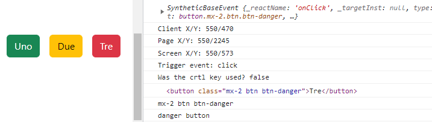
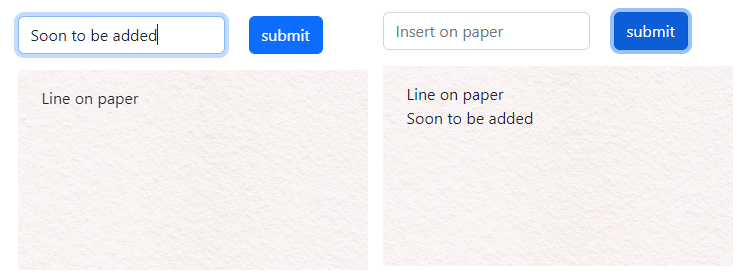

# REACT 5

* 1
* 1
* 1

**React events** (onClick) and their **Event handlers** (onClick(()=>())) have access to the **React Event Object**. We use it to access the (event) **type**, DOM **target**, and **clientX, pageX, and screenX** positions.

<details>

<summary>event.key/event.code on React Event Object</summary>

**event.crtlKey** checks if the crtl button was being held during onClick().                                  Different React events will give access to different **event object properties**, like **event.key/event.code** on _onKeyDown() input_ events.                    &#x20;

```
function controlla(e){
  console.log( e )

  console.log( "Client X/Y: " + e.clientX + "/" + e.clientY)
  console.log( "Page X/Y: " + e.pageX + "/"  + e.pageY )
  console.log( "Screen X/Y: " + e.screenX + "/" + e.screenY )
  console.log( "Trigger event: " + e.type )
  console.log( "Was the crtl key used? " + e.ctrlKey )
  console.log( e.target )
  console.log( e.target.className )

  let pressed = e.target.className

  if( pressed.includes("danger") ){
    console.log("danger button")
  }else if( pressed.includes("warning") ){
    console.log("Warning button")
  }else{
    console.log("Success button")
  }
}
```

On DOM we:

```
<div className="text-end my-4">
  <button onClick={controlla} className="btn btn-success">Uno</button>
  <button onClick={controlla} className="btn btn-warning">Due</button>
  <button onClick={controlla} className="btn btn-danger">Tre</button>
</div>
```

</details>

<figure><figcaption><p>React Event Object properties</p></figcaption></figure>

### Instance methods on useRef() DOM elements.

We can **useRef()** to access DOM element attributes with **hasAttribute()** and **getAttribute()**.

```
//className won't work as an attribute
<button ref={bot} className="btn btn-primary" onClick={check}>
  Check attr    
</button>

bot.current.hasAttribute("class") 	//true
bot.current.getAttribute("class") 	//btn btn-primary
```

We edit a useRef() attribute with **setAttribute(**attribute, value**)**:

```
//or we modify the className property of the ref

bot.current.className = "btn btn-warning"
bot.current.setAttribute("class", "btn btn-warning")
```

We **removeAttribute()** (instead of setting it as null) and **toggleAttribute()** (to toggle in/out attributes on React Events)

```
//toggle won't return the past attribute values 
//it works best on attributes that don't need values, like disable.

bot.current.removeAttribute( "class" )
bot.current.toggleAttribute("disabled")    //remove if it's present and vice versa
```

1

We **useRef()** an input **current.value** to **append()** it in a JSX tag.



We need 2 **useRef()**, for the input **ref** and the **append()** DOM target.

```
//We can't append() a JSX object so we need to document.createElement()

const sce= useRef(null)
const paper= useRef(null)

function entra(e){
  e.preventDefault()
  let plot= document.createElement("div")
  plot.innerText= sce.current.value

  paper.current.append(plot)
  sce.current.value= ""
}

```

On the **DOM** the **ref** will store and update the input.value (we **append()** to render it):

```
<form className="row col-6 mb-3" onSubmit={entra}>
  <div className="col-auto">
  	<input ref={sce} type="text" className="form-control"/>
  </div>
  <div className="col-auto">
  	<button className="btn btn-primary">submit</button>
  </div>
</form>

<div className="paper col-6">
  <div ref={paper} className="pt-3 ps-4">

  </div>
</div>
```



**useState() can {**render**}** the **input.target value** without a useRef(), but we need to _value/onChange()_ the input.

```
const [run, setRun] = useState("")
let con= useRef( null )

function late(e){
  e.preventDefault()
  let yuu= document.createElement("p")
  yuu.innerText= run

  con.current.append(yuu)
  setRun("")
}
```

On the **DOM** we:

```
<form className="row col-6 mb-3" onSubmit={late}>
  <div className="col-auto">
      <input type="text" className="form-control"
             value={run} onChange={(e)=>( setRun(e.target.value) )}/>
  </div>
  <div className="col-auto">
      <button className="btn btn-primary">submit</button>
  </div>
</form>

<div className="paper col-6">
  <div ref={con} className="pt-3 ps-4">

  </div>
</div>
```



<figure><figcaption><p>useRef() append() DOM elements</p></figcaption></figure>

We use **scroll()**, **scrollBy()**, and **scrollIntoView()** on an **overflow:scroll** useRef() **DOM** element.              The **scroll()** method moves the element **to a** **set of coordinates** inside a container.

```
//We set the X/Y coordinates or a top/left/behavior object

function preci(){
  roll5.current.scroll(200, 450)

  riga.current.scroll({
    top: 0,
    left: 400,
    behavior: "smooth",
  })
}
```

<details>

<summary>scrollBy() and scrollIntoView() guide</summary>

**scrolllBy()** **adds up** its **X/Y coordinates** to the **current** position.

<pre><code><strong>//unlike scroll() that if repeated doesn't move.
</strong><strong>const riga = useRef(null)
</strong>
function back(){

  riga.current.scrollBy({
    top: 0,
    left: -200,
    behavior: "smooth",
  })
}
</code></pre>

**scrollIntoView()** scrolls the _container_ so the **element** which calls it gets into the **user** **browser viewpoint**.

```
//Its behavior object uses block/Y axis and inline/X axis 
//it uses start/center/end/nearest for positioning

function goto(){
  let modo={
      behavior: 'smooth',
      block: 'start',
      inline: 'center'
  }

  roll.current.scrollIntoView(modo)
```

In the DOM we useRef() the **scrollIntoView()** on the element, not the container.

```
<ul className="scorri flex-nowrap" ref={riga}>
  <div>
    
  </div>
  <div> 
     
  </div>
  <div> 
     
  </div>
  <div> 
     
  </div>
  <div ref={roll}> 
     
  </div>
  <div> 
     
  </div>
</ul>


```

1

</details>

<figure><figcaption><p>scrollIntoView(), scroll() and scrollBy()</p></figcaption></figure>

**animate()** applies a **CSS keyframe()** and a **timing object** to a **useRef()** DOM element.



The **keyframe** is an _array of objects_ to **iterate** and the **timing** object has the **animation properties**.

```
const roll = useRef(null)

function mosso(){
  const rotate = [
    {
     backgroundColor: "red",
     transform: "translateX(200px)"
    }
  ]

  const timing = {
    duration: 3000,
    iterations: 2,
  };

  roll.current.animate(rotate, timing)
}

<h1 ref={roll}> Are we sure </h1>

```



**animate()** is the equivalent of adding an **animation class** to a **DOM** element.

```
const [rosso, setRosso] = useState("")

function old(){
  setRosso("rosso")
}

.rosso{
  animation: example 2s;
  animation-delay: 1s;
}

@keyframes example {
  100% {background-color: red;}
}

<h1 className={rosso}>Here the rest</h1>
```



The _timing object_ contains the **animation properties**.

```
const timing = {
  direction: "alternate",		    //animation-direction
  easing: "cubic-bezier(0, 0.5, 1, 0.5)",   //animation-timing-function
  fill: "forwards",                         //animation-fill-mode
  delay: 1000,	                            //animation ms delay before start
  delayEnd: 1000,	//delay at the end, used when sequencing multiple animations
  iterationStart: 0.5,	                    //how much animation skips at the start
  pseudoElement: ":before"              //to animate the pseudoSelector of the target
};
```

1

The **animate()** method on useRef() DOM elements **won't trigger** the **onAnimationStart**, **onAnimationIteration**, or **onAnimationEnd** events (we need _CSS keyframes_).



**onAnimationIteration**() will trigger only when _iteration-count > 1_.

```
const [naso, setNaso] = useState("")
function copia(){
  setNaso("muove")
}

.muove{
  color: red;
  animation: dodo 2s;
  animation-iteration-count: 3;
}

@keyframes dodo {
  100% {
    color: green;
  }
}
```

The events go on the animated DOM element.

```
<div>
  <h1 
    className={naso}
    onAnimationStart={e => console.log('started')}
    onAnimationIteration={e => console.log('repeated')}
    onAnimationEnd={e => console.log('finished')}
  >
    CSS keyframes element
  </h1>

  <button className="btn btn-primary" onClick={copia}>
    Anima
  </button>
</div>
```



The events won't trigger even if the animation is replicated.

```
let fly= useRef(null)
function copia1(){
  let chiavi= [
    {color: "green"}
  ]

  let timing={
    duration: 1000,
    iterations: 2
  }

  fly.current.animate(chiavi, timing)
}

<div>
  <h1 ref={fly} 
    	onAnimationStart={e => console.log('started')}
    	onAnimationIteration={e => console.log('repeated')}
    	onAnimationEnd={e => console.log('finished')}
  >
    useRef() animate() method
  </h1>

  <button className="btn btn-primary" onClick={copia1}>
    Anima
  </button>
</div>
```



1

1

1

1

1

1

1

1

1

1

