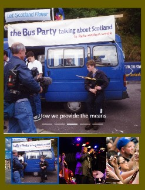

# REACT 6

* 1
* 1
* 1
* 1

We use **objects** to dynamically **style** _components_, using JSX brackets.

```jsx
//remember that style needs double {}
const picture={
  url: "https://.../635258.jpg",
  width: 100,
  height: 100
}

function Imma({pic}){
  return (
    
  )
}
```

On the DOM we pass the **style object prop** to the **component**.

```jsx
<div className="row col-10 justify-content-center">
  <Imma pic={picture} />
  <div>
    <button className="btn btn-primary" onClick={rotate}>
      Rotate
    </button>
  </div>
</div>
```

We install the **classnames** utility to join JSX classes conditionally.

```jsx
//First the classname then (:) the condition, we can include default classNames 
//we useState() to render the conditions

const [roll, setRoll] = useState(false)

let cubo= cn("p-0", {
  "rotola": roll
})

function rotate(){
  setRoll((x)=> (!x))
}

//and use the className to toggle the CSS animation 
.rotola{
  animation: roll 4s;
  animation-iteration-count: infinite;
}

@keyframes roll {
  100%{
    transform: rotate(360deg);
  }
}
```

<figure><figcaption><p>DOM element animated with a classname object</p></figcaption></figure>

### React-Bootstrap Navbar and Carousel

We need to use **flexGrow:0** for the nav elements justify and a custom-fill **SVG** for the React-bootstrap collapse icon.


Navbar and Navbar collapse on React-Bootstrap


We can edit the **.carousel-indicators** and **.carousel-control-prev-icon (SVG)** in the CSS**.**

```css
/*Even if the selectors don't appear in the HTML*/
/*The indicators being the square icons on the bottom of the carousel */
/*We edit the colors with %23hexNumber */

#bootlock .carousel-indicators{
  margin-bottom: 0;
}

#bootlock .carousel-control-prev/next-icon {
  background-image:
    url("data:image/svg+xml;charset=utf8,%3Csvg xmlns='http://www.w3.org/2000/svg' fill='%23e6d200' viewBox='0 0 8 8'%3E%3Cpath d='M5.25 0l-4 4 4 4 1.5-1.5-2.5-2.5 2.5-2.5-1.5-1.5z'/%3E%3C/svg%3E"); 
}
```

<details>

<summary>Carousel onSelect(), activeIndex() and animated imageBar </summary>

The **onSelect()** is triggered when the carousel moves and sets the current Index.                                       The **activeIndex()** triggers the carousel based on its index.

```jsx
//We include the <Link> component inside the item.

<Carousel onSelect={(e)=> conting(e)} activeIndex={conta}>
  {stato.galleria.map((cont, index)=>(
  <Carousel.Item key={index}>
    <Link to="gallery" className="d-flex">
      <div style={{width: "100%", height: "65vh"}}>
        <div style={{backgroundImage: `URL(${cont.src})`}}></div>
      </div>

      <Carousel.Caption>
	<p>{cont.desc}</p>
      </Carousel.Caption>
    </Link>

  </Carousel.Item>
  ))}
</Carousel>
```

Both the **carousel** and the imageBar are triggered by the same **useState**().&#x20;

We need a flex-centered container for the imageBar, to avoid justifying the starting point of the border, both have to start at left: 0.

```jsx
//We indent the useSpringValue() to adapt it to the current vh
//height/width of the images in the imageBar
//remember to repeat the width/height in the map()

let [conta, setConta] = useState(0)
let mosso = useSpringValue( 0, {config: {duration: 500}})

function conting(e){
  setConta(e)
}

function mossi(e){
  mosso.start( e*20 )
  setConta(e)
}

<div className="d-flex justify-content-center row col-12 mx-0">

  <div className="d-flex position-relative" 
  	style={{height: "15vh", overflowX: "scroll", scrollbarWidth: "none"}}>
    <animated.div className="position-absolute border border border-3 border-secondary" 
      style={{ x: mosso.to(value => `${value*0.75}vh`, 
      width: "100%", height: "15vh") }}>
    </animated.div>

    {stato.galleria.map((cont, index)=>(
      <div key={index} onClick={()=> mossi(index)}>
        <div style={{backgroundImage: `url(${cont.src})`}}></div>
      </div>
    ))}
  </div>

</div>
```

</details>

<div align="center" data-full-width="true">

<figure><figcaption><p>Carousel with image imageBar + border current image</p></figcaption></figure>

</div>

1

1

1
