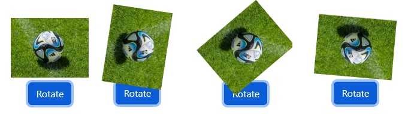
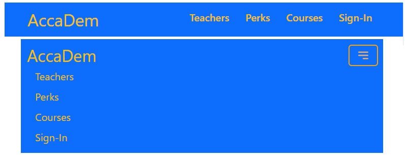

# REACT 6

* 1
* 1
* 1
* 1

We use **objects** to dynamically **style** _components_, using JSX brackets.

```jsx
//remember that style needs double {}
const picture={
  url: "https://.../635258.jpg",
  width: 100,
  height: 100
}

function Imma({pic}){
  return (
    
  )
}
```

On the DOM we pass the **style object prop** to the **component**.

```jsx
<div className="row col-10 justify-content-center">
  <Imma pic={picture} />
  <div>
    <button className="btn btn-primary" onClick={rotate}>
      Rotate
    </button>
  </div>
</div>
```

We install the **classnames** utility to join JSX classes conditionally.

```jsx
//First the classname then (:) the condition, we can include default classNames 
//we useState() to render the conditions

const [roll, setRoll] = useState(false)

let cubo= cn("p-0", {
  "rotola": roll
})

function rotate(){
  setRoll((x)=> (!x))
}

//and use the className to toggle the CSS animation 
.rotola{
  animation: roll 4s;
  animation-iteration-count: infinite;
}

@keyframes roll {
  100%{
    transform: rotate(360deg);
  }
}
```

<figure><figcaption><p>DOM element animated with a classname object</p></figcaption></figure>

### React-Bootstrap Navbar and Carousel

We need to use **flexGrow:0** for the nav elements justify and a custom-fill **SVG** for the React-bootstrap collapse icon.


Navbar and Navbar collapse


<figure><figcaption></figcaption></figure>

The react-bootstrap **Carousel** component includes the **.carousel-indicators** and **.carousel-control-prev-icon** (SVG), we edit them to customize the carousel areas.


React-Bootstrap Carousel with custom SVG arrows


<figure><figcaption></figcaption></figure>

1

1

1
