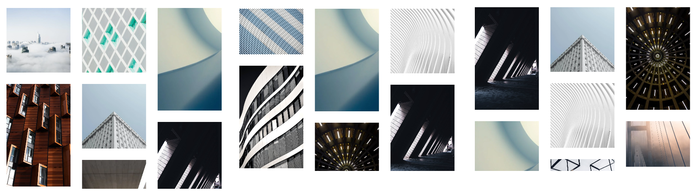

# React-Spring 1

* 1
* 1
* 1
* 1

**React-spring** is a **library** to create **animated** UI components.

```
npm i react-spring

App.js
import { animated, useSpring } from '@react-spring/web'
```

We _**import**_ the **animated** higher-order **component**, a function that takes a component and returns a new one.



We **useSpring({})** hook to set up the **animation object** properties **(**from, to**)**, then we deconstruct it on the **style** property to trigger it on mount.

```jsx
//we append the component on the animated high-order tag
function MyComponent() {

  const springs = useSpring({
    from: { x: 0 },
    to: { x: 100 },
  })

  return (
    <animated.div
      style={{
        width: 80, height: 80,
        background: '#ff6d6d',
        borderRadius: 8,
        ...springs
      }}
    />
  )
}

<div> <MyComponent /> </div>
```



We **deconstruct** the **api object** from the **useString({})** hook, and use its **methods** to control the **state** of the spring animation on _event listeners_.

```jsx
//Use className on the animated.div to style with CSS
//useString({}) needs to include all the animation properties used by the api
//The api methods control the state of the animation (start, stop set, etc)

.box{
    display: flex;
    width: 80px; height: 80px;
    background-color: brown;
    border: solid 5px yellow;
    border-radius: 10px;
}

function MyComponent() {

  const [springs, api] = useSpring(() => ({
    from: { x: 0, y: 0 },
  }))

  const handleClick = () => {
    api.start({
      from: {
        x: 0,
        y: 0,
      },
      to: {
        x: 150,
        y: 50,
      },
    })
  }

  return (
    <animated.div
      onClick={handleClick}
      className="box"
      style={{
        ...springs      
      }}
    />
  )
}
```



<figure><figcaption><p>Spring animation object + onClick api</p></figcaption></figure>

The <**animated**> **component** can be used directly on the **JSX** with a useString() as a style prop.

We can use the **useSpringRef()** hook to **reference** the imperative **API** on event handlers.                         &#x20;

Any **difference** between the useSpring() and the api.method **from:{}** will be **skipped**, to be animated style properties need to be both on <mark style="background-color:blue;">from</mark> and <mark style="background-color:blue;">to</mark>.

```
import { animated, useSpring, useSpringRef } from '@react-spring/web'
let refe = useSpringRef()

let init = useSpring({
  from: {x: 0, transform: "rotate(0deg)"},
  ref: refe
})

function mosso(){
  refe.start({
    from: {x: 50, transform: "rotate(30deg)"},
    to: {x: 150, transform: "rotate(330deg)"},
    config: {duration: 5500},
    loop: {reverse: true}
  })
}

<animated.div
  onClick={mosso} className="boxo"
  style={{ ...init }}
>
</animated.div>
```

<figure><figcaption><p>useSpring(9 state and event handler function with useSringRef()</p></figcaption></figure>

We can _useSpringRef()_ to **pause**/**resume** and **stop** animations.

```
//after stop() it won't resume()
init.pause()
init.resume()
init.stop()

//We can do the same on a useSpring() api.
```

The useSpring() **config property** contains **mass, tension, friction, easing**, and **duration** (used for its "timing function")

```
const basic = useSpring({
  from: {background: 'brown'},
  config:{
    tension: 280, friction: 120,
    easing: "easeOutQuart", duration: 3000,
  },
}

//We can edit the config on the api event handler function.
const handleClick = () => {
  basic.start({
    y: 20,
    config: {
      friction: 10,
    },
  })
}
```

<details>

<summary>List of useString() presets configs</summary>

We can use **both** a **preset** and a **custom** config property.

```
const basic = useSpring({
  from: {background: 'brown'},
  config: config.wobbly,
  config:{
    duration: 3000,
  },
}
```

There are the presets configs.

```
default – { tension: 170, friction: 26 }
gentle – { tension: 120, friction: 14 }
wobbly – { tension: 180, friction: 12 }
stiff – { tension: 210, friction: 20 }
slow – { tension: 280, friction: 60 }
molasses – { tension: 280, friction: 120 }
```

</details>

Using the <mark style="background-color:blue;">**to**</mark> _method_, we **interpolate** the **springValue** data on a different **style** property (we can animate both).

```
// 0/360 used for rotate and translateX if the useSpring is included

import { animated, useSpring , config, to } from '@react-spring/web'
const props = useSpring({
  from: { x: 0 },
  to: { x: 360 },
  config: {duration: 2500}
})

style={{ 
  transform: smal.x.to(value => `rotateZ(${value}deg)`),
  ...props
}}
```

We use the **springValue** as a **breakpoint** to animate a style property.

```
const auto = useSpring({
  from: { x: 0 },
  to: { x: 1 },
  config: {duration: 3000}
})

style= {{
  transform: auto.x
    .to([0, 1], [0, 100])
    .to((x) => `translate(${x}px)`),
}}
```

We use a **conditional springValue** and the <mark style="background-color:blue;">**to**</mark> method to **animate** the **style** properties.                             **Range** are the animated _springValues_ breakpoints, **output** are the style property **values** on each **breakpoint,** and both only accept **integers** in their **array**.

```
//We need {} on the springValue to access the to method
//The useSpring() breakpoint needs to share the name with springValue
//We don't need the from{} property

const [vedo, setVedo] = useState(false)
const {dice} = useSpring({
  dice: vedo ? 1 : 0,
  config: {duration: 5000},
})

<animated.div 
  onClick={ ()=> setVedo(!vedo) }
  className="boxo" 
  style={{
    scale: dice.to({ range: [0, 1], output: [0.5, 1.5] }),
    background: dice.to({ range: [0, 0.5, 1], output: ["red", "orange", "pink"] }),
    y: dice.to({ range: [0, 0.8, 1], output: [0, 50, 50] }),
    x: dice.to({ range: [0, 1], output: [0, 200] }),
  }}>
</animated.div>
```

<figure><figcaption><p>Animated style properties onClick() </p></figcaption></figure>

We use an **array** of <mark style="background-color:blue;">**to**</mark> style **objects** for multiple animations, the array has to **include** the <mark style="background-color:blue;">**from**</mark> object **(**any object before it will be ignored**)**.

```
//A loop: true would skip to the starter point, we need to add reverse.
//This will trigger the animation on mount
let auto = useSpring({
  from: { x: 0, y: 0, scale: 0.5, background: "red"},
  to: [
    { x: 0, y: 0, scale: 0.5, background: "red" },
    { x: 100, y: -50, scale: 1, background: "orange" },
    { x: 200, y: 50, scale: 1.5, background: "pink" },
  ],
  config:{ duration: 1000 },
  loop:{ reverse: true }
})

<animated.div className="boxo" style={auto}>
</animated.div>
```

We animate a **useSpring()** **background image** by only using output (will work on its first 2 values).

```jsx
const {value} = useSpring({
  from: {value: 0}, to: {value: 1},
  loop: {reverse: true},
  config: {duration: 6000}
})

let x2= value.to({ output: ['0%', '20%'] })

<div className="conta">
  <animated.div className="suono" style= {{ x: x2 }} >
  </animated.div>
</div>
```

On the CSS we use [**inset** ](#user-content-fn-1)[^1]to **cover** the **X/Y** **margins** left by the useSpring() **animation**.

```css
//A bigger background avoids empty border spaces during the animation

.conta{
  position: relative;
  width: 85vw;
  height: 30vh;
  overflow: hidden;
  background-color: burlywood;
}

//use inset: -200%; width: 400%; height: 400%; for bigger animations
.treno{
  inset: 0% -25%;
  width: 125%; height: 100%;
  position: absolute;
  opacity: 0.3;
  background: url('https://media.timeout.com/images/105782103/image.jpg') center;
  background-size: cover;
}
```

<figure><figcaption><p>Animated useSpring() background image</p></figcaption></figure>

We can directly **destruct** a **useSpring()** object and re-assign **property** names.

```
//The destructured property then the assigned name
let {opacity, transform: tran} = useSpring({
  opacity: 0.5,
  transform: rotateX(180deg)
})

<animated.div style={{ opacity }}></animated.div>	
<animated.div style={{ transform: tran }} > </animated.div>
```

<details>

<summary>Destruct useSpring() rotateX property on 2 display absolute images</summary>

The 2 **absolute** images are **overlayed** in the same container.

<pre class="language-jsx"><code class="lang-jsx"><strong>&#x3C;div className="carta" onMouseEnter={ronda} onMouseLeave={ronda}>
</strong>  &#x3C;animated.div className="carta davanti">
  &#x3C;/animated.div>

  &#x3C;animated.div className="carta dietro">
  &#x3C;/animated.div>
&#x3C;/div>

//The event handlers are on the container coz the images will be rotated
.carta{
  position: absolute;
  width: 200px;
  height: 120px;
}

.davanti,
.dietro{
  background-size: cover;
}

.davanti{
  background-image: url(https://images.neon.com);
}

.dietro{
  background-image: url(https://images.sea.com);
}
</code></pre>

We **useState()** the _useSpring()_ destructured style **properties**, and use them on the **animated** components.

```jsx
//We use perspective() for a better rotateX effect, or add rotateY()
const [conta, setConta] = useState(false)

let {opacity: opa, transform: tran } = useSpring({
  opacity: conta ? 1 : 0,
  transform: `perspective(600px) rotateX(${conta ? 180 : 0}deg) `,
  config: {duration: 1000}
})

const ronda = () => { setConta(!conta) }
```

Both **images share** the useSpring() style **properties**, the **front** image **opacity** needs to be **opposite** from the back one, we edit it using the <mark style="background-color:blue;">to</mark> method.

```jsx
//we add an opposite rotateX to the back image to avoid it being upside down.
<div className="carta" onMouseEnter={ronda} onMouseLeave={ronda}>

  <animated.div 
    className="carta davanti"
    style={{ 
      opacity: opa.to(x=> 1- x),
      transform: tran
    }}
  >
  </animated.div>

  <animated.div 
    className="carta dietro"
    style={{ 
      opacity: opa, transform: tran,
      rotateX: "-180deg"
    }}
  >
  </animated.div>
</div>
```

</details>

<figure><figcaption><p>rotateX and opacity useString() on 2 absolute images</p></figcaption></figure>

### The useTransition() animation styles and methods

The **useTransition(**array, config**)** hook **sequentially** _animates_ datasets of elements on the DOM.

```jsx
//enter{} is the current style, from/leave are before/after the transition
//exitbefore will repeat the transition to remove the current element before the next

const transitions1 = useTransition(indice, {
  from: { opacity: 0 },
  enter: { opacity: 1 },
  leave: { opacity: 0 },
  exitbefore: true,
  config: { duration: 5000 },
})
```



its array **argument** can also be an **index** while its config is different from useSpring()

```jsx
//We create an array of animated components to use the index in
import { useTransition, animated, useSpringRef } from '@react-spring/web'
const [indice, setIndice] = useState(0)
const refe = useSpringRef()

const pages = [
  ({ style }) => (
    <animated.div style={{ ...style, background: "pink"}}>A</animated.div>
  ),
  ...
]
```

The useTransition() **onRest method** triggers each time an animated **transition** is **completed**.

```jsx
//Its arguments: animationResult(enter style object, cancelled/finished props)
//the spring controller and the useTransition index

const transitions1 = useTransition(indice, {
  from: { opacity: 0, transform: 'translate3d(0,50%,0)' },
  enter: { opacity: 1, transform: 'translate3d(0%,0,0)' },
  leave: { opacity: 0, transform: 'translate3d(0,-50%,0)' },
  config: { duration: 2000 },
  ref: refe,
  onRest: (string, crtl, item)=> {
    if (indice === item) {
      setIndice(x => (x+ 1) % 3 )
    }
  }
})
```

The updated useState() **index** triggers the **useEffect**() which re-starts the **transition**.

```jsx
useEffect(() => {
  refe.start()
}, [indice])
```

The useTransition() hook returns the style objects and the index for the animated component to render.

```jsx
//We also need position: absolute for the effect to work
<div>
  {transitions1((style, i) => {
    const Page = pages[i]
    return <Page style={style} />
  })}
</div>
```

<figure><figcaption><p>automatic useTransition() updated onRest()</p></figcaption></figure>



We use an event listener to edit the useTransition() index and render the array of images.

```jsx
//to keep the index from 0 to 2 (images indexes) we use % 3
const IMAGES = [
  'https://images/art-piece-for-you.png',
  'https://images/generative-waves.jpg',
  'https://images/generative-art.jpg',
]

const [activeIndex, setActiveIndex] = useState(0)
function clicka(){
  setActiveIndex(x => (x+ 1) % 3 )
}

useEffect(() => {
  springApi.start()
}, [activeIndex])

const springApi = useSpringRef()
```

We animate the clipPath height from 0-100-0 while keeping the width at 100.

```jsx
const transitions = useTransition(activeIndex, {
  from: {  clipPath: 'polygon(0% 0%, 0% 100%, 0% 100%, 0% 0%)' },
  enter: { clipPath: 'polygon(0% 0%, 0% 100%, 100% 100%, 100% 0%)' },
  leave: { clipPath: 'polygon(100% 0%, 100% 100%, 100% 100%, 100% 0%)' },
  exitBeforeEnter: true,
  config: {
    duration: 3000,
  },
  delay: 1000,
  ref: springApi,
})

<div>
  {transitions((springs, item) => (
    <animated.div className="img__container" style={springs} onClick={clicka}>
      
    </animated.div>
  ))}
</div>
```

<figure><figcaption><p>exitbeforeenter useTransition() animation onClick()</p></figcaption></figure>



To render **multiple \<animated>** elements we put an **array** as a **useTransition**() argument.

```jsx
//The elements will overlay if position: absolute
let lista = [{ numba: 1,chiave: "unn"}, ... ]

let multipli = useTransition(
  lista1.map((x)=> ({...x})),
  {
    key: (item)=> (item.chiave),
    from: {opacity: 0},
    enter: { opacity: 1, background: "red", x: 20, margin: 10 },
    leave: {opacity: 0}
  }
)

<div>
  {multipli( (style, item, t, index)=>(
    <animated.div className="boxo text-center" style={{...style}}>
      <p className='text-white'>Index {index}</p>
    </animated.div>
    ))
  }
</div>
```

<figure><figcaption><p>useTransition() multiple elements</p></figcaption></figure>

We can **dynamically** create **style** properties during the array methods, which we extract and use in the <mark style="background-color:blue;">**enter**</mark> object.

The **update()** property **animates** its extracted style **properties** each time the array **argument changes**, it also requires the property value to be set using an **external counter.**

```jsx
//The elements don't change, only their properties
//Each ypdate will translate3D() the previous x properties values.
let y= 0;

let colore = useTransition( 
  lista1.map((x)=> ({ ...x, x: y+= x.numba*25}) ), 
  {
    key: (item)=> (item.chiave ),
    from: { opacity: 0 },
    update: ({x}) => ({x}),
    enter: ({x}) => ({ opacity: 1, background: "red", x}),
    leave: { opacity: 0 },
  }
)

const rein = () => setLista1(shuffle)
```

<details>

<summary>useTransition() to set and update style properties with imported objects.</summary>

We npm install lodash (javascript library) and import the shuffle method.

```jsx
import shuffle from 'lodash.shuffle'
shuffle([1,2,3,4,5])	//[3, 5, 4, 2, 1]
```

We **useState()** an array of **style objects** to render and animate with **useTransition()**.                                                                                                                         We _useEffect()_ setInterval() to trigger the **shuffle method.**

```jsx
//we need to cleanInterval() it before re-starting

export default [
  {
    name: 'Rare Wind',
    description: '#a8edea → #fed6e3',
    css: 'linear-gradient(135deg, #a8edea 0%, #fed6e3 100%)',
    width: 120,
  },
  ...
]

import data1 from './Data1'
const [lista, setLista] = useState(data1)

useEffect(() => {
  const t = setInterval(() => setLista(shuffle), 2000)
  return () => clearInterval(t)
}, [])
```

We update the **counter** on the **array**.**method** argument and to set the **style property (x)**.

```jsx
//We update the counter and set spring objects with the imported object

let spazio = 0

const transitions = useTransition(
  lista.map(data => ({ ...data, x: (spazio += data.width) - data.width })),
  {
    key: (item) => item.name,
    from: { width: 0, opacity: 0 },
    update: ({ x }) => ({ x }),
    enter: ({ x, width }) => ({ x, width, opacity: 1, height: 80 }),
    leave: { width: 0, opacity: 0 },
  }
)
```

We use the **counter** to style the **container**, the **spring** object to style the <mark style="background-color:blue;">\<animated></mark>, and the imported **object properties** to style the single-_child components_.

<pre class="language-jsx"><code class="lang-jsx"><strong>&#x3C;div className="list1" style={{ width: spazio }} onClick={mischia} >
</strong>
  {transitions( (style, item, t, index) => (
    &#x3C;animated.div className="card1" style={{ ...style }}>

      &#x3C;div className="details1" style={{ backgroundImage: item.css }} />

    &#x3C;/animated.div>
  ))}
&#x3C;/div>
</code></pre>

The components share the same space (width) with position: absolute.

```
.card1 {
  position: absolute;
  height: inherit;
  padding: 15px;
}

.details1 {
  height: 100%;
}
```

</details>

<figure><figcaption><p>useTransition() on {x} updated style property</p></figcaption></figure>

### React-use-measure on events and react-spring animations

The React-use-measure tool references DOM elements to measure their boundaries.

```jsx
//The bounds objects contain { width, height, top, right, bottom, left, x, y}
npm i react-use-measure 

import useMeasure from 'react-use-measure'
const [ref, bounds] = useMeasure()

function sopra({ clientX, clientY }){
  setXY([clientX, clientY])
}

<div className="inside" ref={ref} onMouseMove={sopra}>
  <div className="box"></div>
</div>

<div>
  <p> Mouse x {Math.round(xy[0] - bounds.left)}px </p>
  <p> Mouse y {Math.round(xy[1] - bounds.top)}px </p>
</div>
```

<figure><figcaption><p>Relative Cursor position on measured DOM element</p></figcaption></figure>

We access the from/to useSpring() properties with:

```
props.width.animation.to             //the to:{} width value
props.width.to(x => x.toFixed(0))    //Dom rendering inside an <animated />
```

<details>

<summary>Animating measures with useSpring() conditional values.</summary>

We **animate** a react-use-measure **width** with a **useState() trigger**, using a t**ernary operator** to change the **useSpring()** target **value** (to).

The relative>absolute **child** component is **animated** using its **parent** measured **width**.

```
//we need the animated component to access the useSpring() prop

const [open, toggle] = useState(false)
const [ref, { width }] = useMeasure()
const props = useSpring({ width: open ? width : 0})

<div ref={ref} className="main" onClick={()=> toggle(!open) } >
  <animated.div className="fill" style={props} />

  <animated.div className="content">
    {props.width.to(x => x.toFixed(0))}
  </animated.div>
</div>
```

The children **CSS** properties set its **starter animation condition** (from).

```css
//the .fill element starts from the left and its height covers the parent
.main {
  position: relative;
  width: 200px;
  height: 50px;
  cursor: pointer;
  border-radius: 5px;
  border: 2px solid #272727;
  overflow: hidden;
}

.fill {
  position: absolute;
  left: 0;
  height: 100%;
  background: hotpink;
}

.content {
  position: absolute;
  display: flex;
  color: #272727;
  width: 100%; height: 100%;
  align-items: center; justify-content: center;
}
```

The useString() **api** for the event works too, but we **can't reset** the (from) **property** yet.

```sass
const [propa, api] = useSpring(()=>({
  from: {width: 0 }
}))

function checkin(){
  api.start({
    from: {
      width: 0,
    },
    to: {
      width: width,
    },
  })
}

<div ref={ref} className="main" onClick={checkin} >
  <animated.div className="fill" style={propa} />

  <animated.div className="content">
    {propa.width.to(x => x.toFixed(0))}
  </animated.div>
</div>
```

</details>

<figure><figcaption><p>Animated width property on useState()</p></figcaption></figure>

The **matchMedia()** method returns _true_ if the document **matches** (or is higher) than its _media-query string_.

```jsx
//If width > 1000 then matchMedia("(min-width:1000px)").matches == true
//We add/remove an eventListener ("resize") to update the useState() match value

const colonne = useMedia(
  ['(min-width: 1100px)', '(min-width: 900px)', '(min-width: 600px)'], [5, 4, 3], 2)

//value being the array integer sharing the media-query index
function useMedia(queries, values, defaultValue) {

  function match(){      
    return values[queries.findIndex(q => matchMedia(q).matches)] || defaultValue
  }
  const [value, set] = useState(match)

  useEffect(() => {
    const handler = () => set(match)
    window.addEventListener("resize", handler)
    return () => window.removeEventListener("resize", handler)
  }, [])

  return value
}
```

We **useMeasure()** to dynamically **set** the column's **width** on **media queries**.

```jsx
//On resize the number and width of the columns will vary

const [ref, { width }] = useMeasure()
const [items, set] = useState(Data)

let wide = width / colonne

<div ref={ref} className="text-center">
  <p> Each of the {colonne} columns will be {wide} px</p>
</div>
```

<figure><figcaption><p>columns and with on resize</p></figcaption></figure>

We **import** an **array** of images objects as an **useState**(), to use in the useTransition().

```jsx
export default [
  { css: 'https://images.pexels.com/.../pexels-photo-416430.jpeg', height: 150 },
  ...
]

import Data from './Data';
const [items, set] = useState(Data)
```



We import the **lodash.shuffle** method to use on useEffect().

```jsx
//npm install lodash is a javascript utility library
//or npm install lodash.shuffle if it doesn't work
import shuffle from 'lodash.shuffle'

useEffect(() => {
  const t = setInterval(() => set(shuffle), 50000)
  return () => clearInterval(t)
}, [])
```

We store the (container) **height** and the spring-style **images array** on a **useMemo**(), it will change on dependency shuffle (items order change).

```jsx
//Height values are set during y

const [heights, gridItems] = useMemo(() => {
  let heights = new Array(columns).fill(0) 

  let gridItems = items.map((child, i) => {
    const column = heights.indexOf(Math.min(...heights)) 

    const x = (width / columns) * column 
    const y = (heights[column] += child.height / 2) - child.height / 2 

    return { ...child, x, y, width: width/ columns, height: child.height / 2 }
  })

  return [heights, gridItems]
}, [columns, items, width])
```

On shuffle the images **translate-X/Y**, change **column** array **position**, and the (max) height container is updated.

```jsx
//trail is the delay of images overlapping during the transition

const transitions = useTransition(gridItems, {
  key: item => item.css,
  from: ({ x, y, width, height }) => ({ x, y, width, height, opacity: 0 }),
  enter: ({ x, y, width, height }) => ({ x, y, width, height, opacity: 1 }),
  update: ({ x, y, width, height }) => ({ x, y, width, height }),
  leave: { height: 0, opacity: 0 },
  config: { mass: 5, tension: 500, friction: 100 },
  trail: 5,
})

<div ref={ref} className="list" style={{ height: Math.max(...heights) }}>
  {transitions((style, item) => (
    <animated.div style={style}>
      <div style={
       { backgroundImage: `url(${item.css}?auto=compress&dpr=2&h=500&w=500)`}
      } />
    </animated.div>
  ))}
</div>
```

<figure><figcaption><p>shuffle useTransition() images array</p></figcaption></figure>



We _useState()_ the "columns **height**" array and the **current** rendered **images**.

```
let [hel, setHel] = useState( new Array(colonne).fill(0) )
let [images, setImages] = useState([ ])
```

We **useState()** to **update** the current **index** image from the imported array.

```
let [indice, setIndice] = useState(0)
function add(){
  setIndice((x)=> x+ 1 )
}

//we set the column's height (on min index), the x, y, and height style props
useEffect(()=>{

  let imma = items[indice]
  let column = hel.indexOf(Math.min(...hel)) 
  let newhel = [...hel]

  let x = (width / colonne) * column;
  let y = ( newhel[column] += imma.height ) - imma.height
  setHel( newhel )

  let cred = [...images]
  cred.push( {  ...imma ,x, y, height: imma.height } )
  setImages( cred )

}, [indice])

```

We **render** the **useTransition**() image array on the **max**-height-**column** styled container&#x20;

```
//we need the auto=compresses to load the images faster

const transitions = useTransition(images, {
  key: item => item.css,
  from: ({ x, y, width, height }) => ({ x, y, width: 0, height, opacity: 0}),
  enter:({ x, y, width, height }) => ({ x, y, width: wide, height, opacity: 1})
  update: ({ x, y, width, height }) => ({ x, y, width: wide, height }),
})

<div ref={ref} className="text-center list" style={{ height:Math.max(...hel)}}>
  {transitions((style, item) => (
    <animated.div style={style}>
      <div style={
        {backgroundImage: `url(${item.css}?auto=compress&dpr=2&h=500&w=500)`}
       }/>
    </animated.div>
  ))}
</div>

```

<figure><figcaption><p>added useTransition() images and higher container</p></figcaption></figure>



In both examples, the images need position absolute to share the same line.

```
.list {
  position: relative;
  width: 100%;
  height: 100%;
}

.list > div {
  position: absolute;
  padding: 15px;
}

.list > div > div {
  background-size: cover;
  background-position: center center;
  width: 100%;
  height: 100%;
}
```



1

1

[^1]: Negative internal margins,

    same css syntax.                &#x20;
