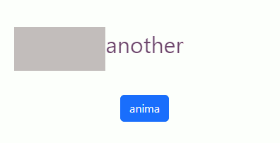
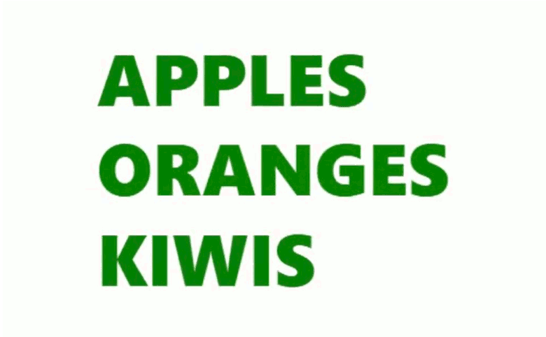
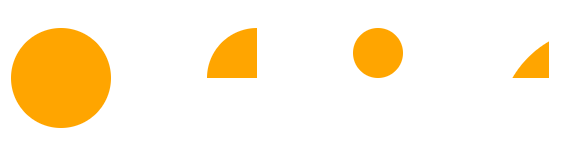

# React-Spring 2

1

* 1
* 1

The **useTrasition()** **style** props can be **rendered** only in an **animated.div** component.

The **Enter** and **Leave** prop **animate** the useTransition() elements being **added/removed** to the DOM, _both will be rendered_ when the element is [<mark style="background-color:blue;">updated</mark>](#user-content-fn-1)[^1].

When the animation is _re-triggered_ the **first** and **final frame** of [<mark style="background-color:blue;">**Enter**</mark> ](#user-content-fn-2)[^2]will be **animated**, to avoid rendering it (and "reset" the transition) _we add a starter frame_ with different property values.

```jsx
//We update the useTransition() by changing the useState()
//opacity is not on the last/first "frame" of Enter, it "reset" the style props
//leave removes the old element while from/enter renders the new
const [mio, setMio] = useState(["another"])

const estilo = useTransition(mio, {
  from: {
    centra: "40%",
    back: "transparent", long: "0%", lefto: "0%",
    display: "block", color: "black", opacity: 0, width: "100%",
  },
  enter: [
    { opacity: 0.8 }, 
    { back: "pink", color: "green", long: "90%", lefto: "10%", opacity: 1 },
    { back: "orange", color: "blue", long: "50%", lefto: "50%" },
    { back: "red", color: "red", long: "0%", lefto: "100%"}
  ],
  leave: [
    { centra: "0%", display: "none" }
  ],
  update: { color: "purple" },
  config:{ duration: 1000 }
})

let plus = useRef(0)

function changed(){
  plus.current += 1;
  ( plus.current % 2 ) ? setMio( ["nuovo"] ) : setMio( ["another"] )
}

//We deconstruct the custom-style properties for the containers
//and use the ...rest-operator for the child component
<div className="d-flex justify-content-center mt-5 mb-2">
  {estilo(( {centra, back, long, lefto, ...resto} , item) => (
  
    <animated.div className="centra" style={{ width: centra }} >
      <animated.div 
        className="sfondo"
        style={{backgroundColor: back, width: long, left: lefto}}
      >
      </animated.div>

      <animated.div className="testo" style={resto}>
        {item}
      </animated.div>
    </animated.div>
  ))}
</div>

```

<figure><figcaption><p>useTransition() on updated() element update</p></figcaption></figure>

We _useTransition(_) 2 **absolute components** on the same level.

<pre class="language-css" data-overflow="wrap" data-full-width="false"><code class="lang-css"><strong>.centra{
</strong>  position: relative;
}

.sfondo{
  position: absolute;
  left: 0%;
  width: 100%;
  height: 10vh;
}

.testo{
  position: absolute;
  text-align: center;
  font-size: 2em;
}
</code></pre>

<details>

<summary>Enter and Leave useTransition() on setTimeout() updated array elements</summary>

A useTransition() updated array **won't animate** its **unchanging** values.

The **setTimeout()** array updates will resolve **sequentially**, based on their timeout (2000 + 2000 + 1000), _not their syntax order_.

```jsx
//We empty the array element to re-start the animation
//Even if rotateX(0) is the default, we declare it to Eenter animate

const [testi, setTesti] = useState([])

const transitions = useTransition(testi, {
  from: {
    innerHeight: 0,
    opacity: 0, color: 'orange', height: 0,
    transform: 'perspective(600px) rotateX(0deg)',
  },
  enter: [
    { opacity: 1, height: 80, innerHeight: 80 , color: "green" },
    { transform: 'perspective(600px) rotateX(180deg)', color: 'yellow' },
    { transform: 'perspective(600px) rotateX(0deg)', color: "red" },
  ],
  leave: [
    { color: 'purple' }, 
    { innerHeight: 0 }, 
    { opacity: 0, height: 0 }
  ],
  update: { color: 'pink' },  
})

const reset = useCallback(() => {
  setTesti([])
  setTimeout(() => setTesti(['Apples', 'Kiwis']) , 5000)
  setTimeout(() => setTesti(['Apples', 'Bananas', 'Kiwis']) , 4000)
  setTimeout(() => setTesti(['Apples', 'Oranges', 'Kiwis']), 2000)
}, [])

//useEffect() triggers the animation once during the initial render
useEffect(() => {
  reset()
}, [])

//Flex is for the Y-align while block is to render the words
<div className='d-flex align-items-center' style={{ height: "320px" }} >
  <div style={{display: "block"}}>
  {transitions(({ innerHeight, ...rest }, item) => (
    <animated.div className="transitionsItem" style={rest}>
      <animated.div style={{ overflow: 'hidden', height: innerHeight }}> 
        {item} 
      </animated.div>
    </animated.div>
  ))}
  </div>
</div>

```

We use the CSS for the text.

```css
.main {
  height: 320px;
  display: flex;
  align-items: center;
}

.transitionsItem {
  font-size: 4em;
  font-weight: 800;
  text-transform: uppercase;
  line-height: 80px;
}
```

</details>

<figure><figcaption><p>Enter and Leave useTransition() array elements</p></figcaption></figure>

The **exitBeforeEnter** property **first** animates the **Leave** element, then **removes** it and renders the **Enter** element in the _same position_.

The **expires** property animates and **doesn't remove** the **Leave** element while rendering the enter one.

```jsx
let animato = useTransition(element, {
  from: {},
  expires: false,
  exitBeforeEnter: true,
}
```

The useTransition() **events** can be linked to a specific **styler property**.

```
//onStart() triggers at the start of each frame.
//onChange() on each pixel of animation 
//onRest(), onPause(), and onResume() for paused/resumed animations
//onProps() triggers on updates by new props, even if it remains idle
//onDestroyed() when the element is un-mounted.

//The TO property renders the target prop, not the current style.
let animato = useTransition(element, {
  from:{},
  onStart: {
    color: (x) => {console.log( "triggers on color" )},
    backgroundColor: (x) => {console.log( "back is " + (x.value.animation.to) )}
  },
  onProps: () => {console.log("will cover each updated property")}
}
```

1

### React use-gesture and useSpring()

We **npm install @use-gesture/react**, a library that binds **mouse** and **touch events** to animate **useSpring()** NODE elements.

```jsx
//We extract the useDrag() hook to animate the useSpring() and useState()
import { useDrag } from '@use-gesture/react'

const [{x, dietro}, api] = useSpring(()=>({
  x: 0,
  dietro: "brown"
}))

let [mosso, setMosso] = useState(0)
```

The **useDrag()** returns an **object** that applies **event handlers** to **animated.div** components.          Its **parameters** are the drag **action** and the **movement** coordinates, and its _gesture data_ **animates** the **useSpring()** style properties.

```jsx
//The useDrag() includes the onPointerUp, onPointerDown, and onPointerMove events.
//active/down event is not a variable, the movement's array is [X-axis, Y-axis]
//We need the immediate property for a smooth property transition later
const muovi = useDrag( ({active, movement: [mx]}) =>(
  api.start({
    x: active ? mx : 0,
    dietro: active ? "orange" : "brown",
    immediate: name => active && name === "mx"
  }),

  setMosso( Math.abs(mx) )
))

//We set a variable based on the useDrag() updated X-style property
//The map property is a filter function for the input value
//The extrapolate property used for the range/output breakpoints
let kolor = x.to({
  map: Math.abs,      //we absolute the negative x coordinates
  range: [10, 300],
  output: [1, 0.2],
  extrapolate: "clamp"  //extends, extrapolate, extrapolateLeft, or extrapolateRight
})
```

We spread the useDrag() variable in the animated.div element we want to interact with.

```jsx
//The useState()/style props are updated on useDrag() movement

<div className="d-block">
  <animated.div className="backo" style={{ backgroundColor: dietro }}>
  </animated.div>

  <div className="d-flex justify-content-center mt-3">
    <animated.div className="boxo" {...muovi()} style={{ x, opacity: kolor }} >
    </animated.div>
  </div>

  <animated.p className="text-center">
    We moved it by {Math.floor(mosso/13)} em
  </animated.p>
</div>
```

<figure><figcaption><p>The useDrag() used to animate a useSpring() component</p></figcaption></figure>

<details>

<summary>Replacing useSpring() properties with the useDrag() hook</summary>

We create **variables** for the **useSpring()** REST style properties.

<pre class="language-jsx"><code class="lang-jsx"><strong>//We rest the bg and justifySelf and set them (left)
</strong><strong>import { useDrag } from '@use-gesture/react'
</strong>
const [{ x, scale, bg, justifySelf }, api] = useSpring(() => ({
  x: 0,
  scale: 1,
  ...left
}))

const left = {
  bg: `linear-gradient(120deg, #f093fb 0%, #f5576c 100%)`,
  justifySelf: 'end',
}
const right = {
  bg: `linear-gradient(120deg, #96fbc4 0%, #f9f586 100%)`,
  justifySelf: 'start',
}
</code></pre>

During **useDrag()** we **replace** the **REST** style properties based on the x-axis **position**.

```jsx
//A left X position is negative
const bind = useDrag(({ active, movement: [x1] }) =>
  api.start({
    x: active ? x1 : 0,
    scale: active ? 1.1 : 1,
    ...(x1 < 0 ? left : right),
    immediate: name => active && name === "x1"
  })
)

const avSize = x.to({
  map: Math.abs,
  range: [50, 300],
  output: [0.5, 1],
  extrapolate: "clamp"
})
```

We don't drag the cover, we **drag** its container and **animate** its **x** style property, _justifySelf_ and _bg_ are replaced during onDrag().

```jsx
//Scale is set based on the useDrag() but outside of it
<div className="d-flex justify-content-center mt-5 mb-2">

  <animated.div {...bind()} className="item" style={{ background: bg }}>
    <animated.div className="circle" style={{ scale: avSize, justifySelf }}/>
    <animated.div className="cover" style={{ x, scale }}>
      Slide11
    </animated.div>
  </animated.div>
</div>

//We can render a useSpring value but we can't add text to it
<animated.div className="text-center">
  { avSize }
</animated.div>
```

The CSS style being:

```
//display: grid used for the justifyself
.item {
  position: relative;
  width: 300px;
  height: 100px;
  user-select: none;
  display: grid;
  align-items: center;
}

.cover {
  position: absolute;
  height: 100%;
  width: 100%;
  display: grid;
  text-align: center;
  background-color: #272727;
  color: rgba(255, 255, 255, 0.8);
  font-size: 3em;
}

.circle {
  width: 60px;
  height: 60px;
  border-radius: 50%;
  background-color: white;
}
```

</details>

<figure><figcaption><p>useDrag() used to replace useSpring()</p></figcaption></figure>

The useDrag() <mark style="color:blue;">state attribute</mark> **velocity** matches the **drag speed** of the element, the config.**decay** triggers the **momentum** at the drag stop.



The useDrag() <mark style="color:blue;">state attribute</mark> **movement** records the gesture **change of position** _relative_ to its _starter useSpring()_, which gets **reset** at the _end_ of useDrag()

```jsx
//decay:false returns the element to its useSpring(), no momentum tho
const [{x1, y1}, api1] = useSpring(()=>({
  x1: 100, y1: 0,
}))

let pinto = useDrag(({ down, movement: [mx, my], velocity, direction}) =>{
  
  api1.start({
    x1: down ? mx: 100, y1: down ? my : 0,
    config: { velocity , decay: false },
    immediate: down,
  })
})

<div>
  <animated.div className="rocket" {...pinto()}
    style={{ x: x1, y: y1}}
  />
</div>
```

<figure><figcaption><p>animated.div onDrag() movement event</p></figcaption></figure>



The useDrag() <mark style="color:blue;">state attribute</mark> **offset** records the **absolute position** relative to its <mark style="color:blue;">container</mark>, it _stores_ the element **position** after the onDrag().

```jsx
//the decay:false to re-dra in the same position we left it
const [{ x3, y3 }, api3] = useSpring(() => ({ 
  x3: 0, y3: 0 
}))

const bind3 = useDrag(({ down, offset: [x3, y3], velocity }) => {

  api3.start({ 
    x3, y3,
    immediate: down,
    config: { velocity , decay: false },
  })
})
	
<div>
  <animated.div className="rocket" {...bind3()} 
    style={{x: x3, y: y3}} 
  />
</div>
```

<figure><figcaption><p>multiple useDrag() offset positions</p></figcaption></figure>



The _arcTangent_ (**Math.atan2**) of the [**direction** ](#user-content-fn-3)[^3]coordinates returns the current **rotation** position.

```jsx
//We keep the position but no momentum
const [{x, y, transform}, apri] = useSpring(()=> ({
  x: 0, y: 0,
  transform: "rotate(0rad)",
}))

const bind4 = useDrag(({ down, offset: [x, y], velocity, direction }) => {

  apri.start({ 
    x, y,
    transform: `rotate(${ Math.atan2(direction[0], -direction[1]) }rad)`,
    immediate: down,
    config: { velocity , decay: false },
  })
})

<div>
  <animated.div className="rocket" {...bind4()}
    style= {{ x, y, transform }}
  />
</div>
```

1

### Waving transitions with animated SVG filters and useSpring()

**SVG**, short for **S**calable **V**ector **G**raphics, uses the **viewBox** _attribute_ to define a visible window **area** _within_ the SVG element.

The **viewBox** can **scale** or **pan** its element **proportionally** to the container **size** (while maintaining its aspect ratio).

```
//The zoom depends on the proportion between the container and the viewBox
//50/100 = 0.5x scale on the SVG, while 50/25 = 2x scale. 

<div>
  <svg width="100" height="100">
    <ellipse fill="orange" cx="50" cy="50" rx="50" ry="50"></ellipse>
  </svg>

  <svg width="50" height="50">
    <ellipse fill="orange" cx="50" cy="50" rx="50" ry="50"></ellipse>
  </svg>

  <svg width="50" height="50" viewBox='0 0 100 100'>
    <ellipse fill="orange" cx="50" cy="50" rx="50" ry="50"></ellipse>
  </svg>

  <svg width="50" height="50" viewBox='0 0 25 25'>
    <ellipse fill="orange" cx="50" cy="50" rx="50" ry="50"></ellipse>
  </svg>
</div>
```

<figure><figcaption><p>circles rendered inside &#x3C;svg> tag using viewBox</p></figcaption></figure>

The **\<filter>** tag contains the filter **primitive elements**, used to create _svg visual effects_.                     The **\<g>** tag can render **multiple** _svg_ elements, its **d**(ata) attribute defines the **path** and shape of the element.

We animate the <mark style="color:blue;">useSpring()</mark> **between** its **starting/ending state** with the useState() **reverse** property and **dependency**.                                                                                                                    We use the <mark style="color:blue;">React-spring</mark> **animated() function** to create **animatable** _filter primitive_ components.

To animate the **SVG wave** effect, we use the **baseFrequency** attribute for its _frequency_ and _direction_ (X/Y values) and the **scale** (factor) for the **strength** of the _displacement effect_.

```jsx
//The filter primitives <feTurbulence> and <feDisplacementMap> create the wave effect
//We can use animated.feDisplacementMap
//A +/- factor changes the direction of the waves
//frequency is 0 at the ending state to not have a distorted image

const AnimFeTurbulence = animated('feTurbulence')
const AnimFeDisplacementMap = animated('feDisplacementMap')

const [aperto, setAperto] = useState(false)

const [{ freq, factor, scale, opacity }] = useSpring(() => ({
    reverse: aperto,
    from: { factor: 10, opacity: 0, scale: 0.9, freq: '0.0, 0.025' },
    to: { factor: 150, opacity: 1, scale: 1, freq: '0.0, 0.0' },
    config: { duration: 3000 },
  }),
  [aperto]
)

<div onClick={() => setAperto(!aperto)}>
  <animated.svg className="svg" style={{ scale, opacity }} viewBox="0 0 850 480">

    <div>
      <filter id="acqua">
        <AnimFeTurbulence type="fractalNoise" baseFrequency={freq} />
        
        <AnimFeDisplacementMap in="SourceGraphic" scale={factor} />
      </filter>
    </div>
    
    <g filter="url(#acqua)" >
      <path fill="orange" d="svg-path..."></path>
    </g>
  </animated.svg>
</div>
```

<figure><figcaption><p>vawe effect on useSpring() svg primitive filters</p></figcaption></figure>

<details>

<summary>Complete list of &#x3C;feDisplacementMap> and &#x3C;feTurbulence> attributes.</summary>

We repeat the wave effect including **all** the fiter primitive **attributes**.

```
<feTurbulence/>
filter: output result of the filter
numOctaves: turbulence detail value 
seed: number used for the random generator on the filter
stitchTiles: "stitch" and "noStich"
type: "fractalNoise" or "turbulence" for a smoother effect

<feDisplacementMap> 
IN: used with an ID for the sourceGraphic of the filter
IN2: second input for the filter
scale: scale factor of the displacement, direction dependant on +/-
xChannelSelector: RGB color of the IN2 map that affects the X-axis
yChannelSelector: RGB color of the IN2 map that affects the Y-axis
result: name of the filter result
```

In the ReactJs:

```
<div onClick={() => toggle(!open)}>
  <animated.svg className="svg" style={{ scale, opacity }} 
    viewBox="0 0 1276 400">

    <div>
      <filter id="water">
        <AnimFeTurbulence type="fractalNoise" baseFrequency={freq} 
          numOctaves="2" result="TURB" seed="18" />
        
        <AnimFeDisplacementMap
          xChannelSelector="B"
          yChannelSelector="R"
          in="SourceGraphic"
          in2="TURB"
          result="DISP"
          scale={factor}
        />
      </filter>
    </div>
    
    <g filter="url(#water)">
      <path d="svgPath..." fill="green" />
    </g>
  </animated.svg>
</div>
```

</details>

1

[^1]: when the useTransition() element is changed.

[^2]: useTransition() enter{} prop

[^3]: useDrag() state attribute      &#x20;
