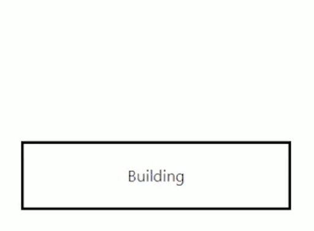
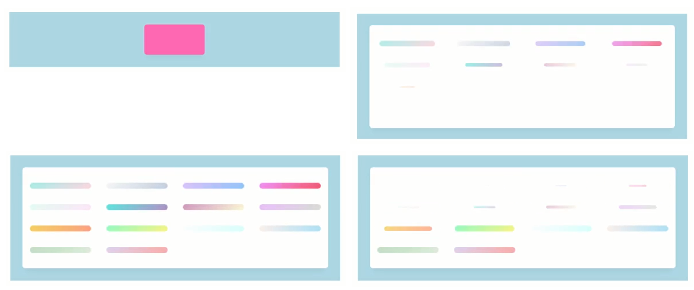
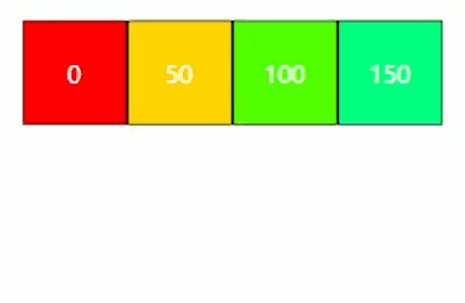
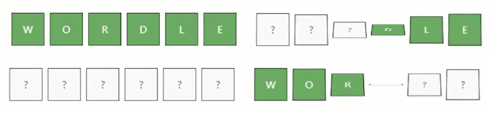
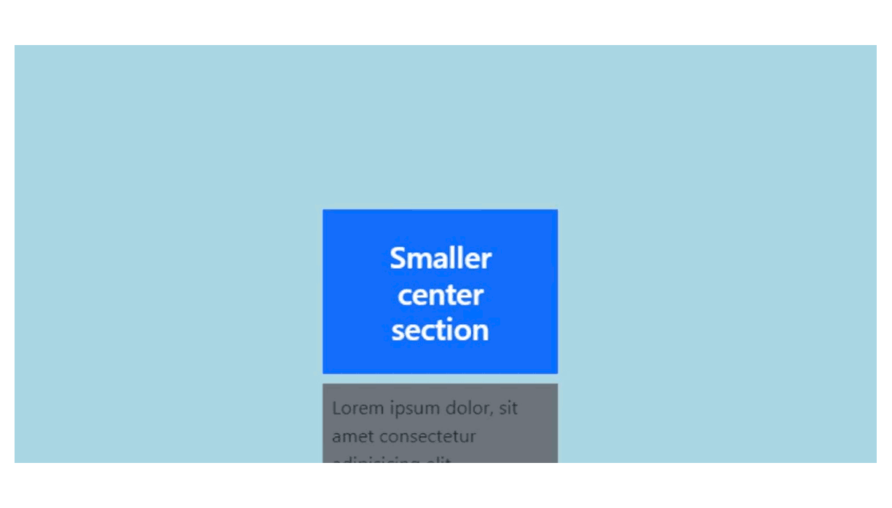
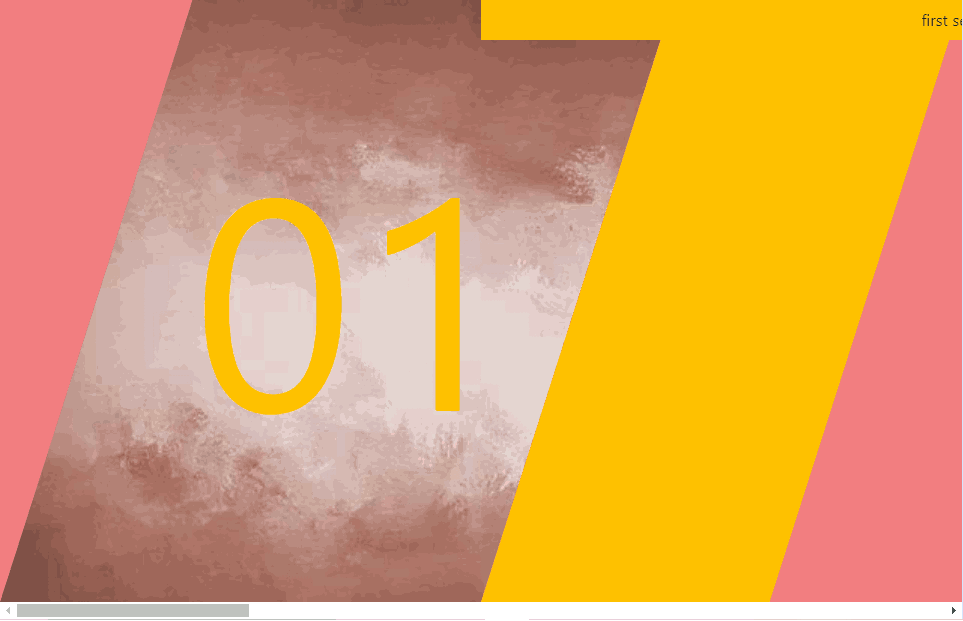
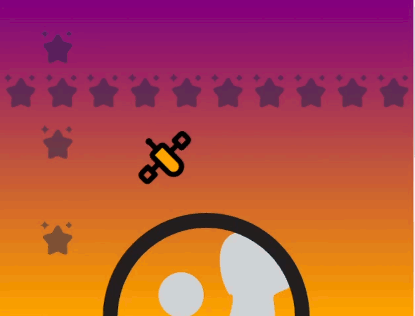

# React-Spring 3 useSpringValue(), useChain(), useTrail() indeterpolation and Parallax.

* [Animation sequences with useChain()](./#animation-sequences-with-usechain)
* [Staggering animations with useTrail()](./#staggering-animations-with-usetrail)
* [Scroll sections with Parallax and ParallaxLayers.](./#scroll-sections-with-parallax-and-parallaxlayers)

The **useSpringValue**() hook sets **singular** style properties, it accesses useSpring() **methods** imperatively.

```jsx
//It doesn't require the API call
//it won't trigger on the updated component, we must use its methods.

let valore = useSpringValue(0, {
  config: config.wobbly,
})

let valore1 = useSpringValue(0, {
  config:{ mass: 20, friction: 3, tension: 10 },
})

function starto(){
  valore.start(300)
  valore1.start(300)
}

<div>
  <animated.div className="barra1" style={{ width: valore }} >
  </animated.div>

  <animated.div className="barra2" style={{ width: valore1 }} >
  </animated.div>
</div>
```

<figure><figcaption><p>useSpringValue() on animation-timing function</p></figcaption></figure>

### Animation sequences with useChain()

The **useChain**( \[**useSpringRef**() array], \[timesets], timeframe ) hook _links multiple animations_ in a specified **order**, controlling their **timing**.

We useState() as a trigger for the **useChain()**, which will **revert** the animation's **order** and delays.

```jsx
//Their timing delays will be timeset-array-value * timeframe (1000ms if not set)
const [open, set] = useState(false)

useChain( 
  open ? [colonna, refe] : [refe, colonna]  , 
  [0, open ? 1.5 : 3] 
)
```

The _useSpring()_ values and the _useTransition()_ element depend on the useState(), to not trigger before the useChain() timing.

```jsx
//Without a useChain() useSpringRef() would block the animation

const colonna = useSpringRef()
const { largo } = useSpring({
  ref: colonna,
  from: { largo: "0%" },
  to: { largo: open ? "100%" : "0%" },
  config: { duration: 1500 },
});

let lego = ["red", "blue", "green", "yellow" ]

let refe = useSpringRef();
let muro = useTransition( open ? lego : [], {
  ref: refe,
  trail: 2000 / lego.length,
  from: {opacity: 0, height: 0 },
  enter: {opacity: 1, height: 120 },
  leave: {opacity: 0, height: 0},
  config: {duration: 3000}
})
```

We change the **order** of the **useTrasition()** elements with its _second property_ (**item**).

```jsx
//The button is relative>absolute width animated background 
<div className="d-block contenitore">
  <div className="fila">
    {muro((style, item) => (
      <animated.div style={{ ...style, backgroundColor: item, 
        order: (lego.length - lego.indexOf( item )) }}>
      </animated.div>
    ))
    }
  </div>

  <div className='blocco' onClick={ ()=> set(!open) } >
    <animated.div className="sfondo" style={{ width: largo }}></animated.div>
    <div className="testo">Building</div>
  </div>
</div>
```

We use **display:grid** on the useTransition() elements.

```css
//We used a right movement to offset the grid-gap movement 
.contenitore{
  width: 60%;
  height: 350px;
}

.fila {
  position: relative;
  display: grid;
  grid-template-columns: repeat(4, minmax( 25%, 25% ));
  grid-gap: 5px;
  padding: 5px 10px 5px 10px;

  right: 10px;
  width: 60%;
  margin: auto;
  background: white;
}
```

<figure><figcaption><p>useChain() on useTransition() and useSpring()</p></figcaption></figure>

<details>

<summary>The useChain() on useTransition() grid elements</summary>

We **import** an array of **gradient** objects for the **useTransition**().

```jsx
import data from './Data'
[
  {
    name: 'Rare Wind',
    description: '#a8edea → #fed6e3',
    css: 'linear-gradient(135deg, #a8edea 0%, #fed6e3 100%)',
    height: 200,
  },
  ...
]
```

We set the useState() trigger like the previous **useChain**() example.

<pre class="language-jsx"><code class="lang-jsx">//The trail adds a delay between each useTransition() renders element
const [open, set] = useState(false)

const springApi = useSpringRef()
const { size, ...rest } = useSpring({
  ref: springApi,
  from: { size: '20%', background: 'hotpink' },
  to: {
    size: open ? '100%' : '20%',
    background: open ? 'white' : 'hotpink',
  },
})

const transApi = useSpringRef()
const transition = useTransition(open ? data : [], {
  ref: transApi,
  trail: 400 / data.length,
  from: { opacity: 0, scale: 0 },
  enter: { opacity: 1, scale: 1 },
  leave: { opacity: 0, scale: 0 },
})

useChain(open ? [springApi, transApi] : [transApi, springApi], 
  [0, open ? 0.1 : 0.6,]
)
<strong>
</strong>&#x3C;div className="wrapper">
  &#x3C;animated.div
    style={{ ...rest, width: size, height: size }}
    className="container"
    onClick={() => set(open => !open)}
  >
    
    {transition((style, item) => (
      &#x3C;animated.div
        className="item"
        style={{ ...style, background: item.css }}
      />
    ))}

  &#x3C;/animated.div>
&#x3C;/div>
</code></pre>

With the same **grid** style.

```css
.container {
  position: relative;
  display: grid;
  grid-template-columns: repeat(4, minmax(100px, 1fr));
  grid-gap: 25px;

  padding: 25px;
  background: white;
}
```

</details>

<figure><figcaption><p>useChain() grid effect</p></figcaption></figure>

### Staggering animations with useTrail()

The **useTrail()** hook generates a trail of sequential animations.

We set the starting _useTrail()_ **properties** and **animate** them on **api methods** (<mark style="color:yellow;">from/to would trigger the animation on start</mark>), each element's **duration adds up** to the previous ones.

```jsx
//The integer sets the number of elements rendered
//We need the ()=> ({}) syntax, the 4th element takes 8 seconds to complete
const [ gira, setGira ] = useState( false )
let lista = [0, 50, 100, 150]

const [tasse, api] = useTrail( lista.length, ()=> ({
  mosso: 0,
  reverse: gira,
  config: {duration: 1500}
}))

function nuota(){
  (gira) ? api.start({ mosso: 0 }) : api.start({ mosso: 100 })
  setGira((x)=> !x )
}
```

We need **position absolute** to avoid _margins being influenced_ by the container area.                               We **extract useTrail()** style props and **i**ndex to access the initial array.

```jsx
//To string interpolate useTrail() values we need the to() method.
//the array integers being the hsl color we interpolate with mosso.prop 
//marginLeft needed to not overlay the absolute elements

<div className="d-block position-relative">
  {tasse.map(({mosso}, i) => (
    <animated.div className="scatola position-absolute" onClick={ nuota } 
      style={{ 
        marginLeft: ( 65*i ) +"px", 
        marginTop: mosso,
        backgroundColor: mosso.to( val => `hsl( ${lista[i] + val}, 100%, 50% )` )
      }}
    >
      {lista[i]}
    </animated.div>
  ))}
</div>
```

<figure><figcaption><p>useTrail() elements on animated style properties</p></figcaption></figure>

<details>

<summary>Backface-visibility on useTrail() rotated elements</summary>

We set and api animate the **useTrail()** props like the previous example.

```jsx
const items = ['W', 'O', 'R', 'D', 'L', 'E']
const [gira, setGira] = useState(false)

const [trail, api] = useTrail(items.length, () => ({
  rotateX: 0,
  reverse: gira
}))

const handleClick = () => {
  (gira) ? api.start({ rotateX: 0, }) : api.start({ rotateX: 180, }) 
  setGira((x)=> !x)
}
```

We **rotateX() 2** opposite useTrail() elements with the **to()** _API method_.

```jsx
<div className="d-flex">

{trail.map(({ rotateX }, i) => (
  <animated.div className="Box" key={i} onClick={handleClick}>

    <animated.div
      className="shared FrontBox"
      key={items[i]}
      style={{
        transform: rotateX.to(
          val => `perspective(600px) rotateX(${180 - val}deg)`
        ),
      }}>
      {'?'}
    </animated.div>

    <animated.div
      className="shared BackBox"
      key={items[i]}
      style={{
        transform: rotateX.to(
          val => `perspective(600px) rotateX(${val}deg)`
        ),
      }}>
      { items[i] }
    </animated.div>

  </animated.div>
))}
</div>
```

We use **backface-visibility** to hide the **rotated** useTrail() absolute element.

```css
//without using opacity

.Box1{
  position: relative;
  height: 50px;
  width: 50px;
}

.shared1{
  width: 100%;
  height: 100%;
  position: absolute;

  display: flex;
  justify-content: center;
  align-items: center;
  
  backface-visibility: hidden;
}

.FrontBox1{
  background-color: #fafafa;
  border: solid 1px black;
}

.BackBox1{
  background-color: #6cab64;
  border: solid 1px black;
  color: #fafafa;
}
```

</details>

<figure><figcaption></figcaption></figure>

### Scroll sections with Parallax and ParallaxLayers.

We **npm install @react-spring/parallax** and extract the **Parallax** and **ParallaxLayer**.

A _Parallax_ container animates its _ParallaxLayer_ **children** onScroll() position.                                                            It comprises **pages**, each **100%** height/width of the viewpoint, and fires its scroll events from the _container,_ not the window.

```css
import { Parallax, ParallaxLayer } from '@react-spring/parallax'

Parallax attributes:
page: value of the page total height of the container
config: to set tension, mass, friction
enabled/horizontal: true/false for vertical/horizontal scroll
innerStyle: CSS object for the inner Parallax object

ParallaxLayer attributes:
factor: Page scale of the parallaxLayer
offset: 0-index starting page position of the component
enabled/horizontal: by default inherited from the container
speed: for the rate of scroll
sticky: with start/end offset position of the sticky component
```

The Parallax **page** has to _include_ all the different _offset positions_ and _factor parallaxLayers_.

```jsx
//Page is 1+ 0.8+ 1.5, the sticky layers are included in the offset:{1} page

<Parallax pages={3.3} className='meno' >
  <ParallaxLayer offset={0}>
  </ParallaxLayer>

  <ParallaxLayer offset={1} sticky={{ start: 1, end: 1.8 }}>
  </ParallaxLayer>

  <ParallaxLayer offset={1.5}>
  </ParallaxLayer>

  <ParallaxLayer offset={1.8} factor={1.5}>
  </ParallaxLayer>
</Parallax>
```

Using the offset position, the Parallax **ref.current** can trigger **scrollTo()** events.                                    We **remove** the included scrollbar with a _pseudo:selector_ and set **left** to fill the gap.

```jsx
//ParallaxLayers have position-absolute and can overlay each other
.meno{
  background: linear-gradient(lightblue, #9198e5);
  left: 0px;
}
.meno::-webkit-scrollbar{
  width: 0;
  height: 0;
}

<Parallax pages={3.3} className='meno'>
  <ParallaxLayer offset={0} className='d-flex justify-content-center'>
    <div className="d-block w-25 mx-auto"> ... </div>
  </ParallaxLayer>

  <ParallaxLayer offset={1} sticky={{ start: 1, end: 1.8 }} className='d-flex'>
    <div className="d-block w-100">
      <div className="bg-warning d-flex" style={{ height: 55 }} >
      </div>

      <div className='w-25 ms-5 bg-danger mt-2'>
      </div>
    </div>
  </ParallaxLayer>

  <ParallaxLayer offset={1.5} className='d-flex justify-content-center'>
    <div className="d-block w-100">
      <div className='w-25 bg-success mt-2 me-5 ms-auto'> ... </div>
    </div>
  </ParallaxLayer>

  <ParallaxLayer offset={1.8} factor={1.5} className='d-flex justify-content-end'>
    <div className="d-block w-100">
      <div className="bg-success d-flex justify-content-end" style={{ height: 55 }} >
      </div>

      <div className='w-25 me-5 bg-danger mt-2 ms-auto'>
      </div>
    </div>
  </ParallaxLayer>
</Parallax>
```

<figure><figcaption><p>Sticky Parallax scroll elements</p></figcaption></figure>

<details>

<summary>Horizontal Parallax and sticky parallaxLayer viewpoint area</summary>

The ParallaxLayer **speed** attribute adds a _translate effect_ on a scrolled element.                     The **\<Page/>** container returns **multiple** _ParallaxLayers_ sharing the _same offset_.

The horizontal **sticky absolute** space occupies the entire **viewpoint**, _independently_ from its width/height, we reduce it to not interfere with the \<Page/> onClick().

```jsx
//backgroundImage is set on a backgroundSize polygon-cut background

let refe = useRef(null)

function Page({offset, back, onClick, image}){

  return(
  <>
    <ParallaxLayer className='taglio1' speed={0.5} 
      offset={offset} onClick={onClick}
      style={{ backgroundImage: `url( ${image} )`, backgroundSize:"cover" }}>
    </ParallaxLayer>

    <ParallaxLayer className={`taglio2 bg-${back}`} speed={0.5} 
      offset={offset} onClick={onClick}>
    </ParallaxLayer>

    <ParallaxLayer className={`numero text-${back}`} speed={1} 
      offset={offset} onClick={onClick}>
      <span> 0{offset +1} </span>
    </ParallaxLayer>
  </>
  )
}

function muove(to){
  if(refe.current){
    refe.current.scrollTo(to)
  }
}

<Parallax pages={4} ref={refe} className='dietro' horizontal>

  <ParallaxLayer offset={0} sticky={{start: 0.5, end: 1}} 
    style={{ height: "10vh" }}>
    <div className="p-2 bg-warning text-center">first section</div>
  </ParallaxLayer>

  <Page offset={0} back="warning" onClick={()=>muove(1)} image="ht:/.jpg"/>
  <Page offset={1} back="success" onClick={()=>muove(2)} image="ht:/.jpg"/>
  
  <ParallaxLayer offset={2} sticky={{ start: 2, end: 2.5}} 
    style={{ height: "10vh" }}>
    <div className="p-2 bg-primary text-center">second section</div>
  </ParallaxLayer>
  
  <Page offset={2} back="danger" onClick={()=>muove(3)} image="ht:/.jpg"/>
  <Page offset={3} back="primary" onClick={()=>muove(0)} image="ht:/.jpg"/>
</Parallax>
```

Each \<Page/> has its clip-path on its background.

```css
.dietro{
  background-color: lightcoral;
  left: 0px;
}

.taglio1,
.taglio2{
  position: absolute;
  width: 100%;
  height: 100%;
  cursor: pointer;
}

.taglio1{
  background-color: brown;
  clip-path: polygon(20% 0, 70% 0, 50% 100%, 0% 100%);
}

.taglio2{
  background-color: yellow;
  clip-path: polygon(70% 0, 100% 0, 80% 100%, 50% 100%);
}

.numero {
  margin-top: 10vh;
  margin-left: 20vw;
  font-size: 300px;
  color: #545864;
}
```

</details>

<figure><figcaption><p>horizontal Parallax with sticky top layer</p></figcaption></figure>

### Sticky ParallaxLayers, SVG images, and backgrounds

Don't use **background** on the **sticky** layer component, it will inherit the "container" layer.&#x20;

It needs **display: "inline-block"** and **height: 0**, to not conflict with the other layer elements, its height is set only by its content.&#x20;

We use **vertical-align: "top"** to align the inline-block elements to the sticky layer linebox, check [CSS-1](../../css/css-1/) for more _vertical-align_.

```jsx
//You can't put a layer inside another layer, embed them using their offset position
//Sticky layers need only one container tag, its empty to not conflict with other
//Inline-block sticky content use vertical-align: baseline, top, middle, bottom.
//We justify sticky elements using width/margin for a 100% new line

<ParallaxLayer offset={1.5} style={{ height: 0, display: "inline-block"}} 
  sticky={{ start: 0.5, end: 1.5 }}>
  <> 
    <div className="d-inline-block" style={{ verticalAlign: "top", width: "30%"}}>
      <div style={{ backgroundColor: "brown", height: "65vh" }} >
        This is the bar
      </div>
    </div>

    <div className="d-inline-block" style={{ marginLeft: "20%",width: "40%" }}>
      <div className="d-flex justify-content-between">
        <h3> This is the other content </h3>
        <div className="bg-warning">
          <p> This is the second context </p>
        </div>
      </div>
    </div>
  </>
</ParallaxLayer>
```

Check the <mark style="background-color:purple;">Intersection API</mark> section to see how Intersection Observer API interacts with \<Parallax>



We **import SVG** icons in the _ParallaxLayer_, as image **src** or as a **component**, and modify their _svg properties._

<pre class="language-jsx"><code class="lang-jsx">//To edit the fill we need to remove the default fill from the svg file
//SVG proportions are independent of height/width, they can be backgroundImage.

import planet from "../images/planet.svg"
import { ReactComponent as Mac } from "../images/car.svg"

&#x3C;ParallaxLayer offset={0.5} className='d-flex justify-<a data-footnote-ref href="#user-content-fn-1">c.</a>-center align-items-center'>
  &#x3C;img src={planet} style={{ width: "50%" }} />
&#x3C;/ParallaxLayer>

&#x3C;ParallaxLayer offset={1.55} >
  &#x3C;Mac style={{ fill:"blue", marginLeft: "32%", width: "20%", height: "10%" }}/>
&#x3C;/ParallaxLayer>
</code></pre>

The _parallaxLayer's_ order is <mark style="background-color:blue;">backgroundColor > SVG icons > SVG backgroundImage.</mark>                         We **scrollTo**() an entire **Page** by including specific _offset ranges_ in a **\<div>** container.

More **images** in the **same ParallaxLayer** _won't overlay_ and will _sum their height_, **z-index** works between layers and _can override the overflow:hidden_.

<details>

<summary>Multiple SVG icons on ParallaxLayer and onScroll entire pages</summary>

Multiple SVG backgroundImage can be added at the end of the offset.

```jsx
import planet from "../images/planet.svg";
import light from "../images/light.svg";
import { ReactComponent as Mac } from "../images/car.svg";
import road from "../images/road.svg";
import starts from "../images/starts.svg";
import { ReactComponent as Sate } from "../images/satellite.svg";

let refe = useRef(null)

<Parallax pages={2} ref={refe}>

  <div onClick= {()=> refe.current.scrollTo(1)}>
  <ParallaxLayer offset={0} 
    style={{ background: "linear-gradient(purple, orange)" }} >
  </ParallaxLayer>

  <ParallaxLayer offset={0.5} 
    className='d-flex justify-content-center align-items-center'>
    
  </ParallaxLayer>

  <ParallaxLayer offset={0.4} speed={0.5}>
    <Sate style={{ 
      width: "20%", height: "20%", marginLeft: "30%", fill: "orange" 
    }} />
  </ParallaxLayer>

  <ParallaxLayer offset={0} speed={0.3} style={{
    backgroundSize: "10% 30%",
    backgroundRepeat: "repeat-y",
    backgroundPosition: "10% 0%",
    backgroundImage: `url(${starts})`,
    opacity: 0.5
  }}
  >
  </ParallaxLayer>

  <ParallaxLayer offset={0} speed={0.3} style={{
    backgroundSize: "10% 15%",
    backgroundRepeat: "repeat-x",
    backgroundPosition: "0% 25%",
    backgroundImage: `url(${starts})`,
    opacity: 0.5
  }}
  >
  </ParallaxLayer>
  </div>

  <div onClick={()=> refe.current.scrollTo(0)}>
  <ParallaxLayer offset={1} style={{ backgroundColor: "orange" }} >
  </ParallaxLayer>

  <ParallaxLayer offset={1.15} speed={0.3} className='text-center'>
    <h2>Don't drive when during storms </h2>
  </ParallaxLayer>

  <ParallaxLayer offset={1.55} speed={0.5} style={{ zIndex: 1 }}>
    <Mac style={{fill:"blue",marginLeft: "32%",width: "20%",height: "10%"}}/>
    <Mac style={{fill:"light",marginLeft:"50%",width: "20%",height: "10%"}}/>
  </ParallaxLayer>

  <ParallaxLayer offset={1.2}>
    
  </ParallaxLayer>

  <ParallaxLayer offset={1} style={{
    backgroundPosition: "0% 35%",
    backgroundRepeat: "repeat-x",
    backgroundSize: "20% 10%",
    backgroundImage:  `url(${light})`,
  }}
  > 
  </ParallaxLayer>
  </div>

</Parallax>
```

</details>

<figure><figcaption><p>Parallax and ParallaxLayers scroll animation</p></figcaption></figure>

[^1]: 
