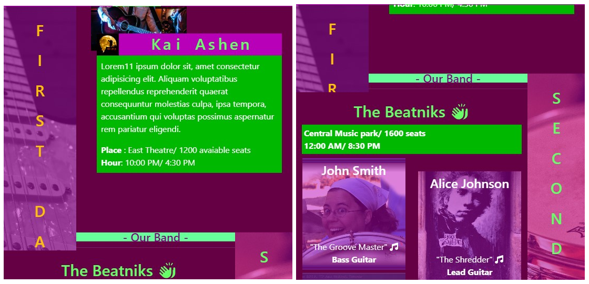
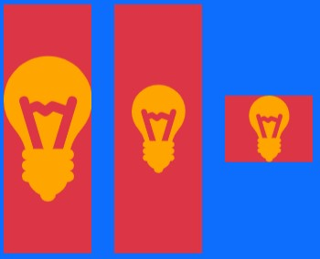

# Parallax

* 1
* 1
* 1

A single **useEffect()** can log DOM **userRef**()/querySelector() elements.&#x20;

The **ParallaxLayer** children components need an **useState**() dependency, that triggers only after the page is useEffect() <mark style="background-color:blue;">**mounted**</mark>, to be logged.

```jsx
//Remember React.strictmode is active when testing

useEffect(() => {
  setParallaxLayerMounted(true); 
}, []);

const stratosRefs = useRef([]);

useEffect(()=> {
  console.log( stratosRefs )
}, [parallaxLayerMounted])
```

The <mark style="background-color:orange;">**navbar**</mark> has to be outside the \<Parallax> container, it will cover part of the first ParallaxPage and won't create additional scrollbars.

```jsx
//It needs a higher zIndex to be visible 
//We modify the intersectionObserver() option object for Parallax elements
let options = {
  root: base,
  rootMargin: "0px 0px -85% 0px",
  threshold: 0,
}

<div>
  <div className='position-fixed' style={{ height: "5em", top: 0, zIndex: 5}}>
    Navbar
  </div>

  <Parallax pages={3.2} id='finestra' ref={parallaxRef} style={{ height: "100vh" }}>
    ...
  </Parallax>
</div>
```

<figure><figcaption><p>Position-fixed navbar on &#x3C;Parallax/></p></figcaption></figure>

A Parallax component won't respond to a scroll event, only to a **wheel**.

<details>

<summary>Wheel event on Parallax</summary>

The wheel event is attached to the useRef() of the \<Parallax> container.

```jsx
const parallaxRef = useRef(); 

useEffect(()=> {
  window.addEventListener('wheel', handleWheelEvent);
  
  return () => {
    if (parallaxRef.current) {
      parallaxRef.current.removeEventListener('wheel', handleWheelEvent);
    }
  };
}, [])

const handleWheelEvent = (index) => {
  const {container, current} = parallaxRef.current;
  const scrollpercent = 
    current / (container.current.scrollHeight - window.innerHeight)
  console.log(scrollpercent);
};

<div className="App">
  <Parallax pages={2} ref={parallaxRef} style={{ height: "100vh" }}>
    <ParallaxLayer offset={0}>
      <h1>This is the moment he became</h1>
    </ParallaxLayer>
    ...
  </Parallax>
</div>
```

</details>

&#x20;We **useRef(\[])** \<ParallaxLayer/> child elements, check useRef() callback function in [React4](../../js/js-4-spread-and-rest-operators-error-constructor-and-object-try-catch-and-finally.md).

We **reduce()** loop the useRef(\[]) intersectionObserver **target.id**, and we assign them to **className** DOM element. We cache the object result before the intersect.

<details>

<summary>Returning Objects from reduce() and for/in loops</summary>

In both methods, the _assign operation_ inside the loop implicitly creates a name:value pair in the object.

```jsx
//Any repeated array element increases the counter on the [""] property.

const names = ["Alice", "Bob", "Tiff", "Bruce", "Alice"];
const countedNames = Object.create(null);
for (const name of names) {
  const currCount = countedNames[name] ?? 0;  //will return 0 if undefined
  countedNames[name] = currCount + 1; 	      //this creates the "Alice": 1
}
//{Alice: 2, Bob: 1, Tiff: 1, Bruce: 1}
```

On **reduce()** the <mark style="background-color:blue;">accumulator</mark> is the returned object with the set name:value pairs.

```jsx
//The looped array elements are the currentValues. 
//And an empty object as initialValue, to be returned.

const names1 = ["Alice", "Bob", "Tiff", "Bruce", "Alice"];
const countedNames1 = names1.reduce((acc, name) => {
  acc[name] = (acc[name] || 0) + 1;
  return acc;
}, Object.create(null));
```

</details>

```jsx
//The stratosRef target.id and the className DOM pair on the returned object
//On an empty initialValue Object 
let latoCol = useRef([])

const colonne = stratosRefs.current.reduce((acc, strat) => {
  const matchingCol = 
    latoCol.current.find((col) => col.className.includes(strat.id));
  if (matchingCol) {
    acc[strat.id] = matchingCol;
  }

  return acc;
}, {});
```

We use the current **boundingClientRect.top** of the current **intersect \<ParallaxLayer/>** to edit the useRef().**style** of its paired column (from the **cached** reduce() object).



We use an array **threshold** to simulate the scroll event, and remove the navbar height from the calc().

```jsx
//For each threshold intersect we edit the current paired column
let coloptions = {
  root: finestra.current.container.current, 
  rootMargin: "0px",
  threshold: [...Array(150).keys()].map(x => x / 150),
}

function scrolled(entries){

  entries.forEach((entry)=>{

    if(entry.isIntersecting && entry.boundingClientRect.top <= 75 ){
      reffe = colonne[entry.target.id]  //from the cached object
      requestAnimationFrame(() => {
        reffe.style.height = 
          `calc(100vh + ${entry.boundingClientRect.top - 75 + "px"} )`;
      });
    }

  })
} 

let observer1 = new IntersectionObserver(scrolled, coloptions)

stratosRefs.current.forEach((valo1)=>{
  observer1.observe(valo1)
})
```



We reduce the height of the **container** while keeping the **content** at **100vh**, this will avoid the content from shirking during the sticky effect.

```jsx
//The 100vh will keep the aspect ratio of the content
<ParallaxLayer offset={0.30} style={{height: 0 ,display: "inline-block"}} 
  sticky={{ start: 0.30, end: 1.55 }}>
  <> 
    <div className="d-inline-block TuneFuse" style={{ width: "25%" }}
      ref={(ref)=> ( colRefs.current[0] = ref )}>

      <div className="position-relative" style={{ height: "100vh" }} >
      	...
      </div>

    </div>
  </>
</ParallaxLayer>
```



We use a normal threshold to **classList.add()** on single intersects.

```jsx
//We first remove from the useRef() nav array.
let options = {
  root: finestra.current.container.current,
  rootMargin: "0px 0px -85% 0px",
  threshold: 0,
}

function altro(entries){

  entries.forEach((entry)=>{

    if( entry.isIntersecting ){
      navItems.forEach(item=>{
        item.classList.remove("active")
      })
      navOb[entry.target.id].classList.add("active")
    }

  })
}

let observer = new IntersectionObserver(altro, options)

stratosRefs.current.forEach((valo)=>{
  observer.observe(valo)
})
```



<figure><figcaption><p>Threshold useRef().style columns on &#x3C;ParallaxLayer> intersect</p></figcaption></figure>

1

1

1

We create an absolute \<parallaxLayer/> between the pages, that ignores the overflow.

```jsx
<ParallaxLayer offset={1.37} sticky={{start: 1.37, end: 1.37 }} 
  style={{height: 0, display: "inline-block"}}>
  <>
    <div className="d-inline-block">
    	...
    </div>
  </>
</ParallaxLayer>
```

1

1

1

1

We can't relative import files from the public folder, so we create a src folder.

We can overlay \<parallaxLayer/> as absolute layers, their display depends on their order.                                                            When overlaying **svg** files we cut the svg extra borders we use[ https://svgcrop.com/](https://svgcrop.com/), which will keep the **svg** aspect ratio with less space.

```jsx
//Put the background color on the top overlay so it doesn't cover the other elements
//We cannot import SVG files from the public folder, so we need an src folder 

import { ReactComponent as Bulb } from "./source/bulb.svg"

<Parallax pages={3.2} id='finestra' ref={parallaxRef} style={{ height: "100vh" }}>
  <ParallaxLayer offset={0.1} className='bg-primary'>
    <Bulb2 className='position-relative bg-danger'
      style={{fill: "orange",height: "45vh",width: "12vw",left: "-15vw",top: "0%"}}/>
  </ParallaxLayer>
  ...
  <ParallaxLayer offset={0.1}>
    <div id='tunefuse' ref={(ref) => (stratosRefs.current[0] = ref)}>
      <h1>First page</h1>
    </div>
  </ParallaxLayer>
</Parallax>
```

<figure><figcaption><p>Cut vs uncut SVG files, with aspect ratio example</p></figcaption></figure>

1

1

1

1

1
