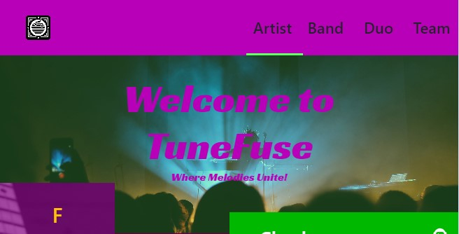

# Parallax

* 1
* 1
* 1

A single **useEffect()** can log DOM **userRef**()/querySelector() elements.&#x20;

The **ParallaxLayer** children components need an **useState**() dependency, that triggers only after the page is useEffect() <mark style="background-color:blue;">**mounted**</mark>, to be logged.

```jsx
//Remember React.strictmode is active when testing

useEffect(() => {
  setParallaxLayerMounted(true); 
}, []);

const stratosRefs = useRef([]);

useEffect(()=> {
  console.log( stratosRefs )
}, [parallaxLayerMounted])
```

The <mark style="background-color:orange;">**navbar**</mark> has to be outside the \<Parallax> container, it will cover part of the first ParallaxPage and won't create additional scrollbars.

```jsx
//It needs a higher zIndex to be visible 
//We modify the intersectionObserver() option object for Parallax elements
let options = {
  root: base,
  rootMargin: "0px 0px -85% 0px",
  threshold: 0,
}

<div>
  <div className='position-fixed' style={{ height: "5em", top: 0, zIndex: 5}}>
    Navbar
  </div>

  <Parallax pages={3.2} id='finestra' ref={parallaxRef} style={{ height: "100vh" }}>
    ...
  </Parallax>
</div>
```

<figure><figcaption><p>Position-fixed navbar on &#x3C;Parallax/></p></figcaption></figure>

A Parallax component won't respond to a scroll event, only to a **wheel**.

<details>

<summary>Wheel event on Parallax</summary>

The wheel event is attached to the useRef() of the \<Parallax> container.

```jsx
const parallaxRef = useRef(); 

useEffect(()=> {
  window.addEventListener('wheel', handleWheelEvent);
  
  return () => {
    if (parallaxRef.current) {
      parallaxRef.current.removeEventListener('wheel', handleWheelEvent);
    }
  };
}, [])

const handleWheelEvent = (index) => {
  const {container, current} = parallaxRef.current;
  const scrollpercent = 
    current / (container.current.scrollHeight - window.innerHeight)
  console.log(scrollpercent);
};

<div className="App">
  <Parallax pages={2} ref={parallaxRef} style={{ height: "100vh" }}>
    <ParallaxLayer offset={0}>
      <h1>This is the moment he became</h1>
    </ParallaxLayer>
    ...
  </Parallax>
</div>
```

</details>

&#x20;We **useRef(\[])** \<ParallaxLayer/> child elements, check useRef() callback function in [React4](../../js/js-4-spread-and-rest-operators-error-constructor-and-object-try-catch-and-finally.md).

We **reduce()** loop the useRef(\[]) intersectionObserver **target.id**, and we assign them to **className** DOM element. We cache the object result before the intersect.

<details>

<summary>Returning Objects from reduce() and for/in loops</summary>

In both methods, the _assign operation_ inside the loop implicitly creates a name:value pair in the object.

```jsx
//Any repeated array element increases the counter on the [""] property.

const names = ["Alice", "Bob", "Tiff", "Bruce", "Alice"];
const countedNames = Object.create(null);
for (const name of names) {
  const currCount = countedNames[name] ?? 0;  //will return 0 if undefined
  countedNames[name] = currCount + 1; 	      //this creates the "Alice": 1
}
//{Alice: 2, Bob: 1, Tiff: 1, Bruce: 1}
```

On **reduce()** the <mark style="background-color:blue;">accumulator</mark> is the returned object with the set name:value pairs.

```jsx
//The looped array elements are the currentValues. 
//And an empty object as initialValue, to be returned.

const names1 = ["Alice", "Bob", "Tiff", "Bruce", "Alice"];
const countedNames1 = names1.reduce((acc, name) => {
  acc[name] = (acc[name] || 0) + 1;
  return acc;
}, Object.create(null));
```

</details>

```jsx
//The stratosRef target.id and the className DOM pair on the returned object
//On an empty initialValue Object 
let latoCol = useRef([])

const colonne = stratosRefs.current.reduce((acc, strat) => {
  const matchingCol = 
    latoCol.current.find((col) => col.className.includes(strat.id));
  if (matchingCol) {
    acc[strat.id] = matchingCol;
  }

  return acc;
}, {});
```

1

1

1

1

```jsx
//We 100vh Parallax in case the Parallax doesn't adapt to the screen
const stratosRefs = useRef([]);

//We loop the DOM reference objects using its id, className, and style properties
useEffect(()=> {
  console.log( stratosRefs )
  //IntersectObserver callback function
  ...
  entries.forEach((entry)=> {
    if(entry.isIntersecting){

      stratosRefs.current.forEach((ref, index)=> {
        if( ref.id == entry.target.id ){
          console.log( ref.className.includes("bg-warning") )
          ref.style.color = "pink"
        }
      })
    }
  })
  ...
}, [parallaxLayerMounted])

<div className="App">
  <Parallax pages={2} style={{ height: "100vh" }}>

    <ParallaxLayer offset={0}>
      <div ref={(ref) => (stratosRefs.current[0] = ref)}>
        <h1>This is the moment he became</h1>
      </div>
    </ParallaxLayer>
    ...
  </Parallax>
</div>
```

1

1

1

1

1
