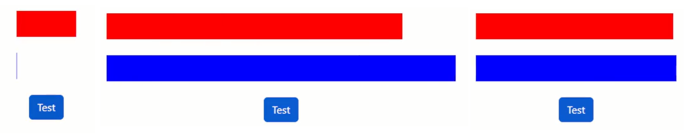

# React-Spring 3

* 1
* 1
* 1
* 1

The **useSpringValue**() hook sets **singular** style properties, it accesses useSpring() **methods** imperatively.

```jsx
//It doesn't require the API call
//it won't trigger on the updated component, we must use its methods.

let valore = useSpringValue(0, {
  config: config.wobbly,
})

let valore1 = useSpringValue(0, {
  config:{ mass: 20, friction: 3, tension: 10 },
})

function starto(){
  valore.start(300)
  valore1.start(300)
}

<div>
  <animated.div className="barra1" style={{ width: valore }} >
  </animated.div>

  <animated.div className="barra2" style={{ width: valore1 }} >
  </animated.div>
</div>
```

<figure><figcaption><p>useSpringValue() on animation-timing function</p></figcaption></figure>

1

1

1

1

1
