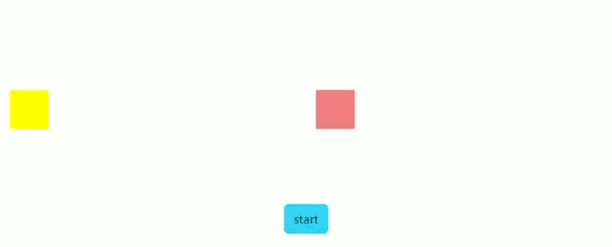
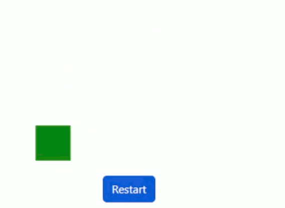
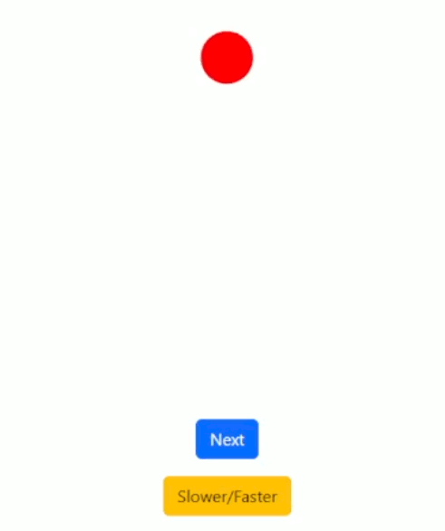
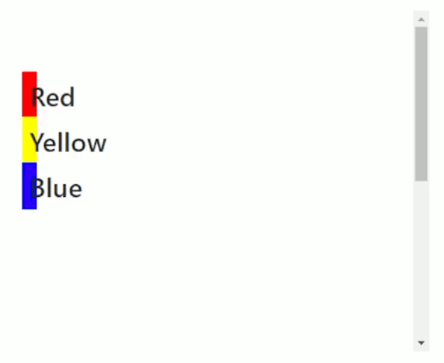

# React-Spring 4 useSpring() methods, async/await springValue(), useSpring() \[scriptsKeys], useLayout(), useSpring() onScroll()

* [Sequential New SpringValue() properties](react-spring-4-usespring-methods-async-await-springvalue-usespring-scriptskeys-uselayout-usespring-o.md#sequential-new-springvalue-properties)
* [Controller constructor and springValue](react-spring-4-usespring-methods-async-await-springvalue-usespring-scriptskeys-uselayout-usespring-o.md#controller-constructor-and-springvalue)
* [useSpring() scrips on conditional keyframes](react-spring-4-usespring-methods-async-await-springvalue-usespring-scriptskeys-uselayout-usespring-o.md#usespring-scrips-on-conditional-keyframes)
* [useIsomorphicLayoutEffect() and useReducedMotion()](react-spring-4-usespring-methods-async-await-springvalue-usespring-scriptskeys-uselayout-usespring-o.md#useisomorphiclayouteffect-and-usereducedmotion)
* [Animation useSpring() values onScroll()](react-spring-4-usespring-methods-async-await-springvalue-usespring-scriptskeys-uselayout-usespring-o.md#animation-usespring-values-onscroll)

The **useSpring**() animations **run** even without rendering, and _api.start() can't change keyframes_ during a loop. We create a new useSpring() hook to change the style keyframe.

<details>

<summary>Changing useSpring() on the same loop element</summary>

We **useState()** style the useSprings(), alternating them with useRef().

The new useSpring() _won't start_ **from:{}** but from its already running **keyframe**.

```jsx
//It will render depending on the number of keyframes and duration
//It renders on the DOM so we useState()

let [spin, api] = useSpring(()=>({
  from: {x: 0, y: 0, background: "lightblue"},
  to: [
    {x: 100, background: "lightblue"},
    {y: 80, background: "blue"},
    {x: 0, background: "lightgreen"},
    {y: 0, background: "green"},
  ],
  loop: true,
  config: config.wobbly
}))

let [spin1, api1] = useSpring(()=>({
  from: {x: 0, y: 0, background: "pink"},
  to: [
    {x: 100, background: "pink"},
    {y: 80, background: "orange"},
    {x: 0, background: "red"},
    {y: 0, background: "orange"},
  ],
  loop: true,
  config:{ duration: 1000 }
}))

let [stile, setStile] = useState(spin)
let trigger2 = useRef(false)

function cambio1(){

  trigger2.current ? setStile(spin) : setStile(spin1)
  trigger2.current = !trigger2.current
}

<div className="d-block">

  <animated.div className="boxo" style={stile}>
  </animated.div>

  <div className="text-center">
    <button className="btn btn-primary" onClick={cambio1}>Change</button>
  </div>

</div>
```

</details>

We can pause() and resume() to **keep** the useSpring() **keyframe** when changed.

<details>

<summary>Changing useSpring() while pause() resume() keyframes</summary>

We **useEffect**() to keep the second useSpring() paused before resuming and rendering it.&#x20;

```jsx
//useEffect() works once onLoad(), then we pause() resume() the useSpring()
let [spin2, api2] = useSpring(()=>({
  from: {x: 0, y: 0, background: "lightblue"},
  to: [
    {x: 100, background: "lightblue"},
    {y: 80, background: "blue"},
    {x: 0, background: "lightgreen"},
    {y: 0, background: "green"},
  ],
  loop: true,
  config: config.wobbly
}))

let [spin3, api3] = useSpring(()=>({
  from: {x: 0, y: 0, background: "pink"},
  to: [
    {x: 100, background: "pink"},
    {y: 80, background: "orange"},
    {x: 0, background: "red"},
    {y: 0, background: "orange"},
  ],
  loop: true,
  config:{ duration: 1000 }
}))

let [stile1, setStile1] = useState(spin2)
let trigger3 = useRef(false)

let fermo1 = true

useEffect(()=>{
  api3.pause()
}, [fermo1])

function cambio2(){

  if(trigger3.current){
    setStile1(spin2)
    api2.resume()
    api3.pause()      
  }else{
    setStile1(spin3)
    api3.resume()
    api2.pause()
  }

  trigger3.current = !trigger3.current
}

<div className="d-block">

  <animated.div className="boxo" style={stile1}>
  </animated.div>

  <button className="btn btn-primary" onClick={cambio2}>
    Resume
  </button>

</div>
```

</details>

### Sequential New SpringValue() properties

We **new SpringValue** _<mark style="color:blue;">single</mark>_ style properties, to **sequentially** animate them as keyframes we **async/await**.

```jsx
//We can keep multiple in an object and it's similar to useSpringValue()
import { SpringValue } from '@react-spring/web'

const mossa1 = {
  x: new SpringValue("0%", {config: {duration: 500} }),
  y: new SpringValue( 0, {config: {duration: 500}} ),
}

async function primo(){
  await mossa1.x.start("50%")
  await mossa1.y.start(100)

  mossa1.x.set("0%")
  mossa1.y.set(0)
  primo()
}

<div>
  <animated.div className="boxo" style={{ marginLeft: mossa1.x, y: mossa1.y }} >
  </animated.div>
</div>
```

<details>

<summary>Sequential SpringValue objects on re-set loop</summary>

We sequentially animate the SpringValue(), re**set** it to its **starting value**, and re-start its function.

```jsx
//like the [keyframes] of a useSpring()
const mossa1 = {
  x: new SpringValue("0%", {config: {duration: 500}, loop: true }),
  y: new SpringValue( 0, {config: {duration: 500}} ),
  background: new SpringValue("yellow", {config: {duration: 1000}})
}

const mossa2 = {
  x: new SpringValue("0%", {config: {duration: 500} }),
  y: new SpringValue( 0, {config: {duration: 500}} ),
  background: new SpringValue("lightcoral", {config: {duration: 1000}})
}

async function primo(){
  mossa1.background.start("orange")
  await mossa1.x.start("33%")
  await mossa1.y.start(-50)

  await mossa1.x.start("66%")
  mossa1.background.start("lightcoral")
  await mossa1.y.start(0)
  await mossa1.x.start("100%")

  mossa1.x.set("0%")
  mossa1.y.set(0)
  mossa1.background.set("blue")

  primo()
}

async function secondo(){
  mossa2.background.start("red")
  await mossa2.x.start("33%")

  await mossa2.y.start(50)
  await mossa2.x.start("66%")
  mossa2.background.start("brown")

  await mossa2.y.start(0)
  await mossa2.x.start("100%")

  mossa2.x.set("0%")
  mossa2.y.set(0)
  mossa2.background.set("lightcoral")
  secondo()
}

async function accel(){
  await primo()
  secondo()
} 

<div className="row">
  
  <div className="col-6 justify-content-start d-flex">
    <animated.div style={{ marginLeft: mossa1.x, ...mossa1 }}>
    </animated.div>
  </div>

  <div className="col-6 justify-content-start d-flex">
    <animated.div style={{ marginLeft: mossa2.x, ...mossa2 }}>
    </animated.div>
  </div>

  <div className="d-block">
    <button className="btn btn-info" onClick={accel}>
      start
    </button>
  </div>

</div>
```

</details>

<figure><figcaption><p>new SpringValue()</p></figcaption></figure>

### Controller constructor and springValue&#x20;

The **new Controller** class constructor sets an _api_ imperative to springValues.

```jsx
//Controller can use springValues() methods, controller..springs for style values
//It works the same as a useSpring() api
import {Controller} from '@react-spring/web'

let mover = new Controller({
  x: 0,
  y: 0,
  onRest: () => {
    mover.each((springValue, key) => {
      console.log(`Spring key: ${key}, Value: ${springValue.get()}`);
    });
  },
})

<div>
  <animated.div className="round" style={mover.springs}>
  </animated.div>
</div>
```

The **each()** method triggers **once** for each _style property_.

<details>

<summary>Bounce controller animation with springValue() functions</summary>

_No function_ triggers on **bounce**, we use an **onChange()** to trigger a limited number of <mark style="color:blue;">horizontal animations</mark>, with a different <mark style="color:blue;">timing function</mark> from the controller.

We re**set()** the controller _springValues_ and start() with randomized tension/friction.

```jsx
//onChange() doesn't trigger on single pixel of animation, we need a range

let rimba = new Controller({
  x: 0,
  y: 0,
  config: {
    mass: 2,
    tension: 20,
    friction: 15,
    bounce: 1.5,
  },
  onChange: (x) => {

    if( x.value.y < 275 && mossa.current <= 100 ){
      mossa.current += 1

      rimba.start({
        x: mossa.current * 2,
        config:{ mass: 1, tension: 170, friction: 26, bounce: 0 }
      })
      
    }
  },
})

function starto(){
  let tenso =  Math.round(350 - (Math.random() * 100))
  let fricto = Math.round(35 - (Math.random() * 20))

  rimba.set({x: 0, y: 0})
  mossa.current = 0

  rimba.start({
    y: 300,
    config:{
      tension: tenso,
      friction: fricto
    }
  })
}

<div>
  <animated.div className="round ms-1" style={rimba.springs}>
  </animated.div>

  <button className="btn btn-primary" onClick={starto}>
    start
  </button>
</div>     
```

</details>

<figure><figcaption><p>Bounce and horizontal animation</p></figcaption></figure>

### useSpring() scrips on conditional keyframes

We _chain_ useSpring() **keyframes** with an **array** of _spring objects_, but we _can't change_ the keyframe array **during the animation** (unless we change the rendered useSpring()). So we create a **script**.

An **async** function that **await** the **next** (function that returns a **Promise** on the **spring state**) once completed.

```jsx
//onStart() triggers on each keyframe and you don't need commas on next({})
let [circle, circleapi] = useSpring(()=>({
  from: {x: 0, y: 0, backgroundColor: "green"},
  to: [
    {x: 100, y: 0, backgroundColor: "yellow"},
    {x: 50, y: 100, backgroundColor: "red"}
  ]
}))

let [ruota, ruotaapi] = useSpring(()=>({
  from: {x: 0, y: 0, backgroundColor: "green"},
  to: async (next, cancel) => {
    await next({x: 100, y: 0, backgroundColor: "yellow"})
    await next({x: 50, y: 100, backgroundColor: "red" })
  }
}))
```

<details>

<summary>Conditional keyframes and re-started loop animations</summary>

We **useRef()** to trigger a <mark style="color:blue;">different set of keyframes</mark> in the **script**.&#x20;

We re**set** the **next** keyframe with the _ternary operator_, making it _transparent_ and _positioning_ it at the beginning (**from**) using a **different config()** while restarting the loop with different keyframes.

```jsx
//We don't repeat unchanging properties to avoid extra animations on reset
//Choose between set() or start if you want an immediate or gradual reset
//The ternary operator is reversed on the other keyframe array

let invi = useRef(true)

let [ruota, ruotaapi] = useSpring(()=>({
  from: {x: -100, y: 0, background: "green"},
  to: async (next, cancel) => {
    if( invi.current ){
      await next({y: -150, background: "yellow"})
      invi.current ? await next({x: 100, background: "red" }) : await ripass(next)
      invi.current ? await next({y: 0, background: "brown" }) : await ripass(next)
      invi.current ? await next({x: -100, background: "green" }) : await ripass(next)
    
    }else{
      await next({x: -50, y: -150, background: "pink"})
      invi.current ? await ripass(next) : await next({x: 100, y: -150, background: "purple" }) 
      invi.current ? await ripass(next) : await next({x: 100, y: 0, background: "orange" }) 
      invi.current ? await ripass(next) : await next({x: -50, y: 0, background: "blue" }) 
    }
  },
  loop: true,
  config: {duration: 1000},
}))

async function ripass(next){
  //await next({background: "transparent", config:{duration: 100} }) 
  ruotaapi.set({ background: "transparent" })

  await next({x: -100, y: 0, config:{duration: 500} }) 
}

function restart(){
  invi.current = !invi.current
}

<div>
  <animated.div className="boxo" style={ruota}>
  </animated.div>

  <button className="btn btn-primary mt-2" onClick={restart}>
    Restart
  </button>
</div>
```

</details>

<figure><figcaption><p>The 2 useSpring() scrips being restarted and on loop.</p></figcaption></figure>

<details>

<summary>Circle useSpring() animation on changing keyframes duration</summary>

We **interpolate** the useSpring() **radians** degree, we **return** the circular _translate(x, y)_ style object to decostruct in the DOM.

```jsx
//We use the Math.cos()/sin() of the radians degree and a fixed radius

let veloce = useRef(false)

let [{radiante}, api] = useSpring(() =>({
  from: {radiante: 0.25},
  to: async(next, cancel) => {
    veloce.current ? await next({ radiante: 0.50, config:{duration: 400} }) : await next({ radiante: 0.50 })
    veloce.current ? await next({ radiante: 0.75, config:{duration: 400} }) : await next({ radiante: 0.75 })
    veloce.current ? await next({ radiante: 1.00, config:{duration: 400} }) : await next({ radiante: 1.00 })
    veloce.current ? await next({ radiante: 1.25, config:{duration: 400} }) : await next({ radiante: 1.25 })
  },
  config: {duration: 700},
  loop: true,
}))

function freccia(val){
  const angle = val * 2 * Math.PI;
  const radius = 140;

  const x = radius * Math.cos(angle);
  const y = radius * Math.sin(angle);

  return `translate(${x}px, ${y}px)`;
}

let mosse = [
  {transform: radiante.to( val => freccia(val) )} ,
  quad,
  triangle,
]

<div className="d-block" style={{ marginTop: "25vh" }}> 

  <animated.div className={forme[ora]} style={{
    ...mosse[ora]
  }}>
  </animated.div>
  
  <button className="btn btn-primary" onClick={tri}>
    Next
  </button>
  
  <button className="btn btn-warning " onClick={velo}>
    Slower/Faster
  </button>
</div>
```

We **useState**() switch between _different useSpring()_ and classes, and we **useRef**() the keyframe script _conditional_ for faster/slower config.

```jsx
//useSpring() have similar durations to keep keyframes positions on switch

let [ora, setOra] = useState(0)

function tri(){
  setOra((ora) => (ora+ 1) % 3 )
}

let forme = ["round mx-auto", "boxo mx-auto", "triago mx-auto"]

function velo(){
  veloce.current = !veloce.current
}


let [triangle, api2] = useSpring(()=>({
  from: {x: -140, y: 0},
  to: async(next, cancel) => {
    veloce.current ? await next({x: 0, y: -242, config:{ duration: 530 } }) : await next({x: 0, y: -242 })
    veloce.current ? await next({x: 140, y: 0, config:{ duration: 530 } }) : await next({x: 140, y: 0 })
    veloce.current ? await next({ x: -140, y: 0, config:{ duration: 530 } }) : await next({x: -140, y: 0 })
  },
  config: {duration: 800},
  loop: true
}))

let [quad, api3] = useSpring(() => ({
  from: {x: -140, y: 0},
  to: async(next, cancel) => {
    veloce.current ? await next({x: -140, y: -260, config:{ duration: 400 } }) : await next({x: -140, y: -260 })
    veloce.current ? await next({x: 140, y: -260, config:{ duration: 400 } }) : await next({x: 140, y: -260 })
    veloce.current ? await next({ x: 140, y: 0, config:{ duration: 400 } }) : await next({ x: 140, y: 0 })
    veloce.current ? await next({ x: -140, y: 0, config:{ duration: 400 } }) : await next({ x: -140, y: 0 })
  },
  config: {duration: 800},
  loop: true
}))
```

</details>

<figure><figcaption><p>Switching multiple useSpring() on the same element</p></figcaption></figure>

### useIsomorphicLayoutEffect() and useReducedMotion()

The React hooks _useEffect_() and _useLayout_() affect the **server** and the **client** respectively.   &#x20;

We properly render _useSpring()_ effects with **useIsomorphicLayoutEffect(),** using a **useState()** to dependency-animate **useSpring()** properties**.**

```jsx
//We can't insert a loop:true in a start() or a single value useSpring()
let [dove, setDove] = useState({x: 0, y: -100})

let [primo, apiPrimo] = useSpring(() =>({
  x: 0, y: 0
}))

useIsomorphicLayoutEffect(()=>{
  apiPrimo.start({
    x: dove.x, y: dove.y
  })
}, [dove])

let [secondo, apiSecondo] = useSpring(() =>({
  from: {x: 0, y: 0},
  to: {x: 0, y: -100},
}))

function mossa(){
  apiSecondo.start({ x: 0, y: 100 })

  setDove({x: 0, y: 100})
}

<div> 
  <animated.div className="boxo" style={primo} />
  <animated.div className="boxo" style={secondo} />

  <button className="btn btn-primary" onClick={mossa}> Starto </button>
</div>
```

The **useReducedMotion()** hook will trigger if the user lowers animations in its device.

```jsx
//We use the boolean returned value
const reducedMotion = useReducedMotion()

<div>
  <h1>Hello World</h1>
  {reducedMotion ? <p>You're using reduced motion!</p> : null}
</div>
```

### Animation useSpring() values onScroll()

The **useScroll()** is a _utility abstraction_ used to create scroll-linked animations.

It returns the **scrollY** springValue, the pixel **scroll distance**, and **scrollYProgress**, a **0-1** value **relative** to the entire **useRef() container**. Both are built-in so we have to **rename** them with **:** if we have _multiple useScroll()_.

We can **animate** an useSpring() on the useScroll() **onChange()** or **interpolate** it with a ternary operator.

```jsx
//Without container the onScroll() covers the entire window
//onScroll() interpolate is less animated than onChange()
//On the overflow-y container we animate absolute bars to 50% of the width

let [{blu, giallo, rosso}, api] = useSpring(()=> ({
  blu: "0%", giallo: "0%", rosso: "0%"
}))

const refe = useRef(null)

const { scrollY: pixel, scrollYProgress: percent } = useScroll({
  container: refe,
  onChange: ({ value: { scrollYProgress, scrollY } }) => {

    if(scrollYProgress > 0.5){
      api.start({ blu: (scrollYProgress * 50) + "%" })
    }else{
      api.start({ blu: "0%" })
    }
  },
  default: {immediate: true}
})

<div className='mx-auto finestra' ref={refe}>

  <animated.h2 className='position-absolute ' style={{
    marginTop: "8%", backgroundColor: "red",
    width: percent.to(val => (
      (val * 50) + "%"
    )),
  }}>
    Red
  </animated.h2>

  <animated.h2 className='position-absolute ms-5 p-2' style={{
    marginTop: "14%", backgroundColor: "yellow",
    width: percent.to(val => (
      ( val > 0.3 ) ? (val * 50) + "%" : "0%" 
    )),
  }}>
    Yellow
  </animated.h2>

  <animated.h2 className='position-absolute ms-5 p-2' style={{
    marginTop: "20%", backgroundColor: "blue",
    width: blu
  }}>
    Blue
  </animated.h2>
  
  <div style={{ height: "100vw", height: "120vh" }} />
  </div>

</div>
```

<figure><figcaption><p>useSpring() with interpolate or onChange() onScroll() animation</p></figcaption></figure>

<details>

<summary>Animated Math.cos() wave onScroll()</summary>

We loop a **new Array().fill()** to _render_ multiple _100% viewpoint_ DOM elements, for the onScroll() to take place.

```jsx
//The created array of empty values is used only for the index
const PAGE_COUNT = 5

<div>
  {new Array(PAGE_COUNT).fill(null).map((_, index) => (
    <div style={{ width: "100vw", height: "100vh" }} key={index} />
  ))}
</div>
```

We **interpolate** the circle **clipPath**() area and onScroll() **onChange()** to animate the **translateY**(0-> 100%) text.

```jsx
//Adding the container prop when scrolling the viewpoint might force a scroll
//The clipPath() starts immediately, the translateY() after 70% scroll
const [textStyles, textApi] = useSpring(() => ({
  y: '100%',
  config: {
    duration: 1000
  }
}))

const { scrollYProgress } = useScroll({
  onChange: ({ value: { scrollYProgress } }) => {      
    (scrollYProgress > 0.7 ) ? textApi.start({ y: '0%' }) 
    : 
    textApi.start({ y: '100%' })
  },
  default: { immediate: true, },
})

<animated.div
  className="d-flex justify-content-start pt-3 align-items-start"
  style={{
    background: "orange",
    clipPath: scrollYProgress.to(val => `circle(${val * 100}%)`),
  }}>

  <h1 className="title d-flex">
    <div>
      <animated.div style={textStyles}>Aha!</animated.div>
    </div>
    <div>
      <animated.div style={textStyles}>You found me!</animated.div>
    </div>
  </h1>
</animated.div>
```

We **Array.from()** render _fixed_ bands on both sides of the window, and we onScroll() **scrollYProgress** interpolate their **width** style prop.

Each bar will have a fixed **scrollP** (their <mark style="color:blue;">current scroll position</mark>) and fixed **percentileP** (their singular _index dependant_ **percentage current position** on the total height, 0.025 for the first and 1 for the last).

```jsx
//Array.from({length: x}) is no different from new Array(x).fill
//we add 1 to the 0 index array.from().map array
//The last bar will have percentileP 1 (by itself) and scrollP 0->1 (shared)

const X_LINES = 40

<div className="animated__layers">
  <animated.div className="bar__container">
    {Array.from({ length: X_LINES }).map((_, i) => (
      <animated.div key={i} className="bar"
        style={{
          width: scrollYProgress.to(scrollP => {
            const percentileP = (i + 1) / X_LINES

            return inter(percentileP, scrollP)
          }),
        }}
      />
    ))}
  </animated.div>
  
  <animated.div className="bar__container__inverted">
  </animated.div>
</div>
```

We use **Math.cos()** to start the wave at percentileP 0.025.                                                     We **multiply the parameters' difference** (onScroll() responsive) inside Math.cos() to increase the difference between bars and then the result by 40 (max-width)

```jsx
//We Math.pi() to use radians, the width is set at 5 if it is too small
//To not get double waves we check the internal multiplier with bar number
//The parameters' difference is always -Math.pi()< x < Math.pi()
function inter(percentileP scrollP){
  let y = (Math.cos( (percentileP - scrollP) * Math.PI * 1.5 ) * 40)
  let y1 = (y < 5) ? y = 5 : null

  return y
}
```

The **flex-column** sidebar **container** is **fixed**, we changed the **align-items** for the left **reverse** bars.

```css
.animated__layers > * {
  pointer-events: none;
  width: 100%;
  height: 100%;
  position: fixed;
  inset: 0;
}

.bar__container {
  display: flex;
  flex-direction: column;
  align-items: flex-end;
  z-index: 2;
  justify-content: space-between;
}

.bar__container__inverted{
  display: flex;
  flex-direction: column;
  justify-content: space-between;
  align-items: flex-start;
  z-index: 2;
}
```

</details>


Double inverted waves with useScroll() animation

