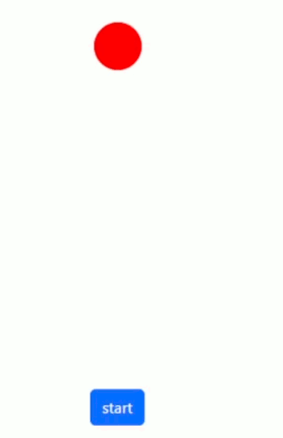

# React-Spring 4

* 1
* 1
* 1
* 1

**useSpring**() animations **run** even without rendering, and _api.start() can't change keyframes_ during a loop. We create a new useSpring() hook to change the style keyframe.

<details>

<summary>Changing useSpring() on the same loop element</summary>

The new useSpring() _won't start_ **from:{}** but from its already running **keyframe**.

```jsx
//It will render depending on the number of keyframes and duration
//It renders on teh DOM so we useState()

let [spin, api] = useSpring(()=>({
  from: {x: 0, y: 0, background: "lightblue"},
  to: [
    {x: 100, background: "lightblue"},
    {y: 80, background: "blue"},
    {x: 0, background: "lightgreen"},
    {y: 0, background: "green"},
  ],
  loop: true,
  config: config.wobbly
}))

let [spin1, api1] = useSpring(()=>({
  from: {x: 0, y: 0, background: "pink"},
  to: [
    {x: 100, background: "pink"},
    {y: 80, background: "orange"},
    {x: 0, background: "red"},
    {y: 0, background: "orange"},
  ],
  loop: true,
  config:{ duration: 1000 }
}))

let [stile, setStile] = useState(spin)
let trigger2 = useRef(false)

function cambio1(){

  trigger2.current ? setStile(spin) : setStile(spin1)
  trigger2.current = !trigger2.current
}

<div className="d-block">

  <animated.div className="boxo" style={stile}>
  </animated.div>

  <div className="text-center">
    <button className="btn btn-primary" onClick={cambio1}>Change</button>
  </div>

</div>
```

</details>

We can pause() and resume() to **keep** the useSpring() **keyframe** when changed.

<details>

<summary>Changing useSpring() while pause() resume() keyframes</summary>

We **useEffect**() to keep the second useSpring() paused before resuming and rendering it.&#x20;

```jsx

let [spin2, api2] = useSpring(()=>({
  from: {x: 0, y: 0, background: "lightblue"},
  to: [
    {x: 100, background: "lightblue"},
    {y: 80, background: "blue"},
    {x: 0, background: "lightgreen"},
    {y: 0, background: "green"},
  ],
  loop: true,
  config: config.wobbly
}))

let [spin3, api3] = useSpring(()=>({
  from: {x: 0, y: 0, background: "pink"},
  to: [
    {x: 100, background: "pink"},
    {y: 80, background: "orange"},
    {x: 0, background: "red"},
    {y: 0, background: "orange"},
  ],
  loop: true,
  config:{ duration: 1000 }
}))

let [stile1, setStile1] = useState(spin2)
let trigger3 = useRef(false)

let fermo1 = true

useEffect(()=>{
  api3.pause()
}, [fermo1])

function cambio2(){

  if(trigger3.current){
    setStile1(spin2)
    api2.resume()
    api3.pause()      
  }else{
    setStile1(spin3)
    api3.resume()
    api2.pause()
  }

  trigger3.current = !trigger3.current
}


<div className="d-block">

  <animated.div className="boxo" style={stile1}>
  </animated.div>

  <button className="btn btn-primary" onClick={cambio2}>
    Resume
  </button>

</div>
```

</details>

### Sequential New SpringValue() properties

We **new SpringValue** _<mark style="color:blue;">single</mark>_ style properties, to **sequentially** animate them as keyframes we **async/await**.

```jsx
//We can keep multiple in an object and it's similar to useSpringValue()
import { SpringValue } from '@react-spring/web'

const mossa1 = {
  x: new SpringValue("0%", {config: {duration: 500} }),
  y: new SpringValue( 0, {config: {duration: 500}} ),
}

async function primo(){
  await mossa1.x.start("50%")
  await mossa1.y.start(100)

  mossa1.x.set("0%")
  mossa1.y.set(0)
  primo()
}

<div>
  <animated.div className="boxo" style={{ marginLeft: mossa1.x, y: mossa1.y }} >
  </animated.div>
</div>
```

<details>

<summary>Sequential SpringValue objects on re-set loop</summary>

We sequentially animate the SpringValue(), re**set** it to its **starting value**, and re-start its function.

```jsx

const mossa1 = {
  x: new SpringValue("0%", {config: {duration: 500}, loop: true }),
  y: new SpringValue( 0, {config: {duration: 500}} ),
  background: new SpringValue("yellow", {config: {duration: 1000}})
}

const mossa2 = {
  x: new SpringValue("0%", {config: {duration: 500} }),
  y: new SpringValue( 0, {config: {duration: 500}} ),
  background: new SpringValue("lightcoral", {config: {duration: 1000}})
}

async function primo(){
  mossa1.background.start("orange")
  await mossa1.x.start("33%")
  await mossa1.y.start(-50)

  await mossa1.x.start("66%")
  mossa1.background.start("lightcoral")
  await mossa1.y.start(0)
  await mossa1.x.start("100%")

  mossa1.x.set("0%")
  mossa1.y.set(0)
  mossa1.background.set("blue")

  primo()
}

async function secondo(){
  mossa2.background.start("red")
  await mossa2.x.start("33%")

  await mossa2.y.start(50)
  await mossa2.x.start("66%")
  mossa2.background.start("brown")

  await mossa2.y.start(0)
  await mossa2.x.start("100%")

  mossa2.x.set("0%")
  mossa2.y.set(0)
  mossa2.background.set("lightcoral")
  secondo()
}

async function accel(){
  await primo()
  secondo()
} 

<div className="row">
  
  <div className="col-6 justify-content-start d-flex">
    <animated.div style={{ marginLeft: mossa1.x, ...mossa1 }}>
    </animated.div>
  </div>

  <div className="col-6 justify-content-start d-flex">
    <animated.div style={{ marginLeft: mossa2.x, ...mossa2 }}>
    </animated.div>
  </div>

  <div className="d-block">
    <button className="btn btn-info" onClick={accel}>
      start
    </button>
  </div>

</div>
```

</details>

<figure><figcaption><p>new SpringValue()</p></figcaption></figure>

### Controller constructor and springValue&#x20;

The **new Controller** class constructor sets an _api_ imperative to springValues.

```jsx
//Controller can use springValues() methods 
import {Controller} from '@react-spring/web'

let mover = new Controller({
  x: 0,
  y: 0,
  onRest: () => {
    mover.each((springValue, key) => {
      console.log(`Spring key: ${key}, Value: ${springValue.get()}`);
    });
  },
})

<div>
  <animated.div className="round" style={rimba.springs}>
  </animated.div>
</div>
```

The **each()** method triggers **once** for each _style property_.

<details>

<summary>Bounce controller animation with springValue() functions</summary>

_No function_ triggers on **bounce**, we use an **onChange()** to trigger a limited number of <mark style="color:blue;">horizontal animations</mark>, with a different <mark style="color:blue;">timing function</mark> from the controller.

We re**set()** the controller _springValues_ and start() with randomized tension/friction.

```jsx
//onChange() doesn't trigger on single pixel of animation, we need a range

let rimba = new Controller({
  x: 0,
  y: 0,
  config: {
    mass: 2,
    tension: 20,
    friction: 15,
    bounce: 1.5,
  },
  onChange: (x) => {

    if( x.value.y < 275 && mossa.current <= 100 ){
      mossa.current += 1

      rimba.start({
        x: mossa.current * 2,
        config:{ mass: 1, tension: 170, friction: 26, bounce: 0 }
      })
      
    }
  },
})

function starto(){
  let tenso =  Math.round(350 - (Math.random() * 100))
  let fricto = Math.round(35 - (Math.random() * 20))

  rimba.set({x: 0, y: 0})
  mossa.current = 0

  rimba.start({
    y: 300,
    config:{
      tension: tenso,
      friction: fricto
    }
  })
}

<div>
  <animated.div className="round ms-1" style={rimba.springs}>
  </animated.div>

  <button className="btn btn-primary" onClick={starto}>
    start
  </button>
</div>     
```

</details>

<figure><figcaption><p>Bounce and horizontal animation</p></figcaption></figure>

1

1

1

1

1
