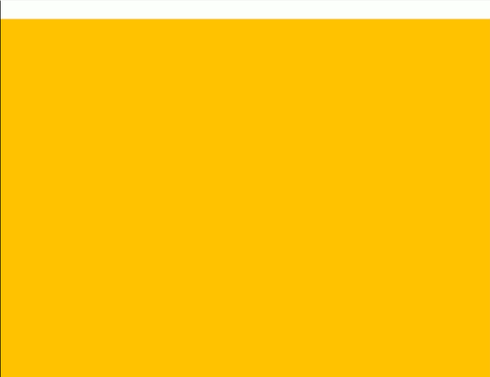
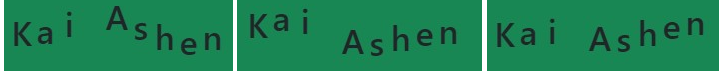

# React Spring 5 useResize(), useInView(), indexed useSprings()

* [Animated useSpring() with useInView() hook](react-spring-5-useresize-useinview-indexed-usesprings.md#animated-usespring-with-useinview-hook)
* [Rendering useSprings() with index-based style properties](react-spring-5-useresize-useinview-indexed-usesprings.md#rendering-usesprings-with-index-based-style-properties)

The **useResize()**, a useSpring() abstraction, returns the **useRef()** container width/height props.            Its onChange() will trigger on <mark style="background-color:blue;">**window resize**</mark>.

```jsx
//width returned in px
let quad = useRef(null)

const { width, height } = useResize({
  container: quad,
  onChange: ({value: {width} })=> {
    console.log( width )
  }
})

<div>
  <div style={{ width: "50vw", height: "30vh", background: "yellow" }} ref={quad}>
  </div>
</div>
```

### Animated useSpring() with useInView() hook&#x20;

The **useInView()** hook tracks an element's **visibility** relative to the **viewpoint**.                                                It will return the **useRef()** for the target element and the **boolean** result of the _Intersection Observer API_

```jsx
import { animated, useSpring, useInView} from '@react-spring/web'

let [ref, inview] = useInView({
  //Element's visibility percentage that will trigger the useInView() callback
  threshold: 0.5,         //independently of scroll direction
  rootMargin: '0px 0px -20% 0%',  //margins around the element (adds to threshold)
  once: true,             //will trigger the API once
})

let springs = useSpring({
  opacity: inview ? 1 : 0,
  y: inview ? 0 : 100,
  backgroundColor: inview ? "red" : "pink",
})

<div ref={ref}>
  <animated.div style={springs}>
    {inview ? "Visible" : "inVisible" }
  </animated.div>
</div>

```

<details>

<summary>Multi directional section with useInView()</summary>

When having **multiple** useInView() elements keep the **threshold below 0.5**, to _not overlay_ and _repeat_ the _useSpring()._

```jsx
//We can add a delay to the useInView
//Instead of absolute/width animation we used margin/opacity
let [primo, visto1] = useInView({
  delay: 500,
  threshold: 0.2
})
let seePrimo = useSpring({
  opacity: visto1 ? 1 : 0,
  marginLeft: visto1 ? 0 : 500,
})

let [secon, visto2] = useInView({
  delay: 500,
  threshold: 0.2
})
let seeSeco = useSpring({
  opacity: visto2 ? 1 : 0,
  marginRight: visto2 ? 0 : 500,
})

let [tri, visto3] = useInView({
  delay: 500
})
let seeTri = useSpring({
  opacity: visto3 ? 1 : 0,
  marginTop: visto3 ? 0 : 200,
})

<div>
  <animated.div ref={primo} className="bg-warning" 
    style={{ height: "100vh", ...seePrimo }}>
  </animated.div>

  <animated.div ref={secon} className="bg-primary" 
    style={{height: "100vh" , ...seeSeco }}>
  </animated.div>

  <animated.div ref={tri} className="bg-danger" 
    style={{width: "100%", ...seeTri}}>
    <div style={{height: "100vh"}}></div>
  </animated.div>
</div>
```

</details>

<figure><figcaption><p>useInView() margin/opacity animated</p></figcaption></figure>

### Rendering useSprings() with index-based style properties

The **useSprings**() hook renders a **number** of indexed springs with _shared props_, their **index**es can set their individual properties and be used to animate specific useSpring().

```jsx
//We render 3 useSprings() each with x based on their array index
//The index conditional is needed in api.start() to not animate every element
let [lista, listaapi] = useSprings(3, i => ({
  from: {x: 0},
  to: {x: i * 100}
})

listaapi.start(i =>{
  if (i !== 2) return

  return {x: 400}
})
```

<details>

<summary>Overlayed useDrag() swipe effect and function from/to useSpring() props</summary>

We use the useSprings() **index** as **arguments** for the **from/to functions**.

The starting animation is a translateY(-1000), we distance (4px) and rotate each card, and the **delay** adds the _stack effect_.

```jsx
import { animated, useSprings, to as interpolate} from '@react-spring/web'
import { useDrag } from '@use-gesture/react'

const cards = [
  'https://RWS_Tarot_08_Strength.jpg',
  'https://RWS_Tarot_16_Tower.jpg',
  'https://RWS_Tarot_07_Chariot.jpg',
  'https://RWS_Tarot_06_Lovers.jpg',
  'https://RWS_Tarot_02_High_Priestess.jpg',
  'https://RWS_Tarot_01_Magician.jpg',
]

const from = (_i) => ({ x: 0, rot: 0, scale: 1.5, y: -1000 })

const to = (i) => ({
  x: 0,
  y: i * -4,
  scale: 1,
  rot: -10 + Math.random() * 20,
})

const [props, api] = useSprings(cards.length, i => ({
  from: from(i),
  to: to(i),
  config: { duration: 2000 },
  delay: i * 100,
})) 

//We can add perspective(1500px) rotateX(30deg) for 3D effect
const trans = (r, s) =>
  `rotateY(${r / 10}deg) rotateZ(${r}deg) scale(${s})`
```

We create a useState() **set** to store the _swiped cards_ (like an array but with no repeated elements and has() method)

We **useDrag**() the current passed **arg**ument **index** element, on **mx** only movement, we **add()** it to the **set** if it exceeds the _minimal velocity_ after it _stops being dragged_.

We api.start() only the useDrag() index useSpring(), onDrag() its **scale** gets bigger, its position and **rot**ation depend on the mx drag distance if it's in the **set()** then we **swipe** it out of viewpoint.

When drag is finished and all cards are **set()** we **clean()** it and **api.start()** the last card keyframe (**to**)

```jsx
//on '@use-gesture/react' velocity is an array, sow e take [1]
//The config tension gets changed onDrag()
const [gone] = useState(() => new Set())

const bind = useDrag(({ args: [index], down, movement: [mx], velocity }) => {

  const trigger = velocity[1] > 0.15 
  const dir = mx < 0 ? -1 : 1 

  if (!down && trigger) gone.add(index) 

  api.start(i => {
    if (index !== i) return

    const isGone = gone.has(index)

    const x = isGone ? (200 + window.innerWidth) * dir : down ? mx : 0 
    const rot = mx / 100 + (isGone ? dir * 10 * velocity[1] : 0) 
    const scale = down ? 1.1 : 1 

    return {
      x, rot, scale,
      config: { friction: 150, tension: down ? 800 : isGone ? 200 : 500 },
    }
  })

  if (!down && gone.size === cards.length)
    setTimeout(() => {
      gone.clear()
      api.start(i => to(i))
    }, 600)
})
```

We loop **useSprings**() into 2 components, with its **index** in the **useDrag**() as **arg**ument.                                                                                                                                                                 A **relative** container for the overlayed _absolute cards_, with **overflow** to not expand the width on swipe.

```jsx
//We use interpolate to set the useSpring() props in the trans function
//We need touchAction and axis for the useDrag()
import {to as interpolate} from '@react-spring/web'

<div className="d-block position-relative" 
     style={{width: "100%", height: "60vh", overflow: "hidden"}}>
     
  {props.map(({ x, y, rot, scale }, i) => (
    <animated.div className="deck1" key={i} style={{ x, y }}>

    <animated.div
      {...bind(i)}
      style={{
        transform: interpolate([rot, scale], trans),
        backgroundImage: `url(${cards[i]})`,
        touchAction: 'pan-x',
        axis: 'x'
      }}
    />
    </animated.div>
  ))}

</div>
```

We add a **custom** circle **cursor** to the absolute cards, and set the background properties.

```css
.deck1{
  position: absolute;
  width: 100%;
  height: 100%;
  display: flex;
  align-items: center;
  justify-content: center;
  touch-action: none;
}

.deck1 > div{
  cursor: url('
    https://uploads.codesandbox.io/uploads/user/b3e56831-8b98-4fee-b941-0e27f39883ab/Ad1_-cursor.png') 
    39 39, auto;

  background-color: white;
  background-size: auto 85%;
  background-repeat: no-repeat;
  background-position: center center;
  width: 45vh;
  height: 85vh;
  box-shadow: 0 12.5px 100px -10px rgba(50, 50, 73, 0.4);
}

```

</details>



We can mimic a useChain() **sequential animation** with useSprings(), we distance the <mark style="color:blue;">delay</mark> of each element by their index, the effect depends on the duration-delay ratio.

<pre class="language-jsx"><code class="lang-jsx">//Each letter (and empty space) needs to be centered and have its own area
//We use the map() index for the useSprings() index
//3 letters will share their animation time 
let star = "Kai Ashen"
let [nome, setNome] = useState(star.split("")) 

let [mosso, mossoApi] = useSprings(nome.length, (i)=>({
  from: { top: 0 },
  to: [ {top: 15}, {top: -15}, {top: 0} ],
  delay: (i * 200),
  config: { duration: 600 }
}) )

&#x3C;div className="bg-success" style={{ height: "30vh", width: "55vw" }}>
  {nome.map((cont, index)=>(
  &#x3C;animated.h1 className="<a data-footnote-ref href="#user-content-fn-1">d-flex</a> position-relative" 
    key={index} style={{width: "0.7em", height: "1em", top: mosso[index].top }}>
    {cont}
  &#x3C;/animated.h1>)
  )}
&#x3C;/div>
</code></pre>

<figure><figcaption><p>useSpring() index sequential animation.</p></figcaption></figure>

<details>

<summary>from/to functions on useSprings() indexed elements</summary>

We use the **from/to functions** to render useSprings() props, the _starting point_ (deck) **from** is shared between the springs while the _endpoint_ **to** depends on the **index** position.

The _useState()_ **reverse** resets the cards to their _starting point_.

```jsx
//We reset x each 4th card to for the rows, on y we increase Y each 4
//we also randomize the ending rotation for each card
let carta = "https://i.pinimg.com/1dc1f9add0ea9e1580c8cee22b6ef39f.jpg";

let carte1 = [
  "https://static.tcgcollector.com/...jpg",
  "https://static.tcgcollector.com/...jpg",
  "https://static.tcgcollector.com/...jpg",
  "https://static.tcgcollector.com/...jpg",
  "https://static.tcgcollector.com/...jpg",
  "https://static.tcgcollector.com/...jpg",
]

let from = (i) => ({
  x: 30 + "vw",
  y: -50 + "vh",
  rot: 0,
  scale: 1.2,
  back: `url(${carta})`,
})

let to = (i) => ({
  x: (i % 4) * 20 + "vw",
  y: Math.floor(i / 4) * 30 + "vh",
  scale: 1,
  rot: -20 + Math.random() * 40,
  back: `url(${carta})`,
})

const trans = (r, s) => `rotateZ(${r}deg) scale(${s})`

let [reve, setReve] = useState(false)

const [mazzo, mazzoapi] = useSprings(carte1.length, i => ({
  from: from(i),
  to: to(i),
  config: {duration: 2000},
  delay: i * 1100,
  reverse: reve
}), [reve])

function cambio(){ setReve( (x)=> !x ) }

<button className="btn btn-primary p-2" onClick={cambio}>
  Re-Draw PKM cards
</button>
```

On **click**, we **reverse** animate the card's **rot**ate prop and **set()** its new _index_ **background** (set() quickly loads the new image instead of waiting for the duration)

We create the draw-from-top effect by **interpolating** the **z-index** prop at the very start of their animation.

```jsx
//We pass the useSprings() index to only animate the clicked card
//We can only use the ternary operator conditional inside the set() start()
//We also set() because its not possible to animate between 2 url() images.
function gira(i){
  mazzoapi.set(n => (
    n == i ?
      {
        back: (mazzo[i].back.animation.to == `url(${carta})`) ? 
        `url(${carte1[i]})` : `url(${carta})`
      }
    :
    null
  ))

  mazzoapi.start(n => (
    n == i ?
      {
        rot: mazzo[i].rot.animation.to * -1,
        config: {duration: 500}
      }
    : 
    null
  ))
}

<div className="d-flex justify-content-center align-items-center ">
  <div style={{marginTop: "60vh",width: "80%", height: "70vh" }}>

    {mazzo.map(({ x, y, rot, scale, back }, i) => (
      <>
      <animated.div
        onClick= {()=> gira(i)}
        className="deck2"
        style={{
          x, y,
          transform: interpolate([rot, scale], trans),
          backgroundImage: back,
          touchAction: 'pan-x',
          axis: 'x',
          zIndex: scale.to(val => val < 1.2 ? 1 : 0 )
        }}
      >
      </animated.div>
      </>
    ))}

  </div>
</div>
```

We translate(**vw**, **vh**) the cards but their width/height is fixed.

```css
//We set their background-image props
.deck2{
  position: absolute;
  width: 170px;
  height: 240px;
  display: flex;

  background-color: white;
  background-size: contain;
  background-repeat: no-repeat;
  background-position: center center;
}
```

</details>

<figure><figcaption><p>useSprings() reverse set() and start()</p></figcaption></figure>

We can set **transition** on the style object and the transition style property on the looped map() elements, without using springs().

```jsx
const itemStyle = {
  ...
  transition: "top 2s, left 2s"
};

const [items, set] = useState(
  [1, 2, 3, 4, 5, 6, 7].map((item, i) => ({ position: i, value: item }))
);

<>
{items.map(({ position, value }) => (
  <div style={{ ...itemStyle, 
    top: `${Math.floor(position/5) * 100}px`, 
    left: `${(position%5) * 100}px`}}>
    {value}
  </div>
))}
</>
```


Transition CSS properties


1

1

1

1

1

[^1]: justify-content-center

    align-items-center
